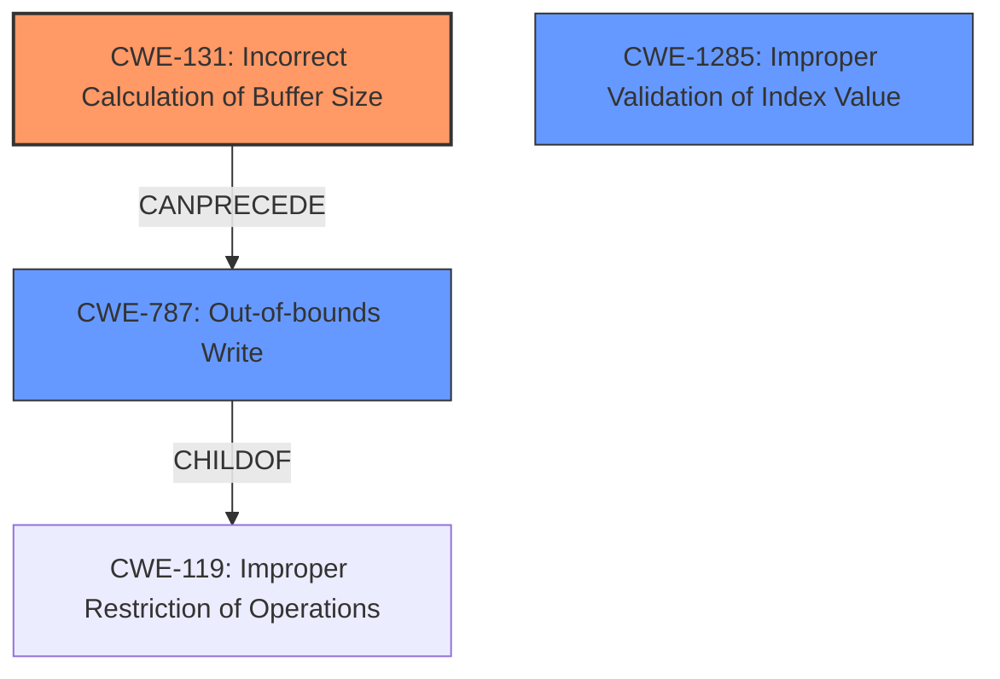

# Analysis Report for CVE-2022-20038

# Vulnerability Analysis Report: CVE-2022-20038

## Description

In ccu driver, there is a possible memory corruption due to an incorrect bounds check. This could lead to local escalation of privilege with System execution privileges needed. User interaction is not needed for exploitation. Patch ID ALPS06183335 Issue ID ALPS06183335.

## Vulnerability Description Key Phrases

**Rootcause:** incorrect bounds check
**Weakness:** memory corruption
**Impact:** local escalation of privilege
**Component:** ccu driver

## Analysis (with Relationship Data)

# Summary
| CWE ID  | CWE Name                                     | Confidence | CWE Abstraction Level | CWE Vulnerability Mapping Label | CWE-Vulnerability Mapping Notes |
| :-------- | :------------------------------------------- | :--------- | :---------------------- | :------------------------------ | :------------------------------ |
| CWE-131 | Incorrect Calculation of Buffer Size     | 0.75      | Base                    | Allowed                        | Primary CWE                   |
| CWE-1285 | Improper Validation of Index Value         | 0.60      | Base                    | Allowed                        | Secondary Candidate           |
| CWE-787 | Out-of-bounds Write                        | 0.50      | Base                    | Allowed                        | Secondary Candidate           |

## Evidence and Confidence

*   **Confidence Score:** 0.70
*   **Evidence Strength:** MEDIUM

- **Analysis and Justification:**
  - *Explanation:* The vulnerability description states a "**memory corruption** due to an **incorrect bounds check**" in the ccu driver. This strongly suggests that the buffer size was either incorrectly calculated or not validated before a memory operation. CWE-131 (Incorrect Calculation of Buffer Size) is the best fit as it directly addresses the root cause of the **incorrect bounds check** leading to the **memory corruption**. The CVE Reference Links Content Summary also mentions "Improper Restriction of Operations within the Bounds of a Memory Buffer (CWE-119)", but CWE-131 is more specific to the root cause, while CWE-119 is a broader description of the symptom.

  - *Relationship Analysis:* CWE-131 can lead to other CWEs related to buffer overflows. It is a root cause that can precede CWE-787 (Out-of-bounds Write) or CWE-119 (Improper Restriction of Operations Within the Bounds of a Memory Buffer).

- **Confidence Score:**
  - Confidence: 0.75 (The description clearly points to a size calculation issue, but lacks specific technical details on the nature of the calculation error.)

---
- **Analysis and Justification:**
  - *Explanation:* CWE-1285 (Improper Validation of Index Value) is considered because the vulnerability involves an "**incorrect bounds check**." This suggests that the index or offset used to access a memory buffer was not properly validated. While CWE-131 addresses the size calculation, CWE-1285 focuses on the validation of the index used to access the buffer. This could be a contributing factor, especially if the size calculation was correct, but the index used to access the buffer within that size was not properly validated.

  - *Relationship Analysis:* CWE-1285 is related to CWE-20 (Improper Input Validation) as it's a specific case of validating an index value. It can also precede CWE-787 (Out-of-bounds Write) if the improperly validated index leads to writing outside the bounds of the buffer.

- **Confidence Score:**
  - Confidence: 0.60 (The description mentions an **incorrect bounds check**, which could relate to index validation, but this is an assumption. Additional information about the specifics of the check would be required to increase confidence.)

---
- **Analysis and Justification:**
  - *Explanation:* CWE-787 (Out-of-bounds Write) is considered because the "**memory corruption**" resulting from the "**incorrect bounds check**" implies that data is being written outside the intended buffer boundaries. While CWE-131 represents the root cause (incorrect size calculation) and CWE-1285 represents a check on an index value, CWE-787 represents the direct consequence of the vulnerability. The description of the vulnerability's impact aligns with an out-of-bounds write.

  - *Relationship Analysis:* CWE-787 is a child of CWE-119 (Improper Restriction of Operations Within the Bounds of a Memory Buffer) and can be preceded by CWE-131 (Incorrect Calculation of Buffer Size) or CWE-1285 (Improper Validation of Index Value).

- **Confidence Score:**
  - Confidence: 0.50 (While the **memory corruption** strongly suggests an out-of-bounds write, the provided information does not explicitly state this. The confidence is lowered because this is an inferred consequence rather than a directly stated fact.)

## Criticism of Analysis

Okay, here's a detailed review of the CWE analysis provided, considering the full CWE specifications:

**Overall Assessment:**

The analysis is generally well-structured and reasoned. It provides justifications for each CWE selection and discusses the relationships between them. The confidence scores are also appropriate, reflecting the uncertainty inherent in mapping vulnerabilities based on limited information. However, there's room for improvement in terms of specificity and adherence to CWE's intended usage, especially in avoiding overbroad CWEs when more specific ones apply.

**Detailed Review by CWE:**

**1. CWE-131: Incorrect Calculation of Buffer Size (Primary CWE)**

*   **Confidence:** The confidence score of 0.75 is reasonable. The description indicates an "incorrect bounds check," which strongly suggests a problem with size calculation. However, the lack of specific details prevents a higher confidence score.
*   **Justification:** The justification is sound. CWE-131 is a good fit as the *root cause* when the bounds check error stems from calculating the buffer size needed.
*   **CWE Specification Adherence:**  The analysis correctly identifies that the incorrect bounds check *leads* to memory corruption. The "Maintenance" section of CWE-131 correctly notes the common chain CWE-131 -> CWE-119. This also means that it is *likely* that the issue *could* also be CWE-787, in that the buffer overflow leads to data written out of bounds.

*   **Potential Improvement:** While the analysis mentions CWE-119, it could emphasize the direct *causation* provided by CWE-131 over the more general CWE-119.  Additionally, explicitly noting the potential chaining relationship between CWE-131 -> CWE-787 to indicate an out of bounds write could be useful.

**2. CWE-1285: Improper Validation of Index Value (Secondary Candidate)**

*   **Confidence:** The confidence score of 0.60 is accurate. The description mentions an "incorrect bounds check" which *could* relate to index validation if the size calculation was correct, but an attempt was made to access an invalid index within the bounds.
*   **Justification:** The analysis is logical in considering CWE-1285. However, it relies on an assumption.
*   **CWE Specification Adherence:** The analysis correctly notes that CWE-1285 is a child of CWE-20 (Improper Input Validation). Also, the child of CWE-20 is a more specific type of input validation issue than CWE-20 itself.
*   **Potential Improvement:** Acknowledge the assumption more directly. The phrase "**incorrect bounds check**" *could* relate to index validation, but it *could* also relate to incorrect calculations of buffer size.

**3. CWE-787: Out-of-bounds Write (Secondary Candidate)**

*   **Confidence:** The confidence score of 0.50 is on the low side, considering that *memory corruption* suggests an out-of-bounds write as a *likely consequence*.
*   **Justification:** The analysis is correct in stating that memory corruption implies that data is being written outside the intended buffer boundaries.
*   **CWE Specification Adherence:** The analysis shows the proper relationship to CWE-119 and that it can be preceded by CWE-131 or CWE-1285.

*   **Potential Improvement:** Since an Out-of-bounds Write is a *likely consequence* of the incorrect buffer calculation, it could be that the confidence could be higher.

**General Critiques and Recommendations:**

*   **Overly Broad CWEs:** While the analysis is correct in identifying CWE-131 as a key issue, the mention of CWE-119 (Improper Restriction of Operations within the Bounds of a Memory Buffer) is appropriate given that CWE-119 is a high level abstraction which the CWE entry itself suggests should be avoided.
*   **Chaining:**  The analysis should more explicitly describe chaining relationships using terms like "can lead to" or "can be caused by."
*   **Mitigation Awareness:** The analysis doesn't mention the mitigation strategies suggested by each of the CWE specifications. While not strictly necessary, including relevant mitigations can enhance the overall value of the analysis. For example, if CWE-131 is present, using a language with automatic memory management is a possible mitigation. For CWE-1285, using an "accept known good" input validation strategy is useful.
*   **Specificity is Key:** In general, strive for the *most specific* CWE that accurately reflects the vulnerability. The goal is to move away from general categories like CWE-119 when more precise mappings exist.
*   **Leveraging Retrieved Results:** The Retriever Results list CWE-787 (Out-of-bounds Write) relatively high. This should push the analyst to try and confirm or deny the presence of an out-of-bounds write. Since the reported vulnerability results in "memory corruption," and out-of-bounds write is a method of "memory corruption" the confidence should be higher.

**Revised Summary Table:**

| CWE ID  | CWE Name                                     | Confidence | CWE Abstraction Level | CWE Vulnerability Mapping Label | CWE-Vulnerability Mapping Notes |
| :-------- | :------------------------------------------- | :--------- | :---------------------- | :------------------------------ | :------------------------------ |
| CWE-131 | Incorrect Calculation of Buffer Size     | 0.80      | Base                    | Allowed                        | Primary CWE                   |
| CWE-1285 | Improper Validation of Index Value         | 0.60      | Base                    | Allowed                        | Secondary Candidate           |
| CWE-787 | Out-of-bounds Write                        | 0.65      | Base                    | Allowed                        | Likely consequence |

**Key Improvements in Revised Table:**

*   Increased confidence in CWE-131 due to its direct link to the root cause.
*   Increased confidence in CWE-787 because the vulnerability results in "memory corruption"
*   Added note that CWE-787 is a likely consequence, to denote the chained relationship

By incorporating these suggestions, the analysis can become even more robust and informative, leading to better understanding and mitigation of the vulnerability.

## Final Resolution

# Summary
| CWE ID  | CWE Name                                     | Confidence | CWE Abstraction Level | CWE Vulnerability Mapping Label | CWE-Vulnerability Mapping Notes |
| :-------- | :------------------------------------------- | :--------- | :---------------------- | :------------------------------ | :------------------------------ |
| CWE-131 | Incorrect Calculation of Buffer Size     | 0.80      | Base                    | Allowed                        | Primary CWE                   |
| CWE-787 | Out-of-bounds Write                        | 0.65      | Base                    | Allowed                        | Secondary Candidate |
| CWE-1285 | Improper Validation of Index Value         | 0.60      | Base                    | Allowed                        | Secondary Candidate           |

## Evidence and Confidence

*   **Confidence Score:** 0.75
*   **Evidence Strength:** MEDIUM

## Relationship Analysis
The primary relationship impacting the decision is the chain: CWE-131 (Incorrect Calculation of Buffer Size) CANPRECEDE CWE-787 (Out-of-bounds Write). While CWE-1285 (Improper Validation of Index Value) is also considered, the initial **incorrect bounds check** points more directly to a size calculation issue (CWE-131) causing a write outside the intended buffer (CWE-787). CWE-787 is a CHILDOF CWE-119 (Improper Restriction of Operations Within the Bounds of a Memory Buffer), however, CWE-119 is discouraged due to its high level of abstraction.

## Vulnerability Chain
The vulnerability chain starts with the **ROOTCAUSE** CWE-131 (Incorrect Calculation of Buffer Size). This leads to the weakness CWE-787 (Out-of-bounds Write), manifesting as memory corruption. The **incorrect bounds check** in the description serves as the bridge between the incorrect size calculation and the out-of-bounds write. CWE-1285 could be a contributing factor if index validation is also flawed, but it is secondary to the primary issue of size calculation.

## Summary of Analysis
The analysis and criticism both align on CWE-131 as the primary weakness, and the **memory corruption** points to CWE-787 (Out-of-bounds Write). The vulnerability description explicitly mentions an "**incorrect bounds check**," which directly aligns with the concept of incorrectly calculating the buffer size. The statement that this "**could lead to local escalation of privilege**" supports the inclusion of CWE-787 as the impact. The retriever results also support the inclusion of CWE-787.

The graph relationships, especially the CANPRECEDE relationship between CWE-131 and CWE-787, solidified the decision to include both CWEs. CWE-1285 remains a secondary candidate because the description doesn't definitively confirm an issue with index validation, but it could be a contributing factor. The selected CWEs are at the optimal level of specificity because they are Base-level CWEs, providing more precise mappings than Class or Pillar level CWEs.

*Report generated on 2025-03-18 08:29:04*
