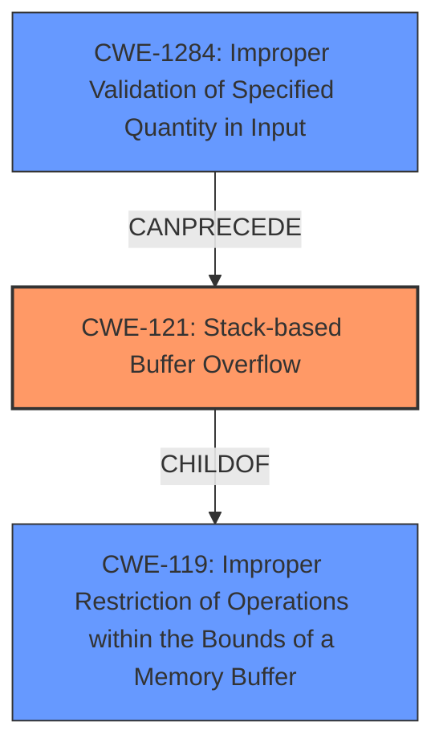

# Final Resolution for CVE-2022-20040

# Summary
| CWE ID  | CWE Name                       | Confidence | CWE Abstraction Level | CWE Vulnerability Mapping Label | CWE-Vulnerability Mapping Notes |
| :------- | :----------------------------- | :--------- | :-------------------- | :------------------------------ | :------------------------------ |
| CWE-121 | Stack-based Buffer Overflow | 0.9        | Variant               | Allowed                         | Primary CWE                     |
| CWE-1284 | Improper Validation of Specified Quantity in Input | 0.7 | Base | Allowed | Secondary Candidate |

## Evidence and Confidence

*   **Confidence Score:** 0.8
*   **Evidence Strength:** MEDIUM

## Relationship Analysis
The primary relationship that impacted my decision was the parent-child relationship between **CWE-119 (Improper Restriction of Operations within the Bounds of a Memory Buffer)** and **CWE-121 (Stack-based Buffer Overflow)**. The vulnerability description specifically mentions a "stack-based buffer overflow," making CWE-121 the most specific and appropriate choice as it is a variant of CWE-119.

Also considered was the chain relationship where **CWE-1284 (Improper Validation of Specified Quantity in Input)** can precede **CWE-121 (Stack-based Buffer Overflow)**. If the size of the input is not validated, it can lead to a buffer overflow on the stack.

## Vulnerability Chain
The vulnerability chain starts with potentially missing or improper input validation (**CWE-1284**), which leads to a **stack-based buffer overflow (CWE-121)**. The **root cause** is the lack of proper size validation on the input, and the **weakness** is the resulting buffer overflow. The **impact** is a possible permission bypass leading to local escalation of privilege.

## Summary of Analysis
The initial analysis correctly identified **CWE-121 (Stack-based Buffer Overflow)** as the primary **weakness**. The vulnerability description explicitly states "stack-based buffer overflow," making this the most specific and appropriate CWE.

The criticism suggested considering potential contributing factors such as **CWE-131 (Incorrect Calculation of Buffer Size)**, **CWE-190 (Integer Overflow or Wraparound)** and **CWE-20 (Improper Input Validation)**. While these are possibilities, there's no explicit evidence in the provided description to confirm them. However, the criticism makes a good point of **CWE-1284 (Improper Validation of Specified Quantity in Input)**, where the length or size of the input is controlled by the attacker, and that value is not validated, which leads to the overflow.

The final decision is to keep **CWE-121** as the primary **CWE** because the description explicitly mentions "stack-based buffer overflow." Add **CWE-1284** as a secondary candidate since the vulnerability description states that "This could lead to local escalation of privilege with no additional execution privileges needed," which is possible if the input length is not validated and is larger than the buffer size.

The selected CWEs are at the optimal level of specificity because **CWE-121** is a Variant that accurately describes the location of the buffer overflow, and **CWE-1284** is a Base **CWE** that describes the root cause of the overflow.