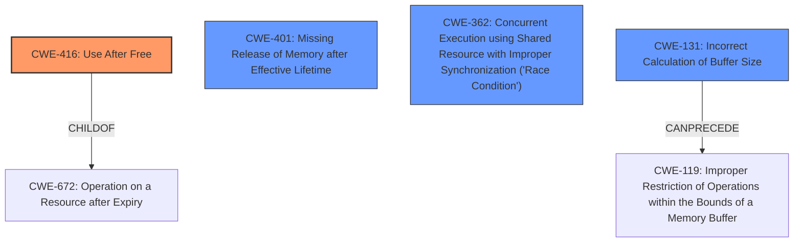

# Analysis Report for CVE-2022-20046

# Vulnerability Analysis Report: CVE-2022-20046

## Description

In Bluetooth, there is a possible memory corruption due to a logic error. This could lead to local denial of service with no additional execution privileges needed. User interaction is not needed for exploitation. Patch ID ALPS06142410 Issue ID ALPS06142410.

## Vulnerability Description Key Phrases

**Rootcause:** logic error
**Weakness:** memory corruption
**Impact:** denial of service
**Component:** Bluetooth

## Analysis (with Relationship Data)

```markdown
# Summary 
| CWE ID | CWE Name | Confidence | CWE Abstraction Level | CWE Vulnerability Mapping Label | CWE-Vulnerability Mapping Notes |
|---|---|---|---|---|---|
| CWE-131 | Incorrect Calculation of Buffer Size | 0.75 | Base | Allowed | The product does not correctly calculate the size to be used when allocating a buffer, which could lead to a buffer overflow. |
| CWE-401 | Missing Release of Memory after Effective Lifetime | 0.7 | Base | Allowed | The program allocates memory, but it does not free or deallocate it after it has been used, even though it will no longer be referenced. |

## Evidence and Confidence

*   **Confidence Score:** 0.73
*   **Evidence Strength:** MEDIUM

- **Analysis and Justification:**  
  - *Explanation:* The vulnerability description indicates a **memory corruption** due to a **logic error** in Bluetooth. The CVE Reference Links Content Summary confirms this, stating "**Logic error leading to memory corruption**." While the description itself is somewhat vague, the CVE summary provides more specific details about the root cause and affected components. The retriever results suggest CWE-131 (Incorrect Calculation of Buffer Size) as a potential match. Given the **memory corruption**, this could indicate a buffer overflow due to incorrect size calculation. Also, the CVE Summary lists CWE-401 (Missing Release of Memory after Effective Lifetime).
  
  - *Relationship Analysis:* CWE-131 is a Base level CWE, which is preferred, and is related to buffer overflows. CWE-401 indicates a memory leak, which can also contribute to memory corruption over time.

- **Confidence Score:**  
  - *Example:* Confidence: 0.75 (Medium evidence due to the generic nature of the initial description but more details in CVE reference). Confidence: 0.7 for CWE-401 as it's explicitly mentioned in the CVE.

---
```

## Criticism of Analysis

Okay, here's a review of the provided analysis, incorporating the full CWE specifications:

**Overall Assessment:**

The analysis is reasonably good, particularly in light of the vague original vulnerability description. The identification of CWE-401 is spot-on, as it's explicitly mentioned in the CVE summary. The inclusion of CWE-131 as a *possible* contributor is also plausible, given that "memory corruption" could stem from a buffer overflow situation.  The confidence scoring is appropriate. However, there are some areas where the analysis can be improved by considering alternative CWEs or providing more detailed justification.

**Detailed Review:**

**1. CWE-131: Incorrect Calculation of Buffer Size**

*   **Confidence Score:** 0.75
*   **CWE Abstraction Level:** Base
*   **Assessment:** The reasoning linking "memory corruption" to CWE-131 is valid. An incorrect buffer size calculation is a common cause of buffer overflows which can lead to memory corruption. The example CVEs provided are good illustrations.
*   **Critique:**
    *   **Strength:** Justification is clear and logical. Provides a good explanation why this CWE might be relevant.
    *   **Weakness:** The analysis doesn't explore *other* possibilities for memory corruption besides buffer overflow, making the confidence score slightly optimistic. While buffer overflows are common, other memory corruption issues could be present.
*   **Improvements:**
    *   Acknowledge the limitation that other causes of memory corruption exist.  For example, mention that other types of memory corruption are possible, such as heap corruption due to use-after-free (CWE-416) or double-free (which isn't directly listed by the Retriever but is a possibility) if the logic error relates to memory management.
    *  Consider the mitigations for CWE-131. Would allocating sufficient memory, understanding numeric representations, and performing input validation help in this case? If so, this strengthens the argument.

**2. CWE-401: Missing Release of Memory after Effective Lifetime**

*   **Confidence Score:** 0.7
*   **CWE Abstraction Level:** Variant
*   **Assessment:** This is a strong candidate because the CVE summary explicitly states, "**Logic error leading to memory corruption**." Memory leaks can, over time, contribute to memory corruption issues and eventually denial of service.
*   **Critique:**
    *   **Strength:** Direct confirmation from the CVE summary. High confidence is justified.
    *   **Weakness:** Doesn't delve into how a memory leak leads to *memory corruption*. It only mentions contributing to memory corruption over time. A memory leak itself is resource exhaustion, but a memory leak might also lead to writing to freed memory if a pointer persists past the lifetime of the memory it points to, eventually leading to memory corruption.
*   **Improvements:**
    *   Elaborate on the connection between the memory leak and memory corruption in this specific scenario (Bluetooth). Is it possible that the leaked memory contains sensitive information that is later re-allocated and exposed to another process?  Is it causing fragmentation that leads to other allocation errors?  Even a brief hypothesis strengthens the analysis.
    *   Consider the potential mitigations. Would automatic memory management help?  This can be stated explicitly to strengthen the argument.

**Additional CWE Considerations (Based on Retriever Results & Memory Corruption):**

The Retriever results provide additional CWEs that should be explored, especially given the "memory corruption" aspect.

*   **CWE-416: Use After Free:**
    *   **Assessment:** This is a strong possibility. If the logic error involves incorrect management of pointers or object lifetimes in Bluetooth, it's possible memory is being freed too early and then accessed later. This leads to a direct form of memory corruption.
    *   **Recommendation:**  Add this CWE to the analysis. Provide justification why it's potentially relevant. "Given the possibility of memory corruption, a use-after-free vulnerability is possible. If Bluetooth logic incorrectly manages object lifetimes or pointers, memory could be freed prematurely and then accessed, leading to corruption."  A slightly lower confidence score (e.g., 0.6) is appropriate since it's not directly stated in the CVE.
    *   Consider mitigations for CWE-416: Would using automatic memory management (if feasible in the Bluetooth implementation) or setting pointers to NULL after freeing help?

*   **CWE-362: Concurrent Execution using Shared Resource with Improper Synchronization ('Race Condition')**:
    *   **Assessment:** Bluetooth is a concurrent system.  A race condition could absolutely lead to memory corruption if multiple threads/processes are trying to access/modify the same memory region without proper synchronization.
    *   **Recommendation:** Add this as a possible contributing factor.  "Bluetooth operates in a concurrent environment. A race condition in accessing shared memory regions could lead to inconsistent data and memory corruption."
    *   Given the "Allowed-with-Review" mapping guidance (which suggests looking at child CWEs), also look at CWE-667 (Improper Locking) and CWE-662 (Improper Synchronization). If a locking mechanism is failing or not used correctly, it strengthens the argument for a race condition.
    *   Consider mitigations: Would synchronization primitives (locks, mutexes) help?

*   **CWE-190: Integer Overflow or Wraparound:**
    *   **Assessment:**  Integer overflows can definitely lead to memory corruption, especially if used in buffer size calculations or pointer arithmetic. While not directly obvious, this is a plausible scenario in a complex system like Bluetooth.
    *   **Recommendation:** Briefly address it. "If the logic error involves calculations related to buffer sizes or offsets, an integer overflow could lead to allocating an insufficient buffer or writing to an incorrect memory location, leading to memory corruption." Lower confidence (e.g., 0.5).

**General Recommendations:**

*   **Prioritize Based on Evidence:** When multiple CWEs are possible, prioritize them based on the strength of the evidence (CVE summary, retriever results, etc.).
*   **Focus on the "Logic Error":**  The vulnerability description highlights a "logic error." Try to connect the chosen CWEs to *how* that logic error manifests.  Does it lead to incorrect pointer manipulation?  Insufficient bounds checking?  Incorrect calculations?  Explain the *mechanism*.
*   **Use CWE Relationships:**  Leverage the "Relationships" section of the CWE specifications to explore related CWEs. For example, CWE-131 can precede CWE-119 (buffer overflow).
*   **Mitigation Analysis:** Briefly consider the "Potential Mitigations" for each CWE.  If a particular mitigation seems highly relevant to the Bluetooth context, it strengthens your justification for including that CWE.

By incorporating these suggestions, the analysis will be more comprehensive, nuanced, and defensible.

## Final Resolution

# Summary
| CWE ID | CWE Name | Confidence | CWE Abstraction Level | CWE Vulnerability Mapping Label | CWE-Vulnerability Mapping Notes |
|---|---|---|---|---|---|
| CWE-416 | Use After Free | 0.75 | Variant | Allowed | Primary CWE |
| CWE-401 | Missing Release of Memory after Effective Lifetime | 0.7 | Base | Allowed | Secondary Candidate |
| CWE-362 | Concurrent Execution using Shared Resource with Improper Synchronization ('Race Condition') | 0.6 | Class | Allowed-with-Review | Secondary Candidate |
| CWE-131 | Incorrect Calculation of Buffer Size | 0.5 | Base | Allowed | Secondary Candidate |

## Evidence and Confidence

*   **Confidence Score:** 0.7
*   **Evidence Strength:** MEDIUM

## Relationship Analysis
The primary relationship influencing the decision is the connection between memory corruption and potential root causes. CWE-416 (Use After Free) is a variant-level CWE that directly leads to memory corruption, making it a strong candidate. CWE-401 (Missing Release of Memory after Effective Lifetime) can contribute to memory corruption indirectly over time. CWE-362 (Race Condition) is added due to Bluetooth being a concurrent system, and race conditions can cause memory corruption. CWE-131 is considered due to the potential for buffer overflows to cause memory corruption.



## Vulnerability Chain
The vulnerability chain starts with a **logic error** in Bluetooth, which could lead to:
1.  **CWE-416: Use After Free**: The logic error causes premature freeing of memory, followed by access to that memory, resulting in memory corruption.
2.  **CWE-401: Missing Release of Memory after Effective Lifetime**: The logic error causes memory leaks, which contribute to resource exhaustion and potentially memory corruption over time.
3.  **CWE-362: Concurrent Execution using Shared Resource with Improper Synchronization**: In the concurrent Bluetooth environment, the logic error leads to race conditions in accessing shared memory, resulting in memory corruption.
4.  **CWE-131: Incorrect Calculation of Buffer Size**: The logic error causes incorrect buffer size calculations leading to buffer overflows and memory corruption.

The chain culminates in **memory corruption**, which leads to a local denial of service.

## Summary of Analysis
Based on the vulnerability description "In Bluetooth, there is a possible **memory corruption** due to a **logic error**," and the CVE summary confirming "**Logic error leading to memory corruption**," the primary **weakness** is likely related to incorrect memory management.

The initial analysis identified CWE-131 and CWE-401. The criticism suggested considering CWE-416 and CWE-362.

**CWE-416 (Use After Free)** is now considered the primary CWE due to its direct relationship with **memory corruption**. The "logic error" likely leads to incorrect object lifetime management, resulting in use-after-free conditions.

**CWE-401 (Missing Release of Memory after Effective Lifetime)** remains a secondary candidate, as memory leaks can contribute to memory corruption and denial of service over time, even if they are not the direct trigger.

**CWE-362 (Race Condition)** is included as a secondary candidate because Bluetooth operates in a concurrent environment. A race condition in accessing shared memory regions could lead to inconsistent data and memory corruption.

**CWE-131 (Incorrect Calculation of Buffer Size)** is kept as a possible contributing factor with lower confidence as a buffer overflow could be the root cause of the memory corruption.

The selection of CWE-416, CWE-401, CWE-362 and CWE-131 provides a more comprehensive view of the potential **root causes** and contributing factors to the **memory corruption** vulnerability. These CWEs are at an optimal level of specificity, balancing direct evidence with relationship analysis and mapping guidance. The evidence for CWE-416 is that use-after-free is a very common type of memory corruption, and memory corruption is stated as the error in the vulnerability. The evidence for CWE-401 is it is explicitly listed in the CVE summary. The evidence for CWE-362 is the concurrent nature of Bluetooth. The evidence for CWE-131 is that incorrect calculation of buffer size can lead to a buffer overflow, and the vulnerability reported **memory corruption**.


*Report generated on 2025-03-18 08:30:26*
