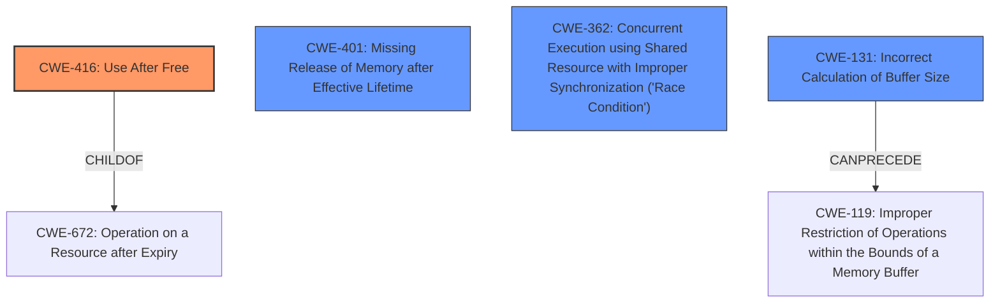

# Final Resolution for CVE-2022-20046

# Summary
| CWE ID | CWE Name | Confidence | CWE Abstraction Level | CWE Vulnerability Mapping Label | CWE-Vulnerability Mapping Notes |
|---|---|---|---|---|---|
| CWE-416 | Use After Free | 0.75 | Variant | Allowed | Primary CWE |
| CWE-401 | Missing Release of Memory after Effective Lifetime | 0.7 | Base | Allowed | Secondary Candidate |
| CWE-362 | Concurrent Execution using Shared Resource with Improper Synchronization ('Race Condition') | 0.6 | Class | Allowed-with-Review | Secondary Candidate |
| CWE-131 | Incorrect Calculation of Buffer Size | 0.5 | Base | Allowed | Secondary Candidate |

## Evidence and Confidence

*   **Confidence Score:** 0.7
*   **Evidence Strength:** MEDIUM

## Relationship Analysis
The primary relationship influencing the decision is the connection between memory corruption and potential root causes. CWE-416 (Use After Free) is a variant-level CWE that directly leads to memory corruption, making it a strong candidate. CWE-401 (Missing Release of Memory after Effective Lifetime) can contribute to memory corruption indirectly over time. CWE-362 (Race Condition) is added due to Bluetooth being a concurrent system, and race conditions can cause memory corruption. CWE-131 is considered due to the potential for buffer overflows to cause memory corruption.

## Vulnerability Chain
The vulnerability chain starts with a **logic error** in Bluetooth, which could lead to:
1.  **CWE-416: Use After Free**: The logic error causes premature freeing of memory, followed by access to that memory, resulting in memory corruption.
2.  **CWE-401: Missing Release of Memory after Effective Lifetime**: The logic error causes memory leaks, which contribute to resource exhaustion and potentially memory corruption over time.
3.  **CWE-362: Concurrent Execution using Shared Resource with Improper Synchronization**: In the concurrent Bluetooth environment, the logic error leads to race conditions in accessing shared memory, resulting in memory corruption.
4.  **CWE-131: Incorrect Calculation of Buffer Size**: The logic error causes incorrect buffer size calculations leading to buffer overflows and memory corruption.

The chain culminates in **memory corruption**, which leads to a local denial of service.

## Summary of Analysis
Based on the vulnerability description "In Bluetooth, there is a possible **memory corruption** due to a **logic error**," and the CVE summary confirming "**Logic error leading to memory corruption**," the primary **weakness** is likely related to incorrect memory management.

The initial analysis identified CWE-131 and CWE-401. The criticism suggested considering CWE-416 and CWE-362.

**CWE-416 (Use After Free)** is now considered the primary CWE due to its direct relationship with **memory corruption**. The "logic error" likely leads to incorrect object lifetime management, resulting in use-after-free conditions.

**CWE-401 (Missing Release of Memory after Effective Lifetime)** remains a secondary candidate, as memory leaks can contribute to memory corruption and denial of service over time, even if they are not the direct trigger.

**CWE-362 (Race Condition)** is included as a secondary candidate because Bluetooth operates in a concurrent environment. A race condition in accessing shared memory regions could lead to inconsistent data and memory corruption.

**CWE-131 (Incorrect Calculation of Buffer Size)** is kept as a possible contributing factor with lower confidence as a buffer overflow could be the root cause of the memory corruption.

The selection of CWE-416, CWE-401, CWE-362 and CWE-131 provides a more comprehensive view of the potential **root causes** and contributing factors to the **memory corruption** vulnerability. These CWEs are at an optimal level of specificity, balancing direct evidence with relationship analysis and mapping guidance. The evidence for CWE-416 is that use-after-free is a very common type of memory corruption, and memory corruption is stated as the error in the vulnerability. The evidence for CWE-401 is it is explicitly listed in the CVE summary. The evidence for CWE-362 is the concurrent nature of Bluetooth. The evidence for CWE-131 is that incorrect calculation of buffer size can lead to a buffer overflow, and the vulnerability reported **memory corruption**.