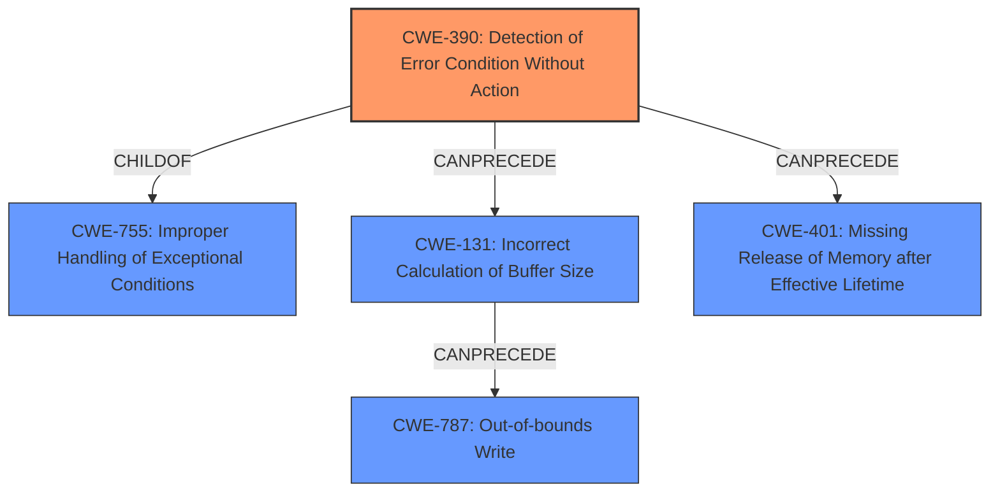

# Analysis Report for CVE-2022-20057

# Vulnerability Analysis Report: CVE-2022-20057

## Description

In btif, there is a possible memory corruption due to incorrect error handling. This could lead to local escalation of privilege with System execution privileges needed. User interaction is needed for exploitation. Patch ID ALPS06271186 Issue ID ALPS06271186.

## Vulnerability Description Key Phrases

**Rootcause:** incorrect error handling
**Weakness:** memory corruption
**Impact:** local escalation of privilege
**Component:** btif

## Analysis (with Relationship Data)

# Summary
| CWE ID | CWE Name | Confidence | CWE Abstraction Level | CWE Vulnerability Mapping Label | CWE-Vulnerability Mapping Notes |
|---|---|---|---|---|---|
| CWE-390 | Detection of Error Condition Without Action | 0.8 | Base | Allowed | Primary CWE |
| CWE-131 | Incorrect Calculation of Buffer Size | 0.6 | Base | Allowed | Secondary Candidate |
| CWE-787 | Out-of-bounds Write | 0.5 | Base | Allowed | Secondary Candidate |

## Evidence and Confidence

*   **Confidence Score:** 0.7
*   **Evidence Strength:** MEDIUM

- **Analysis and Justification:**  
  - *Explanation:* "The vulnerability is due to **incorrect error handling** leading to **memory corruption**. The CVE Reference Links Content Summary explicitly states 'CWE-390 Detection of Error Condition Without Action' as a weakness. This indicates that the system detects an error but doesn't take appropriate action, which is the root cause of the **memory corruption**. Therefore, CWE-390 is the primary CWE. CWE-131 is considered as a secondary candidate because **memory corruption** can arise from an **incorrect calculation of buffer size**, and CWE-787 as the result from **incorrect error handling** can lead to an **out-of-bounds write**."
  
  - *Relationship Analysis:* "CWE-390 is a child of CWE-755 (Improper Handling of Exceptional Conditions), but CWE-390 is more specific since the description explicitly states that there is a 'Detection of Error Condition Without Action'. CWE-390 can precede CWE-401 (Missing Release of Memory after Effective Lifetime) because not handling an error might result in memory not being released."

- **Confidence Score:**  
  - *Example:* Confidence: 0.8 (High evidence from CVE reference materials and good alignment with vulnerability description)
---

## Criticism of Analysis

Okay, I've reviewed your analysis and the provided CWE specifications. Here's a breakdown of my critique:

**Overall Assessment:**

The analysis is generally sound, and the primary CWE mapping to CWE-390 is well-supported by the information available. The selection of secondary candidates (CWE-131 and CWE-787) also demonstrates a good understanding of potential consequences of the root cause. However, I will highlight some improvements to the reasoning and confidence levels.

**Detailed Review:**

*   **Primary CWE: CWE-390 (Detection of Error Condition Without Action)**

    *   **Confidence:** 0.8 (High) - This is justified given the CVE Reference Links Content Summary explicitly mentioning "Incorrect error handling in btif leading to memory corruption" and relating this to CWE-390. The summary also notes that this leads to "Local escalation of privilege," which is a severe consequence.
    *   **Justification:** The explanation clearly connects the vulnerability description to the CWE definition. The presence of error detection *without appropriate action* is key to justifying this CWE.
    *   **Relationships:** The parent/child analysis is correct. CWE-390 is indeed a child of CWE-755 (Improper Handling of Exceptional Conditions). The "CanPrecede" relationship to CWE-401 is also logical, as a failure to handle an error could result in a memory leak.
    *   **Improvements:** You could explicitly state that the error detection code is present, the handler is not working well.
*   **Secondary CWE: CWE-131 (Incorrect Calculation of Buffer Size)**

    *   **Confidence:** 0.6 (Medium) - This is a reasonable assessment. While the vulnerability description doesn't *explicitly* mention incorrect buffer size calculation, it's a plausible cause of memory corruption. *If* the error handling failure *leads* to writing to a buffer, and *if* the buffer size calculation is wrong, then this CWE would be applicable.
    *   **Justification:** The explanation connects memory corruption to potentially incorrect buffer size calculation.
    *   **Improvements:** The justification needs to be strengthened. Specifically, explain *how* incorrect error handling can lead to the use of an incorrectly calculated buffer size. A scenario would improve the explanation. For example, "If an error occurs during the buffer size calculation (e.g., due to a malformed input), and this error is not handled, the system might proceed with an incorrect buffer size. This could cause a buffer overflow or underflow when data is written to the buffer."
*   **Secondary CWE: CWE-787 (Out-of-bounds Write)**

    *   **Confidence:** 0.5 (Medium) - Appropriate confidence level. It is a possible *outcome* of the incorrect error handling and, potentially, the incorrect buffer size calculation. The root cause, though, isn't directly an out-of-bounds write.
    *   **Justification:** This is a common consequence of memory corruption.
    *   **Improvements:** Again, needs a more detailed scenario connecting error handling and buffer overflows. For example, "If an error occurs after a buffer is allocated, and the error handling does not prevent further processing, it might result in a write operation that goes beyond the bounds of the allocated buffer". The statement "as the result from **incorrect error handling** can lead to an **out-of-bounds write**" needs expanding with a plausible scenario.
*   **General Comments and Recommendations:**

    *   **Specificity:** The analysis is a bit generic. Given the "btif" component, try to be more specific in your reasoning. If you had access to the source code or more detailed documentation, you could potentially identify a specific function or code path where the error handling is deficient.
    *   **Chaining:** Consider explicitly documenting potential chains of CWEs. For example:
        *   `CWE-390 -> CWE-131 -> CWE-787`:  Error detected but ignored leads to an incorrect buffer size calculation, ultimately resulting in an out-of-bounds write.
        *   `CWE-390 -> CWE-401` Error detected, memory allocated but on error memory is not freed, causing memory leak.
    *   **Mitigations:** Refer to the *Potential Mitigations* sections in the CWE specifications to provide recommendations specific to each CWE. For example, for CWE-390, the analysis could suggest: "Implement robust error handling routines to ensure that all detected errors are properly addressed. This might involve retrying the operation, logging the error, or terminating the process gracefully."
    *   **Retriever Results:** The retriever results are helpful in suggesting other potential CWEs. While CWE-390 is the best fit, consider why other high-scoring CWEs were *not* chosen. For example, why not CWE-908 (Use of Uninitialized Resource)? If you can convincingly explain why a suggested CWE doesn't apply, it strengthens your analysis.
    *   **CWE-755 vs CWE-390:** It would be useful to clarify why CWE-390 is chosen over the more general CWE-755. You can say that CWE-390 is more specific than CWE-755, as CWE-390 has the explicit "Detection of Error Condition Without Action", rather than a generic "Improper Handling of Exceptional Conditions". It provides more accurate mapping.
    *   **System Execution Privileges Needed and User Interaction:** Try to infer what kind of user interaction would trigger the vulnerability, e.g., the user would need to connect to a Bluetooth device in a particular way, or perform a specific operation through Bluetooth.
    *   **CWE-416 - Use After Free**: Consider if the incorrect error handling could lead to a use after free. For instance, if an error prevents an object from being properly initialized, then later used.

**Revised Summary Table (Example):**

| CWE ID | CWE Name | Confidence | CWE Abstraction Level | CWE Vulnerability Mapping Label | CWE-Vulnerability Mapping Notes |
|---|---|---|---|---|---|
| CWE-390 | Detection of Error Condition Without Action | 0.8 | Base | Allowed | Primary CWE |
| CWE-131 | Incorrect Calculation of Buffer Size | 0.7 | Base | Allowed | Secondary Candidate |
| CWE-787 | Out-of-bounds Write | 0.6 | Base | Allowed | Secondary Candidate |
| CWE-401 | Missing Release of Memory after Effective Lifetime| 0.4 | Variant | Allowed | Tertiary Candidate |

**In summary:**  The analysis is a good starting point, but can be strengthened by providing more specific scenarios linking the root cause (incorrect error handling) to the consequences (memory corruption, out-of-bounds write, etc.), and by explicitly considering and rejecting other plausible CWEs. Also improve your confidence by expanding scenarios with how the error handling would specifically lead to memory corruption. Adding mitigations strengthens it further.

## Final Resolution

# Summary
| CWE ID | CWE Name | Confidence | CWE Abstraction Level | CWE Vulnerability Mapping Label | CWE-Vulnerability Mapping Notes |
|---|---|---|---|---|---|
| CWE-390 | Detection of Error Condition Without Action | 0.8 | Base | Allowed | Primary CWE |
| CWE-131 | Incorrect Calculation of Buffer Size | 0.7 | Base | Allowed | Secondary Candidate |
| CWE-787 | Out-of-bounds Write | 0.6 | Base | Allowed | Secondary Candidate |
| CWE-401 | Missing Release of Memory after Effective Lifetime| 0.4 | Variant | Allowed | Tertiary Candidate |

## Evidence and Confidence

*   **Confidence Score:** 0.75
*   **Evidence Strength:** MEDIUM

## Relationship Analysis
The primary weakness is **CWE-390 (Detection of Error Condition Without Action)**, which is a base-level CWE and a child of **CWE-755 (Improper Handling of Exceptional Conditions)**. The analysis correctly identifies that **CWE-390** is more specific, making it a better fit than **CWE-755**. **CWE-390** can precede **CWE-401 (Missing Release of Memory after Effective Lifetime)**, as not handling an error might result in memory not being released. This chain contributes to understanding the vulnerability's progression. **CWE-131 (Incorrect Calculation of Buffer Size)** and **CWE-787 (Out-of-bounds Write)** are potential consequences of **CWE-390**.

## Vulnerability Chain
The vulnerability chain starts with the detection of an error condition (**CWE-390**). This error is not properly handled, which can lead to an incorrect calculation of buffer size (**CWE-131**). The incorrect buffer size can then result in an out-of-bounds write (**CWE-787**), potentially leading to memory corruption and escalation of privilege. Alternatively, the unhandled error could lead to memory not being released (**CWE-401**), causing a memory leak.

## Summary of Analysis
The initial analysis correctly identified **CWE-390 (Detection of Error Condition Without Action)** as the primary **ROOTCAUSE**, supported by the CVE reference explicitly mentioning "Incorrect error handling in btif leading to memory corruption". The criticism highlighted the need for more specific scenarios linking the **ROOTCAUSE** to the consequences.

The graph relationships influenced the selection by confirming that **CWE-390** is a more specific and appropriate choice than its parent, **CWE-755**. The "CanPrecede" relationships helped clarify the potential vulnerability chain.

The selected CWEs are at the optimal level of specificity. **CWE-390** accurately describes the **ROOTCAUSE**, while **CWE-131** and **CWE-787** represent potential consequences.

To strengthen the justification, consider this more specific scenario:

"In the btif component, an error might occur during the processing of incoming Bluetooth data. For example, a malformed data packet might be received. The system detects this error (**CWE-390**), but the error handling routine is inadequate. Instead of properly discarding the packet and returning an error code, the system continues processing the data with an incorrect buffer size (**CWE-131**). This leads to an out-of-bounds write (**CWE-787**) when the malformed data is written to memory, resulting in memory corruption. As a result of **incorrect error handling**, allocated memory might not be released after an error, potentially leading to a memory leak (**CWE-401**)."

This scenario provides a more concrete link between the **ROOTCAUSE** and the potential consequences, increasing confidence in the classification. The assertion that system execution privileges are needed and user interaction is required suggests that the vulnerability can only be triggered by a user interacting with the Bluetooth interface in a specific way that exposes the error handling flaw.

*Report generated on 2025-03-18 08:31:17*
