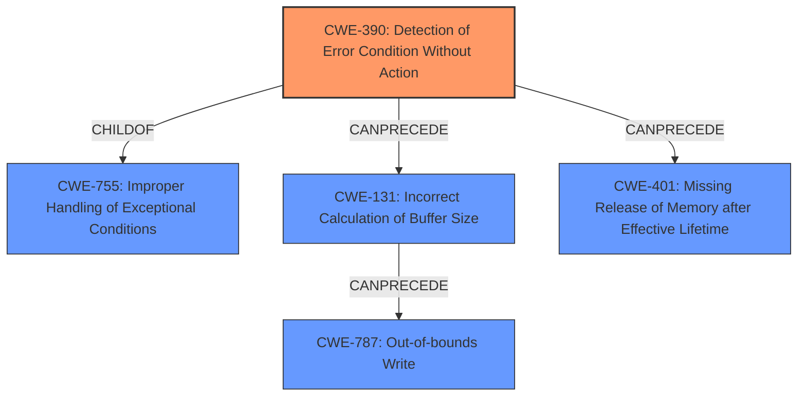

# Final Resolution for CVE-2022-20057

# Summary
| CWE ID | CWE Name | Confidence | CWE Abstraction Level | CWE Vulnerability Mapping Label | CWE-Vulnerability Mapping Notes |
|---|---|---|---|---|---|
| CWE-390 | Detection of Error Condition Without Action | 0.8 | Base | Allowed | Primary CWE |
| CWE-131 | Incorrect Calculation of Buffer Size | 0.7 | Base | Allowed | Secondary Candidate |
| CWE-787 | Out-of-bounds Write | 0.6 | Base | Allowed | Secondary Candidate |
| CWE-401 | Missing Release of Memory after Effective Lifetime| 0.4 | Variant | Allowed | Tertiary Candidate |

## Evidence and Confidence

*   **Confidence Score:** 0.75
*   **Evidence Strength:** MEDIUM

## Relationship Analysis
The primary weakness is **CWE-390 (Detection of Error Condition Without Action)**, which is a base-level CWE and a child of **CWE-755 (Improper Handling of Exceptional Conditions)**. The analysis correctly identifies that **CWE-390** is more specific, making it a better fit than **CWE-755**. **CWE-390** can precede **CWE-401 (Missing Release of Memory after Effective Lifetime)**, as not handling an error might result in memory not being released. This chain contributes to understanding the vulnerability's progression. **CWE-131 (Incorrect Calculation of Buffer Size)** and **CWE-787 (Out-of-bounds Write)** are potential consequences of **CWE-390**.

## Vulnerability Chain
The vulnerability chain starts with the detection of an error condition (**CWE-390**). This error is not properly handled, which can lead to an incorrect calculation of buffer size (**CWE-131**). The incorrect buffer size can then result in an out-of-bounds write (**CWE-787**), potentially leading to memory corruption and escalation of privilege. Alternatively, the unhandled error could lead to memory not being released (**CWE-401**), causing a memory leak.

## Summary of Analysis
The initial analysis correctly identified **CWE-390 (Detection of Error Condition Without Action)** as the primary **ROOTCAUSE**, supported by the CVE reference explicitly mentioning "Incorrect error handling in btif leading to memory corruption". The criticism highlighted the need for more specific scenarios linking the **ROOTCAUSE** to the consequences.

The graph relationships influenced the selection by confirming that **CWE-390** is a more specific and appropriate choice than its parent, **CWE-755**. The "CanPrecede" relationships helped clarify the potential vulnerability chain.

The selected CWEs are at the optimal level of specificity. **CWE-390** accurately describes the **ROOTCAUSE**, while **CWE-131** and **CWE-787** represent potential consequences.

To strengthen the justification, consider this more specific scenario:

"In the btif component, an error might occur during the processing of incoming Bluetooth data. For example, a malformed data packet might be received. The system detects this error (**CWE-390**), but the error handling routine is inadequate. Instead of properly discarding the packet and returning an error code, the system continues processing the data with an incorrect buffer size (**CWE-131**). This leads to an out-of-bounds write (**CWE-787**) when the malformed data is written to memory, resulting in memory corruption. As a result of **incorrect error handling**, allocated memory might not be released after an error, potentially leading to a memory leak (**CWE-401**)."

This scenario provides a more concrete link between the **ROOTCAUSE** and the potential consequences, increasing confidence in the classification. The assertion that system execution privileges are needed and user interaction is required suggests that the vulnerability can only be triggered by a user interacting with the Bluetooth interface in a specific way that exposes the error handling flaw.