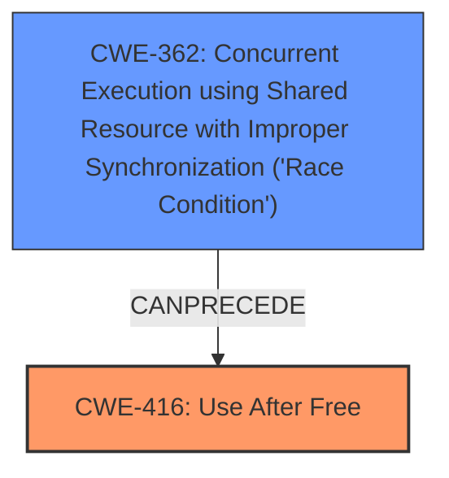

# Final Resolution for CVE-2022-2007

# Summary
| CWE ID | CWE Name | Confidence | CWE Abstraction Level | CWE Vulnerability Mapping Label | CWE-Vulnerability Mapping Notes |
|---|---|---|---|---|---|
| CWE-416 | Use After Free | 0.95 | Variant | Primary | Allowed |
| CWE-362 | Concurrent Execution using Shared Resource with Improper Synchronization ('Race Condition') | 0.6 | Secondary | Secondary Candidate | Allowed-with-Review |

## Evidence and Confidence

*   **Confidence Score:** 0.9
*   **Evidence Strength:** MEDIUM

## Relationship Analysis
The primary weakness is identified as **CWE-416 (Use After Free)**, a variant-level CWE. The analysis suggests a possible secondary weakness: **CWE-362 (Concurrent Execution using Shared Resource with Improper Synchronization ('Race Condition'))**.

The relationship analysis indicates that **CWE-362** can precede **CWE-416**. If the use-after-free condition is triggered due to concurrent access and improper synchronization in WebGPU, a vulnerability chain exists. However, without explicit evidence of threading or concurrency, **CWE-416** remains the primary **root cause**.

## Vulnerability Chain
The vulnerability chain starts with a potential race condition (**CWE-362**) if multiple threads are involved in WebGPU's memory management. This race condition leads to memory being freed while another thread still holds a reference to it. Subsequently, the thread attempts to access the freed memory, resulting in a use-after-free (**CWE-416**). The impact is heap corruption, potentially leading to arbitrary code execution.

Missing link: Concrete evidence of multi-threading in WebGPU to confirm the presence of **CWE-362**.

## Summary of Analysis
The initial analysis correctly identifies **CWE-416 (Use After Free)** as the primary **weakness** based on the vulnerability description, CVE details, and retriever results. The criticism suggests acknowledging and excluding other potential CWEs from the retriever results.

Based on the retriever results, other CWEs were considered:
*   **CWE-843 (Access of Resource Using Incompatible Type ('Type Confusion'))**: Excluded as the primary cause is related to the timing of memory access, not the type of data.
*   **CWE-366 (Race Condition within a Thread)** and **CWE-362 (Concurrent Execution using Shared Resource with Improper Synchronization ('Race Condition'))**: Considered as potential contributing factors if the freeing and subsequent access happen in different threads.
*   **CWE-415 (Double Free):** A double free could lead to a use-after-free.
*   **CWE-122 (Heap-based Buffer Overflow)** and **CWE-787 (Out-of-bounds Write):** A UAF could lead to a heap overflow if the freed memory is reallocated and then overwritten
*   **CWE-190 (Integer Overflow or Wraparound)** and **CWE-193 (Off-by-one Error):** Unlikely to be directly relevant to the described UAF.
*   **CWE-367 (Time-of-check Time-of-use (TOCTOU) Race Condition):** Less likely to apply as there isn't a clear indication of a 'check' followed by a 'use' with a timing window in between.

The analysis is primarily based on the provided evidence, which clearly states a **"use after free"** condition. The graph relationships influenced the consideration of **CWE-362** as a potential secondary **weakness**, as it can precede **CWE-416**.

The selected CWEs are at the optimal level of specificity. **CWE-416** is a variant-level CWE that precisely describes the vulnerability. While **CWE-362** is a class-level CWE, it provides context if the use-after-free is triggered by a race condition.

Without confirmation of multi-threading activity, the confidence in **CWE-362** remains moderate (0.6). If there's concrete evidence of multiple threads present in WebGPU, the confidence in **CWE-362** and its inclusion in the vulnerability chain would increase.

The retriever results show that CWE-362 can precede CWE-416. If multiple threads are present in WebGPU it is possible that a chain is present.