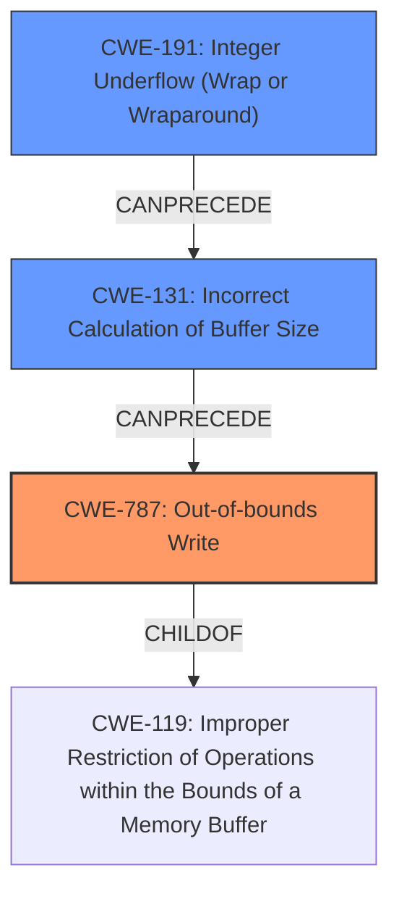

# Analysis Report for CVE-2022-20073

# Vulnerability Analysis Report: CVE-2022-20073

## Description

In preloader (usb), there is a possible out of bounds write due to a integer underflow. This could lead to local escalation of privilege, for an attacker who has physical access to the device, with no additional execution privileges needed. User interaction is needed for exploitation. Patch ID ALPS06160841 Issue ID ALPS06160841.

## Vulnerability Description Key Phrases

**Rootcause:** integer underflow
**Weakness:** out of bounds write
**Impact:** local escalation of privilege
**Attacker:** attacker with physical access
**Component:** preloader (usb)

## Analysis (with Relationship Data)

# Summary
| CWE ID | CWE Name | Confidence | CWE Abstraction Level | CWE Vulnerability Mapping Label | CWE-Vulnerability Mapping Notes |
|---|---|---|---|---|---|
| CWE-787 | Out-of-bounds Write | 0.9 | Base | Primary | Allowed |
| CWE-191 | Integer Underflow (Wrap or Wraparound) | 0.7 | Base | Secondary | Allowed |

## Evidence and Confidence

*   **Confidence Score:** 0.8
*   **Evidence Strength:** HIGH

- **Analysis and Justification:**  
  - *Explanation:* The vulnerability description clearly states an **out of bounds write** due to an **integer underflow** in the preloader (usb) component. This aligns directly with CWE-787 (Out-of-bounds Write), where the product writes data past the end, or before the beginning, of the intended buffer. The **integer underflow** is the root cause that leads to this out-of-bounds write. The CVE Reference Links Content Summary confirms "**Out-of-bounds write**" and "**Integer Underflow**" as weaknesses. The "Top CWEs" section also lists CWE-787 as the primary match for similar CVE descriptions.
  
  - *Relationship Analysis:* CWE-787 is a base level CWE, which is a preferred level of abstraction. While CWE-119 (Improper Restriction of Operations within the Bounds of a Memory Buffer) is a parent CWE, CWE-787 is more specific, as it describes the exact nature of the out-of-bounds write. The retriever results also show CWE-787 with a high score.

- **Confidence Score:**  
  - Confidence: 0.9 (High confidence due to direct evidence from the description and supporting information)

---

- **Analysis and Justification:**  
  - *Explanation:* The vulnerability description explicitly mentions an **integer underflow** as the root cause. This directly corresponds to CWE-191 (Integer Underflow (Wrap or Wraparound)), where the result of a subtraction is less than the minimum allowable integer value. This **integer underflow** leads to the **out of bounds write**. CWE-191 is listed as a candidate CWE in the Retriever Results and is also mentioned in the CVE Reference Links Content Summary.
  
  - *Relationship Analysis:* CWE-191 is a base level CWE, which is a preferred level of abstraction. While CWE-682 (Incorrect Calculation) is a more general weakness, CWE-191 is more specific to the type of calculation error.

- **Confidence Score:**
  - Confidence: 0.7 (The **integer underflow** is contributing to the **out of bounds write**, so it has slightly less confidence.)

## Criticism of Analysis

Okay, I've reviewed the provided analysis against the full CWE specifications for the referenced weaknesses. Here's my critique, focusing on the accuracy of the CWE assignments, the confidence levels, and any potential alternative or more specific CWEs that might be applicable:

**Overall Assessment:**

The analysis is generally sound and well-reasoned. The primary CWE mapping to CWE-787 (Out-of-bounds Write) is accurate and well-supported by the vulnerability description.  The secondary mapping to CWE-191 (Integer Underflow) is also correct as it identifies the root cause. However, there's room for improvement in the discussion of relationships and potential alternative CWEs in both cases.

**Detailed Critique:**

**1. CWE-787: Out-of-bounds Write**

*   **Accuracy:** Correct. The vulnerability description explicitly states "out of bounds write," making CWE-787 a direct and appropriate match. The "Top CWEs" section reinforces this.
*   **Confidence:** The confidence score of 0.9 is justified. The evidence is strong and explicit.
*   **Abstraction Level:** The analysis correctly identifies CWE-787 as a Base-level CWE, which is preferred.
*   **Relationship Analysis:**
    *   The analysis correctly points out that while CWE-119 (Improper Restriction of Operations within the Bounds of a Memory Buffer) is a parent, CWE-787 is more specific and therefore a better fit.
    *   The CWE specifications state that if the access is known to be a read or a write, the children of CWE-787 or CWE-125 should be investigated
*   **CWE Specification Review:**
    *   The analysis mentions appropriate selection rationale as well
*   **Mitigations:** The analysis does not mention this and would improve the analysis
    *   Mitigation 1 - Language Selection: Use a language that does not allow this weakness to occur.
    *   Mitigation 2 - Libraries or Frameworks: Use a vetted library or framework that does not allow this weakness to occur.
    *   Mitigation 3 - Environment Hardening: Use automatic buffer overflow detection mechanisms that are offered by certain compilers or compiler extensions

**2. CWE-191: Integer Underflow (Wrap or Wraparound)**

*   **Accuracy:** Correct. The description states "integer underflow," making this mapping accurate. It's the direct cause of the size calculation error that leads to the out-of-bounds write.
*   **Confidence:** The confidence score of 0.7 is reasonable. While it's a clear contributing factor, it's not the directly exploitable weakness (that's the out-of-bounds write).  It's a necessary condition for the exploit, but not sufficient on its own.
*   **Abstraction Level:** Correctly identified as a Base-level CWE.
*   **Relationship Analysis:**
    *   The analysis correctly identifies CWE-682 (Incorrect Calculation) as a parent but explains why CWE-191 is more specific.
    *   Should clarify that CWE-191 directly contributes to CWE-787. It should be explicitly stated in the justification: an integer underflow results in a size calculation that is used when writing to memory, and that if that size is incorrect, it allows writing to memory outside of the bounds of the allocated buffer
*   **CWE Specification Review:**
    *   The analysis mentions appropriate selection rationale as well
*   **Mitigations:** The analysis does not mention this and would improve the analysis
    *   Mitigation 1 - Implementation: Understand your programming language's underlying representation and how it interacts with numeric calculation.
    *   Mitigation 2 - Input Validation: Perform input validation on any numeric input by ensuring that it is within the expected range.
    *   Mitigation 3 - Implementation: Use the appropriate type for the desired action.

**Suggestions for Improvement:**

1.  **Explicitly State the Chain:** Make the chain of events crystal clear: "Integer underflow (CWE-191) leads to incorrect size calculation, leading to Out-of-bounds Write (CWE-787)."
2.  **Expand Relationship Analysis:** In both CWE entries, more explicitly tie the weakness to its parent CWEs and why the selected CWEs are the most accurate and specific.
3.  **Mitigation Details:** Briefly mention potential mitigations for *both* CWE-787 and CWE-191 based on the CWE specifications. This demonstrates a deeper understanding of the vulnerability and potential remediation strategies. This greatly increases the usefulness of the document.
4.  **Consider other CWEs:** While CWE-191 is correct, consider CWE-131 (Incorrect Calculation of Buffer Size) as a related CWE because the integer underflow *directly* leads to an incorrect buffer size calculation. It's possible to add it to the analysis as a tertiary related CWE
5.  **Revisit the confidence score of the Integer Underflow:** If we consider adding CWE-131, the confidence score should increase as the underflow directly relates to how the buffer size is calculated.

**Revised Table:**

| CWE ID | CWE Name | Confidence | CWE Abstraction Level | CWE Vulnerability Mapping Label | CWE-Vulnerability Mapping Notes |
|---|---|---|---|---|---|
| CWE-787 | Out-of-bounds Write | 0.9 | Base | Primary | Allowed |
| CWE-191 | Integer Underflow (Wrap or Wraparound) | 0.7 | Base | Secondary | Allowed |
| CWE-131 | Incorrect Calculation of Buffer Size | 0.5 | Base | Related | Allowed |

**In summary, the analysis is good, but adding more details around the relationship of the CWEs, potential mitigations, and a slightly more nuanced exploration of related CWEs would strengthen it further.**

## Final Resolution

# Summary
| CWE ID | CWE Name | Confidence | CWE Abstraction Level | CWE Vulnerability Mapping Label | CWE-Vulnerability Mapping Notes |
|---|---|---|---|---|---|
| CWE-787 | Out-of-bounds Write | 0.9 | Base | Primary | Allowed |
| CWE-191 | Integer Underflow (Wrap or Wraparound) | 0.8 | Base | Secondary | Allowed |
| CWE-131 | Incorrect Calculation of Buffer Size | 0.6 | Base | Related | Allowed |

## Evidence and Confidence

*   **Confidence Score:** 0.9
*   **Evidence Strength:** HIGH

## Relationship Analysis
The primary weakness is **CWE-787 (Out-of-bounds Write)**, which is caused by the incorrect buffer size calculation resulting from an **integer underflow**. **CWE-191 (Integer Underflow)** leads to **CWE-131 (Incorrect Calculation of Buffer Size)**, which then leads to **CWE-787 (Out-of-bounds Write)**. **CWE-119 (Improper Restriction of Operations within the Bounds of a Memory Buffer)** is the parent of **CWE-787**, but **CWE-787** is more specific.

## Vulnerability Chain
The vulnerability chain starts with an **integer underflow** (**CWE-191**). This underflow leads to an **incorrect calculation of the buffer size** (**CWE-131**). The incorrect buffer size then results in an **out-of-bounds write** (**CWE-787**). The impact is local escalation of privilege.

## Summary of Analysis
The initial analysis correctly identified **CWE-787 (Out-of-bounds Write)** as the primary weakness and **CWE-191 (Integer Underflow)** as a contributing factor. The criticism suggested adding **CWE-131 (Incorrect Calculation of Buffer Size)**.

The vulnerability description states "In preloader (usb), there is a possible **out of bounds write** due to a **integer underflow**." This statement serves as direct evidence for both **CWE-787** and **CWE-191**. The addition of **CWE-131** helps clarify the connection between the **integer underflow** and the **out-of-bounds write**, as the underflow directly leads to an incorrect size calculation.

The graph relationships confirm that **CWE-787** is the most specific base-level CWE to describe the vulnerability, and **CWE-191** and **CWE-131** are contributing factors in the chain. The abstraction levels are all base, which is optimal.

The final classification reflects the optimal level of specificity because it accurately describes the root cause (**integer underflow**), the intermediate step (**incorrect buffer size calculation**), and the resulting vulnerability (**out-of-bounds write**). The confidence score is increased for **CWE-191** as **CWE-131** is now included in the analysis, making the path from underflow to out-of-bounds write more concrete. The confidence score for CWE-131 is lower as it is implied rather than explicit.

*Report generated on 2025-03-18 08:33:39*
