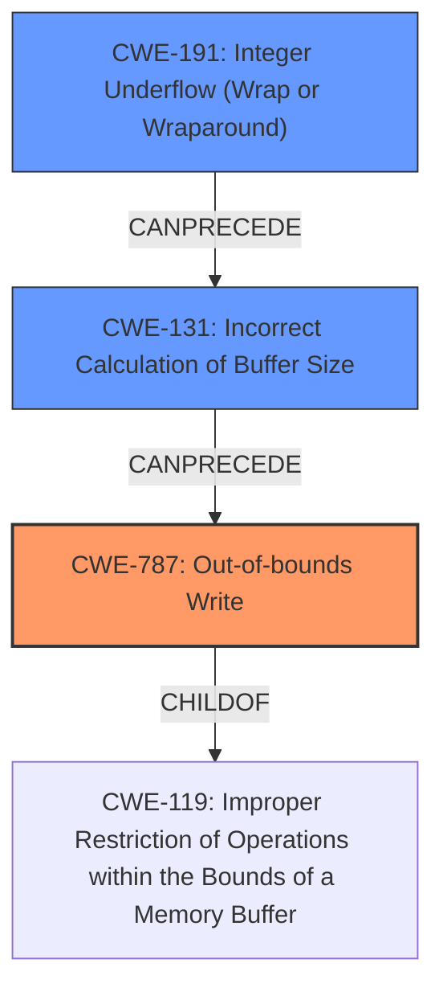

# Final Resolution for CVE-2022-20073

# Summary
| CWE ID | CWE Name | Confidence | CWE Abstraction Level | CWE Vulnerability Mapping Label | CWE-Vulnerability Mapping Notes |
|---|---|---|---|---|---|
| CWE-787 | Out-of-bounds Write | 0.9 | Base | Primary | Allowed |
| CWE-191 | Integer Underflow (Wrap or Wraparound) | 0.8 | Base | Secondary | Allowed |
| CWE-131 | Incorrect Calculation of Buffer Size | 0.6 | Base | Related | Allowed |

## Evidence and Confidence

*   **Confidence Score:** 0.9
*   **Evidence Strength:** HIGH

## Relationship Analysis
The primary weakness is **CWE-787 (Out-of-bounds Write)**, which is caused by the incorrect buffer size calculation resulting from an **integer underflow**. **CWE-191 (Integer Underflow)** leads to **CWE-131 (Incorrect Calculation of Buffer Size)**, which then leads to **CWE-787 (Out-of-bounds Write)**. **CWE-119 (Improper Restriction of Operations within the Bounds of a Memory Buffer)** is the parent of **CWE-787**, but **CWE-787** is more specific.

## Vulnerability Chain
The vulnerability chain starts with an **integer underflow** (**CWE-191**). This underflow leads to an **incorrect calculation of the buffer size** (**CWE-131**). The incorrect buffer size then results in an **out-of-bounds write** (**CWE-787**). The impact is local escalation of privilege.

## Summary of Analysis
The initial analysis correctly identified **CWE-787 (Out-of-bounds Write)** as the primary weakness and **CWE-191 (Integer Underflow)** as a contributing factor. The criticism suggested adding **CWE-131 (Incorrect Calculation of Buffer Size)**.

The vulnerability description states "In preloader (usb), there is a possible **out of bounds write** due to a **integer underflow**." This statement serves as direct evidence for both **CWE-787** and **CWE-191**. The addition of **CWE-131** helps clarify the connection between the **integer underflow** and the **out-of-bounds write**, as the underflow directly leads to an incorrect size calculation.

The graph relationships confirm that **CWE-787** is the most specific base-level CWE to describe the vulnerability, and **CWE-191** and **CWE-131** are contributing factors in the chain. The abstraction levels are all base, which is optimal.

The final classification reflects the optimal level of specificity because it accurately describes the root cause (**integer underflow**), the intermediate step (**incorrect buffer size calculation**), and the resulting vulnerability (**out-of-bounds write**). The confidence score is increased for **CWE-191** as **CWE-131** is now included in the analysis, making the path from underflow to out-of-bounds write more concrete. The confidence score for CWE-131 is lower as it is implied rather than explicit.