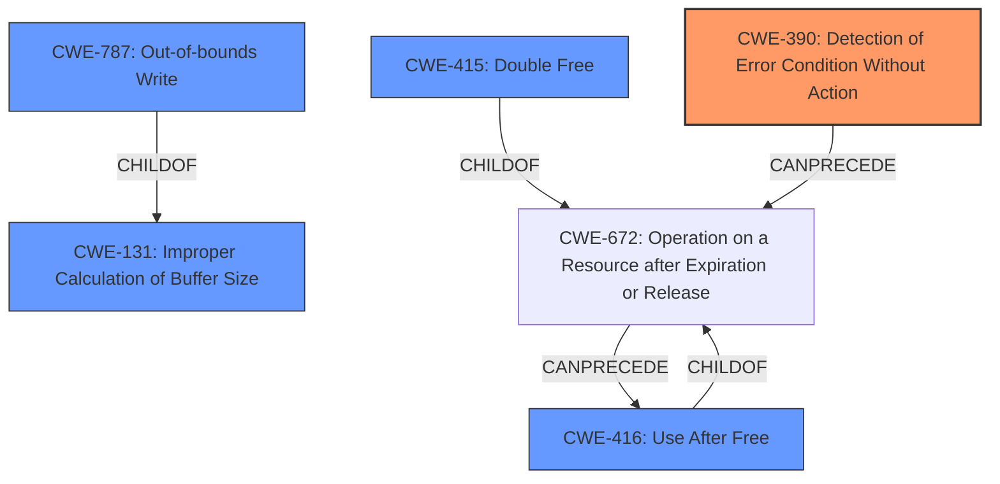

# Final Resolution for CVE-2022-20076

# Summary
| CWE ID  | CWE Name                                                                                                | Confidence | CWE Abstraction Level | CWE Vulnerability Mapping Label | CWE-Vulnerability Mapping Notes |
| :-------- | :------------------------------------------------------------------------------------------------------- | :---------- | :----------------------- | :------------------------------- | :--------------------------------- |
| CWE-390 | Detection of Error Condition Without Action | 0.75      | Base                    | Allowed                          | Primary CWE                                          |
| CWE-131 | Improper Calculation of Buffer Size | 0.65      | Base                    | Allowed                          | Secondary Candidate                                          |
| CWE-416 | Use After Free                                                                                              | 0.60      | Variant                    | Allowed                        | Secondary Candidate                                          |
| CWE-415 | Double Free                                                                                              | 0.50      | Variant                    | Allowed                        | Secondary Candidate                                          |
| CWE-787 | Out-of-bounds Write                                                                                              | 0.45      | Base                    | Allowed                        | Secondary Candidate                                          |

## Evidence and Confidence

*   **Confidence Score:** 0.75
*   **Evidence Strength:** MEDIUM

## Relationship Analysis
The initial analysis correctly identified CWE-390 as the primary issue. The criticism highlighted other potential candidates and relationships. The most impactful relationship consideration was that of CWE-131 (**Improper Calculation of Buffer Size**) , which can directly lead to buffer overflows and memory corruption, as well as the chain relationship where CWE-390 can lead to CWE-672 (Operation on a Resource after Expiration or Release), and subsequently to CWE-416 (**Use After Free**). Considering these relationships, CWE-131 was added as a secondary candidate.

## Vulnerability Chain
The vulnerability chain starts with **CWE-390 (Detection of Error Condition Without Action)**. This leads to a failure to properly manage resources or handle exceptional conditions. The lack of error handling can then manifest in several ways:

1.  **Improper Buffer Size Calculation (CWE-131):** The error handling failure can result in an incorrect buffer size calculation, which can then lead to a buffer overflow.
2.  **Use-After-Free (CWE-416):** The error handling failure can lead to premature freeing of memory, and a subsequent access to this memory region results in a use-after-free condition.
3.  **Double-Free (CWE-415):** Incomplete or faulty error recovery can result in the same memory being freed twice.
4.  **Out-of-Bounds Write (CWE-787):** An index might not be properly reset or validated after an error, leading to a write beyond the bounds of the allocated buffer.

The final impact is local information disclosure due to memory corruption.

## Summary of Analysis
The initial analysis identified **CWE-390 (Detection of Error Condition Without Action)** as the primary issue, which is supported by the CVE reference materials stating "**Improper error handling in ged**". The criticism suggested considering other root causes, especially **CWE-131 (Improper Calculation of Buffer Size)** and **CWE-908 (Use of Uninitialized Resource)**. While **CWE-908** is plausible, the description says "**memory corruption** due to an **incorrect error handling**". The most direct cause of memory corruption would be that the improper error handling leads to an incorrect buffer size calculation (**CWE-131**), which can then lead to a buffer overflow. This chain of events provides a more specific and direct link than simply using an uninitialized resource. Therefore, **CWE-131** was added as a secondary candidate.

The selection of **CWE-390** as the primary CWE is based on the evidence of improper error handling. The other CWEs are secondary candidates because the memory corruption could manifest in those ways. The selected CWEs are at the optimal level of specificity, with **CWE-390** being a Base CWE representing the root cause and the others being Variant or Base CWEs representing the potential consequences.