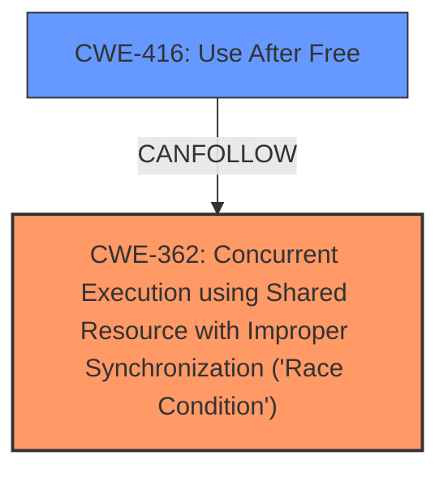

# Final Resolution for CVE-2022-20077

# Summary
| CWE ID | CWE Name | Confidence | CWE Abstraction Level | CWE Vulnerability Mapping Label | CWE-Vulnerability Mapping Notes |
|---|---|---|---|---|---|
| CWE-362 | Concurrent Execution using Shared Resource with Improper Synchronization ('Race Condition') | 0.95 | Class | Allowed-with-Review | Primary CWE |
| CWE-416 | Use After Free | 0.75 | Variant | Allowed | Secondary Candidate |

## Evidence and Confidence

*   **Confidence Score:** 0.95
*   **Evidence Strength:** HIGH

## Relationship Analysis
The primary weakness, CWE-362, is a Class-level CWE, and the analysis correctly identified that while more specific children exist (CWE-366, CWE-367, CWE-667), they are not appropriate given the lack of specific details in the vulnerability description. CWE-416, a Variant-level CWE, is correctly identified as a potential consequence of the race condition. The relationship between CWE-362 and CWE-416 is further supported by the "CanPrecede" relationship in the CWE definitions, showing that a race condition can lead to a use-after-free.

## Vulnerability Chain
The vulnerability chain starts with a **race condition** (CWE-362), which leads to **memory corruption**. This **memory corruption** can then lead to a Use-After-Free condition (CWE-416). The initial flaw is the improper synchronization of shared resources, and the final impact is potential local escalation of privilege.

## Summary of Analysis
The initial analysis and criticism are both well-justified. The vulnerability description explicitly mentions a **race condition** leading to **memory corruption**, which strongly supports the assignment of CWE-362 as the primary weakness. The analysis also correctly identifies CWE-416 as a potential consequence, given the possibility that the **memory corruption** could result in memory being freed and then accessed again. The provided evidence is sufficient to support the classification, and the confidence scores are appropriate. The selection of CWEs reflects the optimal level of specificity based on the available evidence.

The analysis is based on the following evidence from the vulnerability description: "In vow, there is a possible memory corruption due to a race condition. This could lead to local escalation of privilege..." The graph relationship supports the selection, as CWE-362 can lead to CWE-416. The selected CWEs are at the optimal level of specificity because the description doesn't provide enough detail to choose a more specific child of CWE-362, but it does suggest that memory corruption is a potential consequence, making CWE-416 a reasonable secondary candidate.