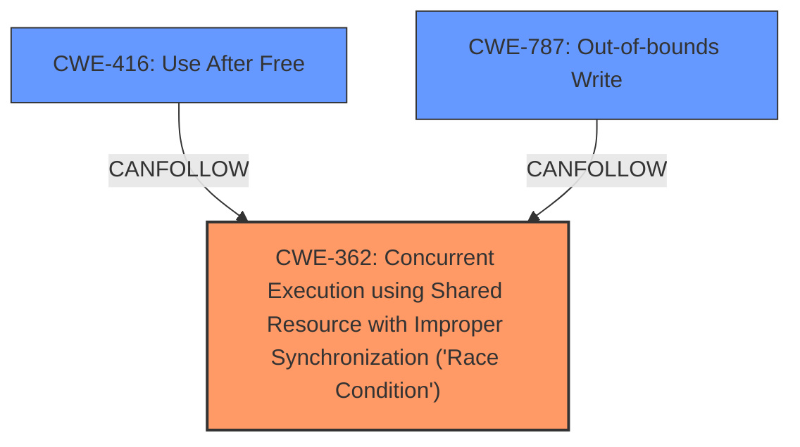

# Final Resolution for CVE-2022-20078

# Summary
| CWE ID | CWE Name | Confidence | CWE Abstraction Level | CWE Vulnerability Mapping Label | CWE-Vulnerability Mapping Notes |
|---|---|---|---|---|---|
| CWE-362 | Concurrent Execution using Shared Resource with Improper Synchronization ('**Race Condition**') | 0.85 | Class | Primary | Allowed-with-Review |
| CWE-416 | Use After Free | 0.60 | Variant | Secondary | Allowed |
| CWE-787 | Out-of-bounds Write | 0.60 | Base | Secondary | Allowed |

## Evidence and Confidence

*   **Confidence Score:** 0.80
*   **Evidence Strength:** HIGH

## Relationship Analysis
The primary **CWE-362** (Concurrent Execution using Shared Resource with Improper Synchronization ('**Race Condition**')) is a Class-level CWE. While more specific Base CWEs exist as children, the provided information doesn't allow for a more specific selection. **CWE-416** (Use After Free) and **CWE-787** (Out-of-bounds Write) are potential consequences of the **memory corruption** caused by the **race condition**, forming a potential chain of weaknesses.

## Vulnerability Chain
The vulnerability chain starts with **CWE-362** (Concurrent Execution using Shared Resource with Improper Synchronization ('**Race Condition**')), which leads to **memory corruption**. This **memory corruption** can manifest as either **CWE-416** (Use After Free) or **CWE-787** (Out-of-bounds Write), ultimately leading to local escalation of privilege.

## Summary of Analysis
The initial analysis correctly identifies **CWE-362** (Concurrent Execution using Shared Resource with Improper Synchronization ('**Race Condition**')) as the primary weakness due to the explicit mention of a **race condition** in the vulnerability description: "In vow, there is a possible **memory corruption** due to a **race condition**." The secondary **CWEs**, **CWE-416** (Use After Free) and **CWE-787** (Out-of-bounds Write), are plausible consequences of the **memory corruption**.

The criticism suggests acknowledging the "Allowed-with-Review" mapping guidance for **CWE-362** and explaining why a more specific Base **CWE** isn't possible with the available information. It also suggests reducing the confidence score for **CWE-416** and clarifying the relationships between the **CWEs**.

I agree with the criticism. Given the generic description of the vulnerability, selecting a child of **CWE-362** isn't feasible. The confidence score for **CWE-416** has been reduced to 0.60 to reflect that it's a *possible* consequence of the **memory corruption**. The relationships have been clarified to state that **CWE-416** and **CWE-787** are potential consequences of the **memory corruption** caused by **CWE-362**. The selected **CWEs** are at the optimal level of specificity based on the available evidence.