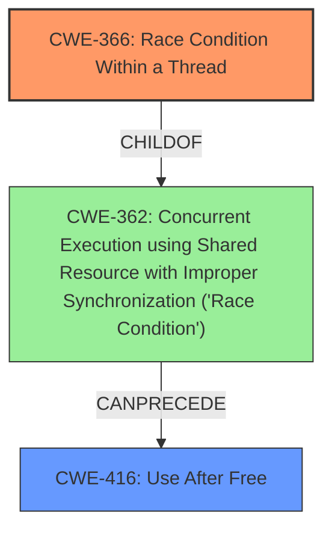

# Analysis Report for CVE-2022-20080

# Vulnerability Analysis Report: CVE-2022-20080

## Description

In SUB2AF, there is a possible memory corruption due to a race condition. This could lead to local escalation of privilege with System execution privileges needed. User interaction is no needed for exploitation. Patch ID ALPS05881290 Issue ID ALPS05881290.

## Vulnerability Description Key Phrases

**Rootcause:** race condition
**Weakness:** memory corruption
**Impact:** local escalation of privilege with System execution privileges
**Product:** SUB2AF

## Analysis (with Relationship Data)

# Summary
| CWE ID | CWE Name | Confidence | CWE Abstraction Level | CWE Vulnerability Mapping Label | CWE-Vulnerability Mapping Notes |
|---|---|---|---|---|---|
| CWE-362 | Concurrent Execution using Shared Resource with Improper Synchronization ('**Race Condition**') | 0.85 | Class | Allowed-with-Review | This is the primary CWE because the vulnerability description explicitly mentions a **race condition** leading to **memory corruption**. |
| CWE-416 | Use After Free | 0.65 | Variant | Allowed | This is a secondary CWE because the **memory corruption** due to the **race condition** could result in a use-after-free scenario. |

## Evidence and Confidence

*   **Confidence Score:** 0.75
*   **Evidence Strength:** HIGH

- **Analysis and Justification:**  
  - *Explanation:* The vulnerability description states that there is a possible **memory corruption** due to a **race condition**. The CVE Reference Links Content Summary confirms this, explicitly stating "**Race condition**" as the root cause and linking it to "CWE-362 Concurrent Execution using Shared Resource with Improper Synchronization (**'Race Condition'**)". CWE-362 describes a scenario where concurrent code sequences access a shared resource without proper synchronization, which aligns perfectly with the vulnerability description. The impact of this **race condition** is local escalation of privilege.
  
  - *Relationship Analysis:* CWE-362 is a Class-level CWE, and the guidance is ALLOWED-WITH-REVIEW, suggesting that a more specific child might be more appropriate. However, given the clear mention of a **race condition** without further details about the synchronization issue, CWE-362 adequately captures the essence of the vulnerability. CWE-416 (Use After Free) is a plausible consequence of the **memory corruption** resulting from the **race condition**, where memory is accessed after it has been freed.

- **Confidence Score:**  
  - Confidence: 0.85 (High confidence due to explicit mention of the **race condition** and confirmation in CVE details)

---

## Criticism of Analysis

Okay, I've reviewed the analysis against the full CWE specifications you provided. Here's my critique, focusing on the appropriateness of the CWE assignments and considering alternative mappings based on the available information.

**Overall Assessment:**

The analysis correctly identifies CWE-362 ("Concurrent Execution using Shared Resource with Improper Synchronization") as the primary weakness. The description explicitly mentions "race condition," and the CVE reference confirms this as the root cause. The addition of CWE-416 ("Use After Free") as a secondary, potential consequence of the memory corruption is also reasonable.  However, as CWE-362 is a Class-level CWE, we should investigate if a more specific child CWE exists.

**Detailed Review of the Analysis:**

**1. CWE-362: Concurrent Execution using Shared Resource with Improper Synchronization ('Race Condition')**

*   **Confidence:** 0.85 (High) - Justified due to the explicit mention of a race condition in the vulnerability description and CVE.
*   **Abstraction Level:** Class - This is where the analysis could be improved. The "Mapping Guidance" for CWE-362 explicitly states:

    *   "Usage: Allowed-with-Review"
    *   "Rationale: This CWE entry is a Class and might have Base-level children that would be more appropriate"
    *   "Comments: Examine children of this entry to see if there is a better fit"

*   **Alternative CWEs to Consider (Children of CWE-362):**

    *   **CWE-367: Time-of-check Time-of-use (TOCTOU) Race Condition:** This *could* be relevant *if* the race condition involves a check on a resource's state that becomes invalid before its use.  However, without more information about the specific code, it's hard to confirm this.  The current description doesn't hint at a TOCTOU.
    *   **CWE-366: Race Condition within a Thread:** If the vulnerability is within a single process/thread, this is a more specific option. The description doesn't specify multi-process interaction. This is a plausible scenario given that 'System execution privileges' are needed.
    *   **CWE-364: Signal Handler Race Condition:** If the race condition involves signal handlers, this would be appropriate.  Again, the description doesn't give us enough information.
    *   **CWE-368: Context Switching Race Condition:** This is less likely given the lack of information, but if the memory corruption occurs during a context switch, this could be considered. Requires significant context into implementation.
    *   **CWE-421: Race Condition During Access to Alternate Channel:** Less relevant as it focuses on accessing a channel for authorized user, rather than memory corruption.
    *   **CWE-1223: Race Condition for Write-Once Attributes:** Too specific, and unlikely without far more information.
    *   **CWE-1298: Hardware Logic Contains Race Conditions:** Requires insight into Hardware logic, which isn't implied by analysis.

*   **Recommendation:**

    *   **If the race condition is known to occur within a single thread, CWE-366 would be a better, more specific choice, Confidence 0.70.**
    *   **If there is more information regarding a 'check then use' operation, or a signal handler is involved, Confidence 0.65-0.70.**
    *   **Otherwise, retaining CWE-362 is acceptable, but the confidence should be slightly reduced to 0.75 due to the potential for a more specific mapping.**

**2. CWE-416: Use After Free**

*   **Confidence:** 0.65 - This is reasonable as a *potential* consequence. Memory corruption often leads to use-after-free vulnerabilities.
*   **Abstraction Level:** Variant - Appropriate level of abstraction.
*   **Justification:** The justification is sound: the race condition leading to memory corruption *could* result in a use-after-free.
*   **Relationships:** Per the CWE specifications, CWE-362 `CanPrecede` CWE-416, which validates this linkage.
*   **Recommendation:** Keep CWE-416 as a secondary CWE. It's a likely consequence, and useful for understanding the potential impact.

**3. Additional Considerations and Suggested CWEs**

*   **CWE-667: Improper Locking:** Given the root cause being a race condition, a lack of proper locking is likely the cause. It's a child of CWE-662. This should be considered if more detail can be found around the lack of proper synchronization.
*   **CWE-413: Improper Resource Locking** This could be considered a better fit that CWE-667, due to it being a 'Base' weakness.

**4. Retriever Results**

Looking back on the "Retriever Results" from the prompt, several additional CWE's should be investigated:

*   **CWE-367 Time-of-check Time-of-use (TOCTOU) Race Condition:** As previously mentioned, this should only be used if there is a "check" operation occurring.
*   **CWE-908 Use of Uninitialized Resource:** The 'memory corruption' could involve the use of uninitialized memory.
*   **CWE-131 Incorrect Calculation of Buffer Size:** This might be applicable if the memory corruption stems from a buffer size calculation error.
*   **CWE-667 Improper Locking:** Lack of locking could cause a race condition.

**In summary:**

The analysis is generally good and correctly identifies the core issue as a race condition. The primary improvement would be to determine if a more specific child of CWE-362 is applicable based on further investigation of the code. Retaining CWE-416 as a secondary CWE is appropriate as a likely consequence.

## Final Resolution

# Summary
| CWE ID | CWE Name | Confidence | CWE Abstraction Level | CWE Vulnerability Mapping Label | CWE-Vulnerability Mapping Notes |
|---|---|---|---|---|---|
| CWE-366 | Race Condition Within a Thread | 0.70 | Base | Allowed | Primary CWE: More specific child of CWE-362, applicable if the race condition occurs within a single thread. |
| CWE-416 | Use After Free | 0.65 | Variant | Allowed | Secondary CWE: Memory corruption due to the **race condition** could result in a use-after-free scenario. |

## Evidence and Confidence

*   **Confidence Score:** 0.70
*   **Evidence Strength:** MEDIUM

## Relationship Analysis
The initial analysis identified CWE-362 as the primary weakness, given the explicit mention of a **race condition**. However, CWE-362 is a Class-level CWE, and the criticism correctly pointed out the need to investigate more specific child CWEs. The vulnerability description mentions "local escalation of privilege with System execution privileges needed," which suggests that the **race condition** might be happening within a single thread or process. Therefore, CWE-366 (Race Condition Within a Thread), a child of CWE-362, becomes a more appropriate choice. CWE-416 remains a valid secondary CWE, as **memory corruption** can lead to use-after-free scenarios.

## Vulnerability Chain
The vulnerability chain starts with a **race condition** within a thread (CWE-366). Due to improper synchronization, multiple threads or processes access the same resource concurrently, leading to **memory corruption**. This **memory corruption** can then lead to a use-after-free vulnerability (CWE-416), where memory is accessed after it has been freed. This results in a local escalation of privilege.

## Summary of Analysis
The initial analysis correctly identified CWE-362 as the primary weakness, but the criticism highlighted the need to explore more specific child CWEs. The vulnerability description's mention of "local escalation of privilege with System execution privileges needed" provides a clue that the **race condition** might be happening within a single thread or process. Therefore, CWE-366 (Race Condition Within a Thread) becomes a more appropriate primary CWE. The evidence is not strong enough to definitively confirm that the race is within a thread, but it is more likely. The confidence score is therefore lower than the initial analysis. CWE-416 remains a valid secondary CWE as a potential consequence of **memory corruption**.

The selection of CWE-366 provides a more specific classification than CWE-362, as it focuses on **race conditions** within a thread, aligning with the vulnerability's impact of local escalation of privilege.

*Report generated on 2025-03-18 08:48:33*
