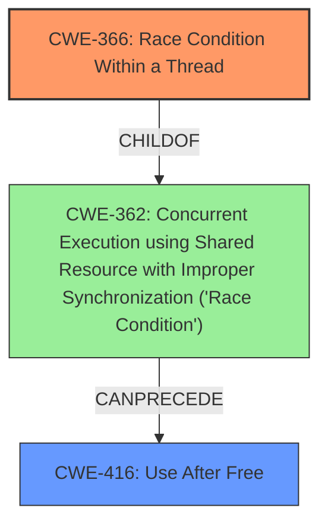

# Final Resolution for CVE-2022-20080

# Summary
| CWE ID | CWE Name | Confidence | CWE Abstraction Level | CWE Vulnerability Mapping Label | CWE-Vulnerability Mapping Notes |
|---|---|---|---|---|---|
| CWE-366 | Race Condition Within a Thread | 0.70 | Base | Allowed | Primary CWE: More specific child of CWE-362, applicable if the race condition occurs within a single thread. |
| CWE-416 | Use After Free | 0.65 | Variant | Allowed | Secondary CWE: Memory corruption due to the **race condition** could result in a use-after-free scenario. |

## Evidence and Confidence

*   **Confidence Score:** 0.70
*   **Evidence Strength:** MEDIUM

## Relationship Analysis
The initial analysis identified CWE-362 as the primary weakness, given the explicit mention of a **race condition**. However, CWE-362 is a Class-level CWE, and the criticism correctly pointed out the need to investigate more specific child CWEs. The vulnerability description mentions "local escalation of privilege with System execution privileges needed," which suggests that the **race condition** might be happening within a single thread or process. Therefore, CWE-366 (Race Condition Within a Thread), a child of CWE-362, becomes a more appropriate choice. CWE-416 remains a valid secondary CWE, as **memory corruption** can lead to use-after-free scenarios.

## Vulnerability Chain
The vulnerability chain starts with a **race condition** within a thread (CWE-366). Due to improper synchronization, multiple threads or processes access the same resource concurrently, leading to **memory corruption**. This **memory corruption** can then lead to a use-after-free vulnerability (CWE-416), where memory is accessed after it has been freed. This results in a local escalation of privilege.

## Summary of Analysis
The initial analysis correctly identified CWE-362 as the primary weakness, but the criticism highlighted the need to explore more specific child CWEs. The vulnerability description's mention of "local escalation of privilege with System execution privileges needed" provides a clue that the **race condition** might be happening within a single thread or process. Therefore, CWE-366 (Race Condition Within a Thread) becomes a more appropriate primary CWE. The evidence is not strong enough to definitively confirm that the race is within a thread, but it is more likely. The confidence score is therefore lower than the initial analysis. CWE-416 remains a valid secondary CWE as a potential consequence of **memory corruption**.

The selection of CWE-366 provides a more specific classification than CWE-362, as it focuses on **race conditions** within a thread, aligning with the vulnerability's impact of local escalation of privilege.