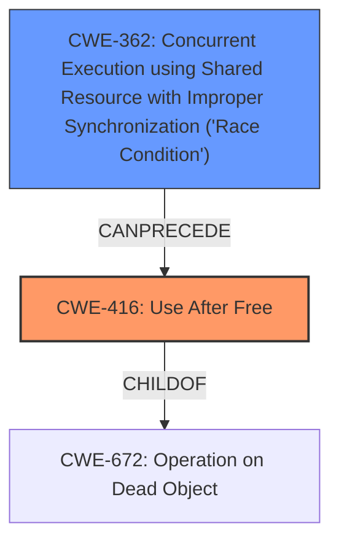

# Analysis Report for CVE-2022-20082

# Vulnerability Analysis Report: CVE-2022-20082

## Description

In GPU, there is a possible use after free due to a race condition. This could lead to local escalation of privilege with no additional execution privileges needed. User interaction is not needed for exploitation. Patch ID ALPS07044730 Issue ID ALPS07044730.

## Vulnerability Description Key Phrases

**Rootcause:** race condition
**Weakness:** use after free
**Impact:** local escalation of privilege
**Product:** GPU

## Analysis (with Relationship Data)

# Summary
| CWE ID | CWE Name | Confidence | CWE Abstraction Level | CWE Vulnerability Mapping Label | CWE-Vulnerability Mapping Notes |
|---|---|---|---|---|---|
| CWE-416 | Use After Free | 0.95 | Variant | Allowed | Primary CWE |
| CWE-362 | Concurrent Execution using Shared Resource with Improper Synchronization ('Race Condition') | 0.90 | Class | Allowed-with-Review | Secondary Candidate |

## Evidence and Confidence

*   **Confidence Score:** 0.93
*   **Evidence Strength:** HIGH

- **Analysis and Justification:**  
  - *Explanation:* The vulnerability description explicitly states a "**use after free** due to a **race condition**" in the GPU. This directly corresponds to CWE-416 (Use After Free), where memory is accessed after it has been freed. The fact that a **race condition** triggers this **use after free** implies that the memory corruption occurs due to concurrent access issues. The vulnerability details section of the CVE reference confirms "**Use after free**" as a weakness. CWE-416 is a Variant level CWE, which is a preferred level of abstraction, and its usage is "Allowed" according to MITRE mapping guidance.

  - *Relationship Analysis:* CWE-416 (Use After Free) is often related to concurrency issues and can lead to various exploitable conditions. The "CANFOLLOW" relationships of CWE-416 include CWE-754 (Improper Check for Unusual or Exceptional Conditions), CWE-364 (Signal Handler Race Condition), and CWE-362 (Concurrent Execution using Shared Resource with Improper Synchronization ('Race Condition')). While these relationships don't directly influence the primary mapping, they highlight potential consequences and contributing factors. The **race condition** **rootcause** supports a relationship to CWE-362.

- **Confidence Score:**  
  - Confidence: 0.95 (High confidence due to direct mention of "use after free" and "race condition" in the description and CVE reference).

---

- **Analysis and Justification:**  
  - *Explanation:* The vulnerability description highlights a "**race condition**" as the **rootcause** leading to the **use after free**. CWE-362 (Concurrent Execution using Shared Resource with Improper Synchronization ('Race Condition')) describes a scenario where concurrent code accesses a shared resource without proper synchronization, leading to exploitable timing windows. The CVE reference confirms "**Race condition**" as the **rootCause** and also lists "Improper Synchronization" as a weakness. While CWE-362 is a Class level CWE, it is a reasonable secondary mapping to capture the concurrency aspect of the vulnerability. Its usage is "Allowed-with-Review," suggesting a review for more specific base-level CWEs, but none of the base-level suggestions fit as well.

  - *Relationship Analysis:* CWE-362 is related to other concurrency-related CWEs like CWE-667 (Improper Locking) and CWE-366 (Race Condition within a Thread). These relationships reinforce the importance of considering concurrency as a key aspect of this vulnerability.

- **Confidence Score:**  
  - Confidence: 0.90 (High confidence as the CVE reference confirms the race condition rootcause, but slightly lower than CWE-416 as CWE-362 is a class-level CWE and the use after free is the more direct weakness).

## Criticism of Analysis

Okay, I have reviewed your CWE mapping analysis against the full CWE specifications you provided. Here's my critique, focusing on the appropriateness of your chosen CWEs and their stated confidence levels:

**Overall Assessment:**

The analysis is generally well-reasoned and demonstrates a good understanding of the CWE specifications. The choice of CWE-416 as the primary mapping and CWE-362 as a secondary candidate is justified by the vulnerability description. The confidence scores are appropriate. The inclusion of supporting evidence and relationship analysis strengthens the rationale.

**Specific Comments:**

*   **CWE-416 (Use After Free):**
    *   **Mapping Justification:** Excellent. The direct mention of "use after free" in the vulnerability description makes this a very strong candidate. The abstraction level (Variant) is ideal per CWE's mapping guidance.
    *   **Evidence Strength:** The evidence is indeed HIGH. The explicit mention of "use after free" is definitive.
    *   **Relationship Analysis:** The discussion of the "CANFOLLOW" relationships is helpful, and mentioning the relevance of CWE-362 due to the race condition is a good connection.
    *   **Confidence Score:** 0.95 is appropriate.
    *   **Mitigations:** The suggested mitigations are relevant. Choosing a language with automatic memory management is a fundamental, architecture-level defense. Setting freed pointers to NULL is a standard implementation-level technique, though its effectiveness can be limited in complex codebases, as noted.

*   **CWE-362 (Concurrent Execution using Shared Resource with Improper Synchronization ('Race Condition'))**
    *   **Mapping Justification:** This is a suitable secondary mapping. The "race condition" rootcause clearly points to a concurrency issue.
    *   **Abstraction Level:** The analysis acknowledges that CWE-362 is a Class-level CWE, which is less specific than preferred, but explains why more specific Base-level CWEs might not fit as well.
    *   **Relationship Analysis:** The discussion of related concurrency CWEs is valuable.
    *   **Confidence Score:** 0.90 is reasonable. It's slightly lower than CWE-416 because it's a Class-level CWE and represents the *cause* of the UAF, rather than the UAF itself, making it a slightly less direct match.
     *  **Mitigations:** Mitigations focus on using synchronization primitives, thread-safe capabilities, and minimizing shared resources. All are highly relevant in addressing the root cause.

**Retriever Results Commentary:**

*   The retriever results are mostly aligned with the analysis.
*   CWE-366 (Race Condition within a Thread) is a child of CWE-362. If the analyzer knows that the race condition is within a single thread, then CWE-366 might be considered instead of CWE-362. Without the information that the Race Condition is explicitly within a thread, CWE-362 is the safer bet.
*   The presence of CWE-908 (Use of Uninitialized Resource) and CWE-413 (Improper Resource Locking) in the top retriever results suggests that these could be contributing or related factors in *some* UAF vulnerabilities but are not the primary issue here given the description.
*   CWE-662 (Improper Synchronization) being discouraged is noted.

**Suggestions for Improvement:**

1.  **Specificity of Race Condition:** While CWE-362 is appropriate given the information, consider whether further investigation could reveal a more specific type of race condition. For example, is it a TOCTOU (Time-of-Check Time-of-Use) issue (CWE-367)? Is it happening within a signal handler (CWE-364)? Or is it related to improper locking (CWE-667, with children CWE-413, CWE-414)? It's probably not possible without more details, but mentioning these possibilities demonstrates thoroughness. However, don't *force* a mapping if it's not genuinely supported by the evidence. In particular, avoid mapping to CWE-662, as it's discouraged.

2.  **Mitigation Specificity:** The mitigations listed are general. Try to connect specific mitigations to the *specific* UAF/race condition scenario in the GPU driver.  For instance, if specific data structures are involved, discuss how those structures could be better protected with locking or thread-safe data structures. If signal handlers are involved, discuss the mitigations for signal handler race conditions.

3.  **Consider 'Chain' Relationships:** Your analysis alludes to chain relationships (e.g., Race Condition leads to Use-After-Free). Consider explicitly stating the relationship. This could be "CWE-362 *leads to* CWE-416."

**Revised Summary Table (Optional):**

You *could* revise the table to include a column for "CWE Chain":

| CWE ID | CWE Name | Confidence | CWE Abstraction Level | CWE Vulnerability Mapping Label | CWE-Vulnerability Mapping Notes | CWE Chain |
|---|---|---|---|---|---|---|
| CWE-416 | Use After Free | 0.95 | Variant | Allowed | Primary CWE | *From CWE-362* |
| CWE-362 | Concurrent Execution using Shared Resource with Improper Synchronization ('Race Condition') | 0.90 | Class | Allowed-with-Review | Secondary Candidate | *Leads to CWE-416* |

**Conclusion:**

Your analysis is strong and well-justified. The suggested improvements are minor and aimed at increasing the thoroughness and practical applicability of the assessment. The confidence scores are appropriate for the available information.

## Final Resolution

# Summary
| CWE ID | CWE Name | Confidence | CWE Abstraction Level | CWE Vulnerability Mapping Label | CWE-Vulnerability Mapping Notes |
|---|---|---|---|---|---|
| **CWE-416** | **Use After Free** | 0.95 | Variant | Allowed | Primary CWE |
| **CWE-362** | **Concurrent Execution using Shared Resource with Improper Synchronization ('Race Condition')** | 0.90 | Class | Allowed-with-Review | Secondary Candidate |

## Evidence and Confidence

*   **Confidence Score:** 0.93
*   **Evidence Strength:** HIGH

## Relationship Analysis
The primary relationship is that the **CWE-362** Concurrent Execution using Shared Resource with Improper Synchronization ('**Race Condition**') can lead to **CWE-416** **Use After Free**. **CWE-416** is a variant of **CWE-672** which is Operations on Dead Object. **CWE-362** is a class level CWE, with more specific base level CWEs as children.

## Vulnerability Chain
The vulnerability chain starts with a **CWE-362** Concurrent Execution using Shared Resource with Improper Synchronization ('**Race Condition**'). Due to the improper synchronization, a memory resource is freed while another thread is still accessing it, leading to **CWE-416** **Use After Free**. The impact is local escalation of privilege.

## Summary of Analysis
The initial analysis and the criticism are both well-reasoned and accurate. The vulnerability description explicitly states a "**use after free** due to a **race condition**". This provides direct evidence for both **CWE-416** and **CWE-362**.

The relationship analysis confirms that **CWE-362** can lead to **CWE-416**, solidifying the proposed vulnerability chain. Although **CWE-362** is a Class level CWE, the criticism correctly notes that without further investigation to determine a more specific type of race condition, it is difficult to select a more specific Base level CWE.

The selected CWEs are at the optimal level of specificity given the available evidence. More detailed information would be required to select a more specific child of **CWE-362**.

*Report generated on 2025-03-18 08:49:28*
