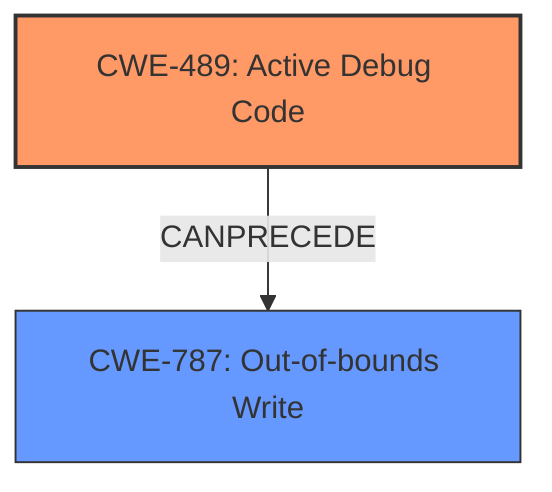

# Final Resolution for CVE-2022-20089

# Summary
| CWE ID | CWE Name | Confidence | CWE Abstraction Level | CWE Vulnerability Mapping Label | CWE-Vulnerability Mapping Notes |
|---|---|---|---|---|---|
| CWE-489 | Active Debug Code | 0.9 | Base | Primary | Allowed |
| CWE-787 | Out-of-bounds Write | 0.6 | Base | Secondary Candidate | Allowed |

## Evidence and Confidence

*   **Confidence Score:** 0.8
*   **Evidence Strength:** MEDIUM

## Relationship Analysis
The primary relationship considered was a chain relationship. The presence of **CWE-489: Active Debug Code** can **precede** memory corruption issues such as **CWE-787: Out-of-bounds Write**. The initial analysis correctly identified CWE-489 as the primary issue due to the explicit mention in the vulnerability description. The criticism highlighted the importance of describing the impact. By adding CWE-787 to the chain, we acknowledge the memory corruption that results from the active debug code.

## Vulnerability Chain
The vulnerability chain starts with **CWE-489 (Active Debug Code)** being present in the deployed product. This **root cause** leads to a **memory corruption**, which is manifested as **CWE-787 (Out-of-bounds Write)**. The **consequence** is a local escalation of privilege.

## Summary of Analysis
The initial analysis correctly identified **CWE-489 (Active Debug Code)** as the primary weakness. The criticism correctly pointed out the need to identify a secondary CWE to describe the impact of the active debug code. The vulnerability description explicitly states "In aee driver, there is a possible **memory corruption** due to **active debug code**". Therefore, I chose **CWE-787 (Out-of-bounds Write)** to represent the memory corruption aspect. While **CWE-416 (Use After Free)** was considered, **CWE-787 (Out-of-bounds Write)** is a more direct and common manifestation of memory corruption, especially given the limited information. The selected CWEs are at the Base level of abstraction, which is the optimal level for vulnerability mapping. The confidence in the overall assessment is high (0.8) due to the direct evidence of active debug code and the likely impact of memory corruption.