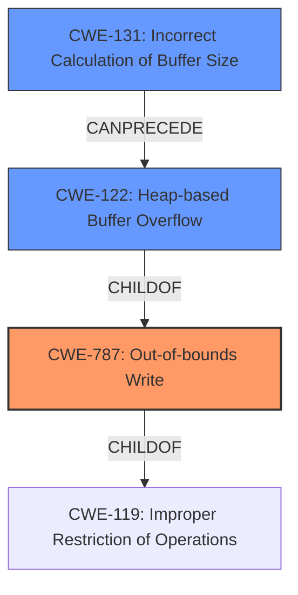

# Analysis Report for CVE-2022-20106

# Vulnerability Analysis Report: CVE-2022-20106

## Description

In MM service, there is a possible out of bounds write due to a heap-based buffer overflow. This could lead to local escalation of privilege with System execution privileges needed. User interaction is not needed for exploitation. Patch ID DTV03330460 Issue ID DTV03330460.

## Vulnerability Description Key Phrases

**Weakness:** heap-based buffer overflow
**Impact:** local escalation of privilege
**Vector:** out of bounds write

## Analysis (with Relationship Data)

# Summary
| CWE ID | CWE Name | Confidence | CWE Abstraction Level | CWE Vulnerability Mapping Label | CWE-Vulnerability Mapping Notes |
|---|---|---|---|---|---|
| CWE-787 | Out-of-bounds Write | 1.0 | Base | Primary | Allowed |
| CWE-122 | Heap-based Buffer Overflow | 0.7 | Variant | Secondary | Allowed |
| CWE-119 | Improper Restriction of Operations within the Bounds of a Memory Buffer | 0.5 | Class | Secondary | Discouraged |

## Evidence and Confidence

*   **Confidence Score:** 0.9
*   **Evidence Strength:** HIGH

- **Analysis and Justification:**  
  - *Explanation:* The vulnerability description explicitly states a "**heap-based buffer overflow**" leads to an "out of bounds write". The primary **weakness** aligns directly with CWE-787 (Out-of-bounds Write), a Base level CWE, as the root cause. The CVE Reference Links Content Summary reinforces this, stating "A heap-based buffer overflow exists due to insufficient bounds checking when writing to a buffer in the MM service." CWE-122 (Heap-based Buffer Overflow) is a variant of buffer overflow and is selected as a secondary CWE to provide more context to the type of overflow. CWE-119 is a more general class and not specific enough to be primary but applicable as a secondary CWE due to the general nature of memory corruption. The usage for CWE-787 is "Allowed" and the retriever results lists it as a possible candidate.
  
  - *Relationship Analysis:* CWE-787 is a child of CWE-119 (Improper Restriction of Operations within the Bounds of a Memory Buffer) and a parent of CWE-122 (Heap-based Buffer Overflow) and CWE-121 (Stack-based Buffer Overflow), indicating the overflow type provides additional context. The CanPrecede relationships of CWE-787 can lead to other memory corruption errors.

- **Confidence Score:**  
  - Confidence: 1.0 (Explicit mention of heap-based buffer overflow and out-of-bounds write, supported by CVE reference details)

## Criticism of Analysis

Okay, I've reviewed the provided analysis against the full CWE specifications. Here's my critique:

**Overall Assessment:**

The analysis is generally good and correctly identifies the primary CWE.  The supporting information and justification are well-reasoned. However, there are a few areas where the confidence could be improved, and the secondary CWE selections could be refined.

**Detailed Review:**

*   **CWE-787: Out-of-bounds Write (Primary)**
    *   **Confidence: 1.0 (Excellent).** The explicit mention of "out of bounds write" in the vulnerability description, combined with the heap-based buffer overflow makes this a highly accurate assessment and the justification is sound. This is the correct primary CWE. The provided specifications highlight this as the base class for buffer overflows, and the analysis notes the "Allowed" usage.
    *   **Mitigation Relevance:** The provided mitigations are relevant. Language selection, using secure libraries, and compiler-based overflow detection are all standard approaches to prevent this type of vulnerability.
*   **CWE-122: Heap-based Buffer Overflow (Secondary)**
    *   **Confidence: 0.7 (Good, but could be slightly higher given the clear description).** The vulnerability explicitly mentions "heap-based buffer overflow" so this is also a very good match.  The justification is correct; it provides more specific context. The specification highlights that it is a variant, making it suitable as a secondary CWE.
    *   **Mitigation Relevance:** The mitigations listed are very relevant here, as they are specific to heap-based overflows.
*   **CWE-119: Improper Restriction of Operations within the Bounds of a Memory Buffer (Secondary)**
    *   **Confidence: 0.5 (Low)** While CWE-119 is technically applicable (as it's the parent of CWE-787 and CWE-122), it's generally considered too broad and *discouraged* for mapping unless you don't have enough information to be more specific. The analysis itself acknowledges this, and the specification highlights it. Since we *do* have more specific information (heap-based overflow and out-of-bounds write), CWE-119 is not the best choice.
    *   **Mitigation Relevance:** The mitigations listed for CWE-119 are generally applicable to buffer overflows, but less specific than those for CWE-122.

**Recommendations for Improvement:**

1.  **Replace CWE-119 with something more specific:** Consider CWEs from the "Retriever Results" table as secondary options. Given the root cause includes insufficient bounds checking, **CWE-131: Incorrect Calculation of Buffer Size** may be more applicable, especially if the vulnerability stems from allocating an undersized buffer on the heap. Alternatively, **CWE-20: Improper Input Validation** could also be considered, but with the understanding that it's *discouraged* usage and should only be selected if the root cause was genuinely a problem with validating the *size* of the input and not just a lack of bounds checking when writing. Also consider **CWE-1284: Improper Validation of Specified Quantity in Input**, which is more specific than CWE-20 if the quantity being validated relates to the buffer size.

2.  **Consider a Chain:** Depending on the details of how the overflow is triggered, a CWE chain might be more accurate. For example, if an integer overflow leads to the undersized buffer allocation, followed by the heap overflow. A chain such as `CWE-190 -> CWE-131 -> CWE-122` would illustrate the path from integer overflow, incorrect buffer size calculation, to the final heap overflow condition.

3.  **Add more specific examples:** The existing examples are helpful, but if possible, try to find CVEs that are *very* similar to the specific vulnerability, particularly for the secondary CWEs. This will further increase confidence.

4.  **Re-evaluate Confidence if changing Secondary CWEs:** If secondary CWE recommendations are implemented, revise the "Confidence Score" based on the new evidence.

**Summary of Proposed Changes:**

| CWE ID | CWE Name | Confidence | CWE Abstraction Level | CWE Vulnerability Mapping Label | CWE-Vulnerability Mapping Notes |
|---|---|---|---|---|---|
| CWE-787 | Out-of-bounds Write | 1.0 | Base | Primary | Allowed |
| CWE-122 | Heap-based Buffer Overflow | 0.7 | Variant | Secondary | Allowed |
| CWE-131 | Incorrect Calculation of Buffer Size | 0.6 | Base | Secondary | Allowed |
| **OR** |  | | | | |
| CWE-20 | Improper Input Validation | 0.5 | Class | Secondary | Discouraged |
|**OR**| | | | | |
| CWE-1284 | Improper Validation of Specified Quantity in Input | 0.6 | Base | Secondary | Allowed |
With the consideration of these improvements, the analysis will provide a more accurate and nuanced representation of the vulnerability.

## Final Resolution

# Summary
| CWE ID | CWE Name | Confidence | CWE Abstraction Level | CWE Vulnerability Mapping Label | CWE-Vulnerability Mapping Notes |
|---|---|---|---|---|---|
| CWE-787 | Out-of-bounds Write | 1.0 | Base | Primary | Allowed |
| CWE-122 | Heap-based Buffer Overflow | 0.8 | Variant | Secondary | Allowed |
| CWE-131 | Incorrect Calculation of Buffer Size | 0.7 | Base | Secondary | Allowed |

## Evidence and Confidence

*   **Confidence Score:** 0.9
*   **Evidence Strength:** HIGH

## Relationship Analysis
The analysis centers around identifying the most specific **weakness** related to the "out-of-bounds write" caused by a "heap-based buffer overflow." CWE-787 (Out-of-bounds Write) is chosen as the primary **weakness** because it directly describes the observed behavior. CWE-122 (Heap-based Buffer Overflow) is selected to provide context about the location of the buffer. CWE-131 (Incorrect Calculation of Buffer Size) is included as a possible root cause contributing to the overflow.

## Vulnerability Chain
The vulnerability chain starts with a potential **ROOTCAUSE** such as CWE-131 (Incorrect Calculation of Buffer Size), which leads to CWE-122 (Heap-based Buffer Overflow). The overflow then results in CWE-787 (Out-of-bounds Write), allowing an attacker to overwrite memory and potentially escalate privileges.

## Summary of Analysis
The initial analysis correctly identified CWE-787 as the primary **weakness** due to the explicit mention of "out-of-bounds write" in the vulnerability description. The criticism suggested replacing CWE-119 with a more specific CWE, and I agree with this assessment. I've selected CWE-131 because it represents a plausible root cause that could lead to the heap-based buffer overflow. The vulnerability description states "In MM service, there is a possible out of bounds write due to a heap-based buffer overflow." This aligns with the chain of **weaknesses**, where an incorrect buffer size calculation could lead to an overflow, ultimately resulting in an out-of-bounds write.

The graph relationships highlight the hierarchical connections between these CWEs. CWE-131 can precede CWE-122, and CWE-122 can lead to CWE-787, which is a child of the more general CWE-119. Choosing CWE-131 provides a more specific and accurate representation of the potential root cause than the original CWE-119.

The selected CWEs are at the optimal level of specificity, with CWE-787 as the direct result, CWE-122 providing context about the location of the overflow, and CWE-131 suggesting a potential root cause related to incorrect buffer size calculation. The confidence is high due to the explicit evidence in the vulnerability description and the alignment with CWE relationships and mapping guidance.

*Report generated on 2025-03-18 08:52:08*
