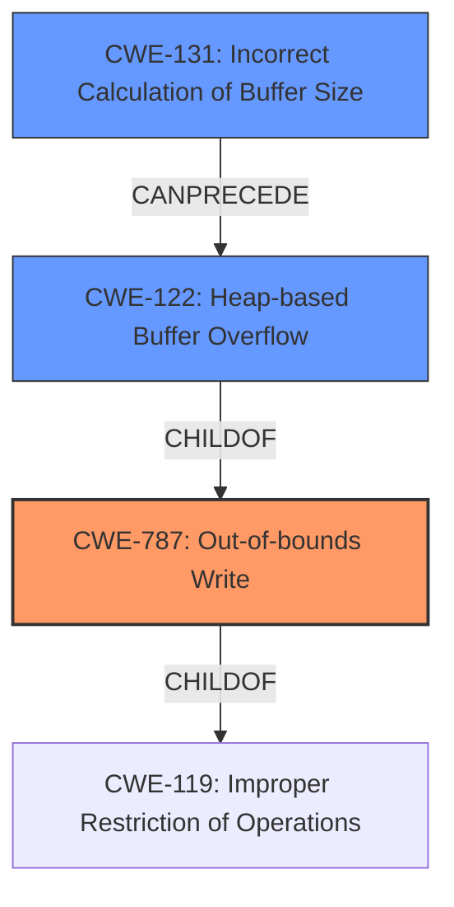

# Final Resolution for CVE-2022-20106

# Summary
| CWE ID | CWE Name | Confidence | CWE Abstraction Level | CWE Vulnerability Mapping Label | CWE-Vulnerability Mapping Notes |
|---|---|---|---|---|---|
| CWE-787 | Out-of-bounds Write | 1.0 | Base | Primary | Allowed |
| CWE-122 | Heap-based Buffer Overflow | 0.8 | Variant | Secondary | Allowed |
| CWE-131 | Incorrect Calculation of Buffer Size | 0.7 | Base | Secondary | Allowed |

## Evidence and Confidence

*   **Confidence Score:** 0.9
*   **Evidence Strength:** HIGH

## Relationship Analysis
The analysis centers around identifying the most specific **weakness** related to the "out-of-bounds write" caused by a "heap-based buffer overflow." CWE-787 (Out-of-bounds Write) is chosen as the primary **weakness** because it directly describes the observed behavior. CWE-122 (Heap-based Buffer Overflow) is selected to provide context about the location of the buffer. CWE-131 (Incorrect Calculation of Buffer Size) is included as a possible root cause contributing to the overflow.

## Vulnerability Chain
The vulnerability chain starts with a potential **ROOTCAUSE** such as CWE-131 (Incorrect Calculation of Buffer Size), which leads to CWE-122 (Heap-based Buffer Overflow). The overflow then results in CWE-787 (Out-of-bounds Write), allowing an attacker to overwrite memory and potentially escalate privileges.

## Summary of Analysis
The initial analysis correctly identified CWE-787 as the primary **weakness** due to the explicit mention of "out-of-bounds write" in the vulnerability description. The criticism suggested replacing CWE-119 with a more specific CWE, and I agree with this assessment. I've selected CWE-131 because it represents a plausible root cause that could lead to the heap-based buffer overflow. The vulnerability description states "In MM service, there is a possible out of bounds write due to a heap-based buffer overflow." This aligns with the chain of **weaknesses**, where an incorrect buffer size calculation could lead to an overflow, ultimately resulting in an out-of-bounds write.

The graph relationships highlight the hierarchical connections between these CWEs. CWE-131 can precede CWE-122, and CWE-122 can lead to CWE-787, which is a child of the more general CWE-119. Choosing CWE-131 provides a more specific and accurate representation of the potential root cause than the original CWE-119.

The selected CWEs are at the optimal level of specificity, with CWE-787 as the direct result, CWE-122 providing context about the location of the overflow, and CWE-131 suggesting a potential root cause related to incorrect buffer size calculation. The confidence is high due to the explicit evidence in the vulnerability description and the alignment with CWE relationships and mapping guidance.