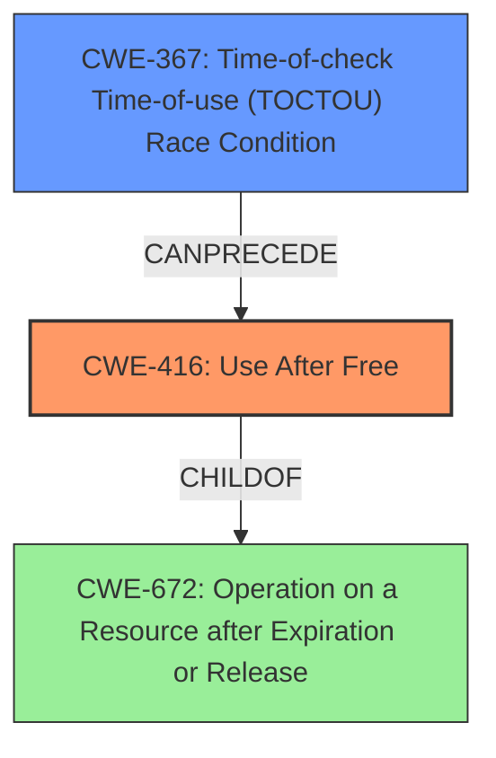

# Analysis Report for CVE-2022-20110

# Vulnerability Analysis Report: CVE-2022-20110

## Description

In ion, there is a possible use after free due to a race condition. This could lead to local escalation of privilege with no additional execution privileges needed. User interaction is not needed for exploitation. Patch ID ALPS06399915 Issue ID ALPS06399901.

## Vulnerability Description Key Phrases

**Rootcause:** race condition
**Weakness:** use after free
**Impact:** local escalation of privilege

## Analysis (with Relationship Data)

# Summary
| CWE ID  | CWE Name                                                                                                              | Confidence | CWE Abstraction Level | CWE Vulnerability Mapping Label | CWE-Vulnerability Mapping Notes |
| ------- | --------------------------------------------------------------------------------------------------------------------- | ---------- | ----------------------- | ------------------------------- | ----------------------------- |
| CWE-416 | Use After Free                                                                                                        | 0.95       | Variant                 | Primary                         | Allowed                       |
| CWE-367 | Time-of-check Time-of-use (TOCTOU) Race Condition                                                                    | 0.85       | Base                    | Secondary                       | Allowed                       |

## Evidence and Confidence

*   **Confidence Score:** 0.90
*   **Evidence Strength:** HIGH

- **Analysis and Justification:**
  - *Explanation:* The vulnerability description clearly states "**use after free** due to a **race condition**". This indicates that memory is being accessed after it has been freed, which is the core characteristic of CWE-416 (Use After Free). The reference link summary confirms this, indicating a race condition leading to a use-after-free vulnerability. CWE-416 is a Variant level CWE, which is a preferred level of abstraction. The retriever results also list CWE-416 with a high score.
  - *Relationship Analysis:* CWE-416 (Use After Free) can be related to race conditions. The vulnerability description mentions that the **use after free** is caused by a **race condition**.

- **Confidence Score:**
  - Confidence: 0.95 (High confidence due to explicit mention of "use after free" and corroborating evidence from CVE reference links)

---

- **Analysis and Justification:**
  - *Explanation:* The vulnerability description and the CVE Reference Links Content Summary both highlight a "**race condition**" as the root cause. The CVE Reference Links Content Summary further specifies this as a "Time-of-check time-of-use (TOCTOU) **race condition**", which aligns directly with CWE-367 (Time-of-check Time-of-use (TOCTOU) Race Condition). CWE-367 is a Base level CWE, which is a preferred level of abstraction. The retriever results also list CWE-367 with a high score. While other race condition related CWEs such as CWE-366 and CWE-362 are possible, the TOCTOU detail makes CWE-367 the most accurate.
  - *Relationship Analysis:* CWE-367 is related to concurrency issues and can lead to other vulnerabilities, such as CWE-416 (Use After Free).

- **Confidence Score:**
  - Confidence: 0.85 (High confidence due to the explicit mention of a TOCTOU race condition in the CVE details)

## Criticism of Analysis

Okay, here's a review of the provided analysis, incorporating the full CWE specifications you've included.

**Overall Assessment:**

The analysis is generally well-reasoned and the chosen CWE mappings are appropriate given the available information.  The use of both CWE-416 (Use After Free) and CWE-367 (Time-of-check Time-of-use (TOCTOU) Race Condition) as primary and secondary weaknesses is justified by the vulnerability description and CVE details. The confidence levels are also justifiable.

**Detailed Review:**

**1. CWE-416 (Use After Free) - Primary**

*   **Confidence:** 0.95.  This is a strong confidence rating.
*   **Justification:**  The explicit mention of "use after free" in the original description and the CVE summary makes this a very direct and strong mapping.  The analysis correctly identifies CWE-416 as a Variant level CWE which is a preferred level of abstraction.
*   **Relationship Analysis:** Excellent. The description correctly states that race conditions can lead to a use-after-free vulnerability and vice-versa. The evidence provided by CVE-2021-0920 reinforces this statement.
*   **CWE Specification Considerations:**
    *   **Mapping Guidance:** The analysis correctly acknowledges and follows the mapping guidance for CWE-416 ("Allowed" and "preferred level of abstraction").
    *   **Potential Mitigations:** The mitigations listed in the specification (language selection/automatic memory management and setting pointers to NULL after free) are relevant. While the analysis doesn't explicitly mention these, it's implicit that the fix would involve preventing the UAF, which these mitigations would address.
*   **Recommendation:** No changes needed. This is a solid mapping.

**2. CWE-367 (Time-of-check Time-of-use (TOCTOU) Race Condition) - Secondary**

*   **Confidence:** 0.85.  This is also a strong confidence rating.
*   **Justification:** The CVE details specifically mention "Time-of-check time-of-use (TOCTOU) race condition." This phrase aligns precisely with CWE-367. The analysis notes that while other race condition related CWEs are possible, the TOCTOU detail makes CWE-367 the most accurate. It also correctly identifies CWE-367 as a Base level CWE which is a preferred level of abstraction.
*   **Relationship Analysis:** Accurate.  TOCTOU race conditions can lead to other vulnerabilities, including UAF, by allowing the state of a resource to change between the time it's checked and the time it's used.
*   **CWE Specification Considerations:**
    *   **Mapping Guidance:** The analysis correctly acknowledges and follows the mapping guidance for CWE-367 ("Allowed" and "preferred level of abstraction").
    *   **Potential Mitigations:** The mitigations in the specification (don't perform check before use, set effective gid and uid to that of the current user and group when the file is being altered is owned by the current user and group, and limit interleaving of operations on files from multiple processes) are relevant and speak directly to the TOCTOU aspect of the vulnerability.
*   **Recommendation:** No changes needed.

**General Observations and Minor Suggestions:**

*   **Retriever Results:** The analysis effectively integrates the retriever results to support the CWE selections. The retriever scores strengthen the justification for selecting CWE-416 and CWE-367.
*   **CWE Examples:** The inclusion of examples from the CWE database is helpful in illustrating the nature of these weaknesses. The inclusion of CVE-2021-0920 within these examples further reinforces the relationship between the identified CWEs.
*   **Minor Suggestion:** While the potential mitigations are implicit in the analysis, explicitly mentioning a relevant mitigation or a class of mitigations (e.g. use locking mechanisms to prevent concurrent access) related to the chosen CWEs could be beneficial.

**Regarding Alternative CWEs from Retriever Results:**

The retriever results suggest other potential CWEs that are worth considering, although the analysis's choices are more accurate:

*   **CWE-366 (Race Condition within a Thread):** This is a more generic race condition. The TOCTOU aspect of the CVE description makes CWE-367 a better fit.
*   **CWE-911 (Improper Update of Reference Count):** While a UAF can sometimes be related to reference counting issues, there's no specific information in the provided data to suggest that this is the case here.  It's possible, but not strongly indicated.
*   **CWE-908 (Use of Uninitialized Resource):** The issue is with *freed* memory, not uninitialized memory, so this is incorrect.
*   **CWE-413 (Improper Resource Locking):** This is plausible because UAF vulnerabilities can often be caused by a lack of proper locking. However, without more information about the specific code, it's difficult to determine whether this is the direct cause.
*   **CWE-362 (Concurrent Execution using Shared Resource with Improper Synchronization ('Race Condition')):** This is a Class level CWE and is less specific than CWE-367 which is a Base level CWE.

**Conclusion:**

This is a strong analysis. The CWE mappings are accurate and well-justified based on the available information. The high confidence ratings are appropriate. No major changes are needed. The inclusion of full CWE specifications solidifies the accuracy of the given analysis.

## Final Resolution

# Summary
| CWE ID  | CWE Name                                                                                                              | Confidence | CWE Abstraction Level | CWE Vulnerability Mapping Label | CWE-Vulnerability Mapping Notes |
| ------- | --------------------------------------------------------------------------------------------------------------------- | ---------- | ----------------------- | ------------------------------- | ----------------------------- |
| CWE-416 | Use After Free                                                                                                        | 0.95       | Variant                 | Primary                         | Allowed                       |
| CWE-367 | Time-of-check Time-of-use (TOCTOU) Race Condition                                                                    | 0.85       | Base                    | Secondary                       | Allowed                       |

## Evidence and Confidence

*   **Confidence Score:** 0.90
*   **Evidence Strength:** HIGH

## Relationship Analysis
The primary relationship is that the **CWE-367** (Time-of-check Time-of-use (TOCTOU) **Race Condition**) can precede **CWE-416** (**Use After Free**). This means the race condition sets the stage for the use-after-free to occur. **CWE-416** is a variant of **CWE-672** (Operation on a Resource after Expiration or Release), which indicates that the memory is accessed after it has been freed. The analysis also considered other potential CWEs suggested by the retriever, such as **CWE-366**, **CWE-911**, **CWE-908**, **CWE-413**, and **CWE-362**, but correctly dismissed them as less accurate or too abstract based on the provided information.

## Vulnerability Chain
The vulnerability chain starts with the **CWE-367** (TOCTOU **race condition**), where the state of a resource is checked, but changes before it is used. This leads to **CWE-416** (**use after free**), where memory is accessed after it has been freed, potentially leading to local escalation of privilege.

## Summary of Analysis
The initial analysis and criticism both align well with the available evidence. The vulnerability description explicitly mentions a "**use after free** due to a **race condition**," justifying the selection of **CWE-416** as the primary weakness and **CWE-367** as the secondary weakness. The graph relationships confirm that the race condition can precede the use-after-free. The selection of CWEs is at the optimal level of specificity, with **CWE-416** being a Variant and **CWE-367** being a Base level CWE. The analysis considered other potential CWEs but correctly determined that they were less accurate or too abstract. The high confidence ratings are appropriate given the direct evidence and the corroborating information from CVE reference links.

*Report generated on 2025-03-18 09:04:31*
