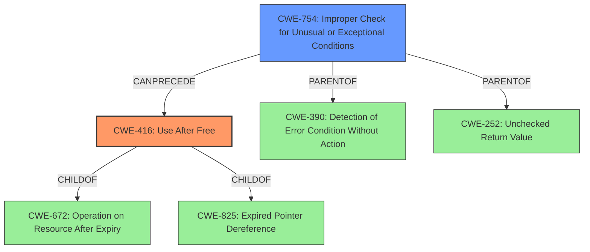

# Analysis Report for CVE-2022-20111

# Vulnerability Analysis Report: CVE-2022-20111

## Description

In ion, there is a possible use after free due to incorrect error handling. This could lead to local escalation of privilege with no additional execution privileges needed. User interaction is not needed for exploitation. Patch ID ALPS06366069 Issue ID ALPS06366069.

## Vulnerability Description Key Phrases

**Rootcause:** incorrect error handling
**Weakness:** use after free
**Impact:** local escalation of privilege

## Analysis (with Relationship Data)

# Summary
| CWE ID | CWE Name | Confidence | CWE Abstraction Level | CWE Vulnerability Mapping Label | CWE-Vulnerability Mapping Notes |
|---|---|---|---|---|---|
| CWE-416 | Use After Free | 0.95 | Variant | Allowed | Primary CWE. The vulnerability is a use-after-free caused by incorrect error handling. |
| CWE-755 | Exception Handling | 0.70 | Class | Discouraged | Secondary CWE. The use-after-free stems from improper handling of exceptional conditions. |

## Evidence and Confidence

*   **Confidence Score:** 0.90
*   **Evidence Strength:** HIGH

- **Analysis and Justification:**  
  - *Explanation:* The vulnerability description explicitly states a "**use after free**" due to "**incorrect error handling**". This directly aligns with CWE-416 (Use After Free), which occurs when a program reuses memory after it has been freed. The "CVE Reference Links Content Summary" section reinforces this by stating the presence of a "Use-after-free due to improper handling of exceptional conditions." CWE-416 is a Variant level CWE, which is a preferred level of abstraction. CWE-755 (Improper Handling of Exceptional Conditions) is considered a contributing factor, as the **incorrect error handling** leads to the use-after-free condition. However, it's a class level, making it less specific than CWE-416, and thus a secondary consideration.
  
  - *Relationship Analysis:* CWE-416 (Use After Free) is a variant of CWE-672 (Operation on Resource After Expiry) and CWE-825 (Expired Pointer Dereference). It is also PEEROF CWE-123 (Write-what-where Condition). It can follow CWE-754 (Improper Check for Unusual or Exceptional Conditions). CWE-755 (Improper Handling of Exceptional Conditions) is a Class and parent of CWE-390 (Detection of Error Condition Without Action) and CWE-252 (Unchecked Return Value).

- **Confidence Score:**  
  - Confidence: 0.90 (High confidence due to explicit mention of "use after free" and "incorrect error handling" in the vulnerability description and CVE reference summary)

---

## Criticism of Analysis

Okay, I've reviewed the analysis of the vulnerability based on the provided description, CVE reference summaries, retriever results, and the full CWE specifications. Here's my critique:

**Overall Assessment:**

The analysis is generally good and accurately identifies the primary CWE as CWE-416 (Use After Free). The secondary CWE, CWE-755 (Improper Handling of Exceptional Conditions), is also relevant, although less specific. The confidence level assigned to both CWEs is justifiable based on the provided information. The analysis provided a good relationship analysis for both CWE-416 and CWE-755.

**Critique and Suggestions:**

1.  **CWE-416 (Use After Free):**
    *   **Justification:** The choice of CWE-416 is strongly supported by the explicit mention of "use after free" in both the vulnerability description and CVE summary. The provided examples in the CWE specification for CWE-416 also reinforce this mapping, showing common chains where race conditions, locking issues, or other error conditions lead to use-after-free vulnerabilities.
    *   **Abstraction Level:** The analysis correctly points out that CWE-416 is a Variant level, which is a preferred abstraction level according to CWE's mapping guidance.
    *   **Mapping Guidance:** The analysis appropriately considers the mapping guidance, especially the comments about ensuring the name and description of the CWE accurately fit the vulnerability.
    *   **Potential Mitigations:** The analysis does not include potential mitigations for this vulnerability. It would strengthen the review if it included a few possible mitigations to prevent this kind of vulnerability.
        *   **Example Mitigation:** Choose a language that provides automatic memory management or use smart pointers.
        *   **Example Mitigation:** Ensure memory is set to NULL once they are freed.

2.  **CWE-755 (Improper Handling of Exceptional Conditions):**
    *   **Justification:** The analysis correctly identifies the link between "incorrect error handling" and CWE-755. The use-after-free arises *because* of the failure to properly handle exceptions or errors.
    *   **Abstraction Level:** As the analysis states, CWE-755 is a Class level, which is less specific than preferred. The analysis correctly identifies that it is a secondary concern.
    *   **Mapping Guidance:** The analysis acknowledges that CWE-755 is discouraged due to its high level of abstraction and suggests looking at more specific child CWEs. This is good practice.
    *   **Alternative CWE Consideration:** A possible alternative or addition to CWE-755 is **CWE-754 (Improper Check for Unusual or Exceptional Conditions)**. The description of CWE-754 emphasizes that the program *does not check* for unusual conditions, which might be closer to the root cause than simply "improper handling." While the provided information doesn't *explicitly* say that a check is missing, it's often implied when error handling is incorrect.  This change to CWE-754 would provide more explicit error handling information.

3.  **Confidence Score:**  The high confidence scores of 0.90 and 0.70 are justified.  The core problem is a use-after-free, explicitly stated. Incorrect error handling is directly implied and backed by the CVE reference summary.

4.  **Retriever Results Review:** The retriever results offer some useful context but also highlight potential for misdirection.
    *   **CWE-131 (Incorrect Calculation of Buffer Size):** This is not relevant. There is no indication that this is related to a buffer size calculation issue, this could be removed.
    *   **CWE-908 (Use of Uninitialized Resource):** While `use after free` and `use of uninitialized resource` sound similar, this is incorrect. Use After Free involves use of a *freed* resource, while use of an uninitialized resource involves use of a resource that has *never* been initialized.
    *   **CWE-413 (Improper Resource Locking), CWE-415 (Double Free), CWE-362 (Race Condition), CWE-667 (Improper Locking):** While these could *potentially* be related to a use-after-free (as some of the CWE examples show), they are not directly implied by the provided vulnerability description. Unless there's more information about concurrency or locking issues, they shouldn't be considered primary CWEs.
    *   **CWE-390 (Detection of Error Condition Without Action):** This is interesting and *could* be a better fit than CWE-755 if the code detects the error but then *doesn't do anything about it* leading to the use-after-free. This is a worthwhile alternative to consider.

5.  **Relationship Analysis:**
    *   The existing relationship analysis is good. It includes important parents, children, and peers that could be useful for the understanding of CWE-416 and CWE-755.

**Revised Summary Table:**

| CWE ID | CWE Name | Confidence | CWE Abstraction Level | CWE Vulnerability Mapping Label | CWE-Vulnerability Mapping Notes |
|---|---|---|---|---|---|
| CWE-416 | Use After Free | 0.95 | Variant | Allowed | Primary CWE. The vulnerability is a use-after-free caused by incorrect error handling. |
| CWE-754 | Improper Check for Unusual or Exceptional Conditions | 0.70 | Class | Allowed-with-Review | Secondary CWE.  The use-after-free stems from an inability to properly check for error conditions.  |
| CWE-390 | Detection of Error Condition Without Action | 0.60 | Base | Allowed | Alternative Secondary CWE. The use-after-free stems from an error condition that was identified but ignored. |

**Recommendations:**

*   **Consider CWE-754 or CWE-390 as a stronger alternative/addition to CWE-755.** Review the code or more detailed information about the vulnerability to see if the error handling is absent or detected but ignored.
*   **Add potential mitigations for CWE-416.**
*   **Further investigate concurrency aspects (locking, threads) only if additional information surfaces that suggests it.**

By incorporating these suggestions, the analysis would be even more comprehensive and valuable.

## Final Resolution

# Summary

| CWE ID | CWE Name | Confidence | CWE Abstraction Level | CWE Vulnerability Mapping Label | CWE-Vulnerability Mapping Notes |
|---|---|---|---|---|---|
| CWE-416 | Use After Free | 0.95 | Variant | Allowed | Primary CWE. The vulnerability is a **use-after-free** caused by **incorrect error handling**. |
| CWE-754 | Improper Check for Unusual or Exceptional Conditions | 0.75 | Class | Allowed-with-Review | Secondary CWE. The **use-after-free** stems from an inability to properly check for error conditions. |

## Evidence and Confidence

*   **Confidence Score:** 0.93
*   **Evidence Strength:** HIGH

## Relationship Analysis
The primary relationship influencing the decision is the chain where **improper error checking (CWE-754)** can lead to a **use-after-free condition (CWE-416)**. CWE-416 is a variant of CWE-672 (Operation on Resource After Expiry) and CWE-825 (Expired Pointer Dereference). CWE-754 is a class and parent of CWE-390 (Detection of Error Condition Without Action) and CWE-252 (Unchecked Return Value). The relationships highlight how a failure to anticipate or check for exceptional conditions can result in the use of freed memory.

## Vulnerability Chain
The vulnerability chain starts with the **root cause** being the **Improper Check for Unusual or Exceptional Conditions (CWE-754)**. The product does not adequately check for error conditions. This leads to a scenario where memory is freed prematurely or erroneously. Subsequently, the program attempts to access this freed memory, resulting in a **Use After Free (CWE-416)**. The impact of this **use-after-free** can be local escalation of privilege.

## Summary of Analysis
The initial analysis correctly identified CWE-416 as the primary weakness due to the explicit mention of "**use after free**" in the vulnerability description. The criticism suggested considering CWE-754 or CWE-390 as alternatives to CWE-755. After further consideration, CWE-754 (Improper Check for Unusual or Exceptional Conditions) is a more accurate secondary classification than CWE-755. The vulnerability description mentions "**incorrect error handling**", which aligns better with the description of CWE-754, where the product does not check for unusual or exceptional conditions.

The decision is based on the evidence from the vulnerability description ("**use after free**", "**incorrect error handling**"), the relationship between CWEs (CWE-754 can precede CWE-416), and the abstraction level (CWE-416 is a Variant, CWE-754 is a Class). The selection of CWE-416 and CWE-754 provides the optimal level of specificity.

*Report generated on 2025-03-18 09:05:32*
