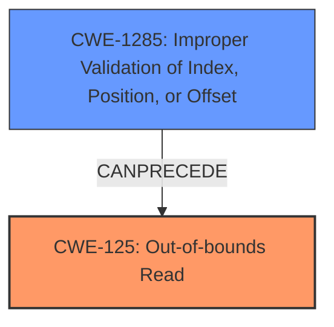

# Final Resolution for CVE-2022-20131

# Summary
| CWE ID | CWE Name | Confidence | CWE Abstraction Level | CWE Vulnerability Mapping Label | CWE-Vulnerability Mapping Notes |
|---|---|---|---|---|---|
| CWE-125 | Out-of-bounds Read [CWE-125: The product reads data past the end, or before the beginning, of the intended buffer.] | 1.0 | Base | Primary | Allowed |
| CWE-1285 | Improper Validation of Index, Position, or Offset [CWE-1285: The product receives input that is expected to specify an index, position, or offset into an indexable resource such as a buffer or file, but it does not validate or incorrectly validates that the specified index/position/offset has the required properties.] | 0.8 | Base | Secondary Candidate | Allowed |

## Evidence and Confidence

*   **Confidence Score:** 0.95
*   **Evidence Strength:** HIGH

## Relationship Analysis
The primary relationship is that **CWE-1285** can precede **CWE-125**. The **missing bounds check** (**CWE-1285**) allows an attacker to specify an index, position, or offset outside the valid range, leading to an out-of-bounds read (**CWE-125**). Both are base level CWEs, which are preferred. The critique suggested considering CWE-1284 as a possible alternative to CWE-1285, given that the index or offset is a quantity. However, CWE-1285 is more specific to the context of indexes, positions, and offsets, making it a more appropriate choice than CWE-1284.

## Vulnerability Chain
The vulnerability chain starts with a **missing bounds check** (**CWE-1285**), allowing an attacker to potentially control the index or offset used to access a buffer. Because of the missing check, the attacker can cause the program to read beyond the boundaries of the buffer (**CWE-125**), potentially disclosing sensitive information.

## Summary of Analysis
The initial analysis and criticism are both accurate and well-supported by the evidence provided. The vulnerability description explicitly mentions an "out of bounds read" and a "missing bounds check," which directly correspond to **CWE-125** and **CWE-1285**, respectively. The retriever results are interesting, but less relevant.

The graph relationships confirm that **CWE-1285** can precede **CWE-125**, establishing a clear causal link between the **missing bounds check** and the out-of-bounds read. Considering the MITRE mapping guidance, both selected CWEs are at the Base level of abstraction and have a usage recommendation of "Allowed".

The decision to classify this vulnerability as **CWE-125** (Out-of-bounds Read) primarily, with **CWE-1285** (Improper Validation of Index, Position, or Offset) as a secondary contributing factor, is based on the evidence in the vulnerability description. **CWE-125** represents the direct consequence of the vulnerability, while **CWE-1285** represents the root cause that enables the vulnerability.

The selected CWEs are at the optimal level of specificity because they accurately reflect the nature of the vulnerability, as evidenced by the vulnerability description and the CWE definitions.