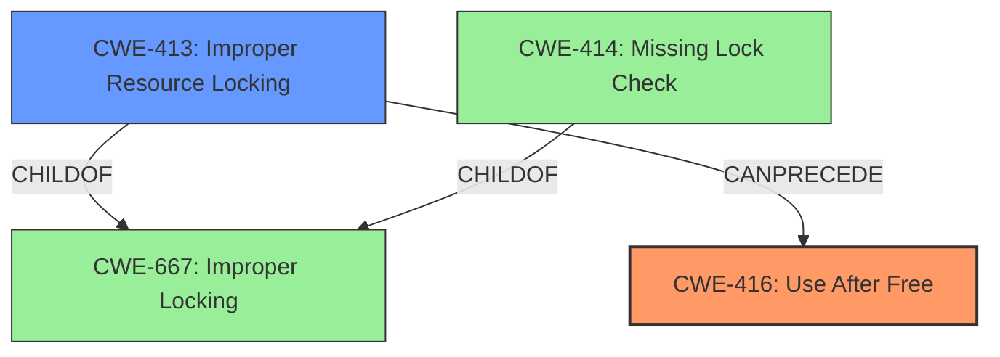

# Analysis Report for CVE-2022-20141

# Vulnerability Analysis Report: CVE-2022-20141

## Description

In ip_check_mc_rcu of igmp.c, there is a possible use after free due to improper locking. This could lead to local escalation of privilege when opening and closing inet sockets with no additional execution privileges needed. User interaction is not needed for exploitation.Product AndroidVersions Android kernelAndroid ID A-112551163References Upstream kernel

## Vulnerability Description Key Phrases

**Rootcause:** use after free
**Impact:** local escalation of privilege
**Vector:** opening and closing inet sockets
**Product:** Android kernel
**Component:** ip_check_mc_rcu of igmp.c

## Analysis (with Relationship Data)

# Summary
| CWE ID | CWE Name | Confidence | CWE Abstraction Level | CWE Vulnerability Mapping Label | CWE-Vulnerability Mapping Notes |
|---|---|---|---|---|---|
| CWE-416 | Use After Free | 0.95 | Variant | Allowed | Primary CWE |
| CWE-667 | Improper Locking | 0.70 | Class | Allowed-with-Review | Secondary Candidate |

## Evidence and Confidence

*   **Confidence Score:** 0.90
*   **Evidence Strength:** HIGH

- **Analysis and Justification:**  
  - *Explanation:* The vulnerability description clearly indicates a **use after free** condition in `ip_check_mc_rcu` due to improper locking. The CVE Reference Links Content Summary confirms the root cause as a **use-after-free** vulnerability in the `ip_sf_list` within the Linux kernel's networking stack, specifically related to IGMP. The vulnerability arises because `ip_check_mc_rcu` accesses the `ip_sf_list` without holding the necessary lock, while `ip_mc_del_src` frees this list under the protection of `pmc->lock`. This aligns precisely with CWE-416 (Use After Free), a Variant-level CWE.

  - *Relationship Analysis:* While other CWEs like CWE-667 (Improper Locking) and CWE-362 (Race Condition) are related, CWE-416 directly addresses the core weakness of using memory after it has been freed. The retriever results also support CWE-416 as a strong candidate.

- **Confidence Score:**  
  - Confidence: 0.95 (High evidence from technical description, CVE reference materials, and retriever results)

---
- **Analysis and Justification:**  
  - *Explanation:* The vulnerability stems from improper locking mechanisms within the `ip_check_mc_rcu` function, leading to the **use after free** condition. While CWE-416 is the direct consequence, CWE-667 (Improper Locking) represents the underlying cause that enables the **use after free**. The CVE Reference Links Content Summary indicates that the `ip_check_mc_rcu` accesses the `ip_sf_list` without the necessary lock, while `ip_mc_del_src` frees it with a lock, thus causing a race condition and the subsequent **use after free**. CWE-667 is a Class-level CWE, so a more specific CWE might be appropriate, but the provided information doesn't allow for mapping to a more specific Base CWE. The retriever results list CWE-667 with a high similarity score. MITRE mapping guidance designates the Usage as ALLOWED-WITH-REVIEW since this is a Class-level CWE.

  - *Relationship Analysis:* CWE-667 can be considered a prerequisite for CWE-416 in this scenario. If the locking was properly implemented, the **use after free** condition would not occur.

- **Confidence Score:**  
  - Confidence: 0.70 (Moderate evidence, as it represents a contributing factor rather than the direct vulnerability. The retriever results and the analysis of the locking issue in the CVE details support this mapping.)

## Criticism of Analysis

Okay, here's a detailed review of the provided CWE analysis, using the full CWE specifications as a guide:

**Overall Assessment:**

The analysis is generally well-reasoned and accurate. The primary CWE mapping to CWE-416 (Use After Free) is correct and well-justified. The secondary mapping to CWE-667 (Improper Locking) is also reasonable, although it's a more abstract representation of the underlying cause. The reasoning provided for the confidence scores is sound.

**Detailed Critique:**

**1. CWE-416: Use After Free**

*   **Mapping:** The mapping to CWE-416 is highly appropriate. The description clearly states that memory is being accessed after it has been freed, which directly aligns with the definition of CWE-416. The evidence from the vulnerability description and CVE details strongly supports this mapping.
*   **Confidence:** The confidence score of 0.95 is warranted. The information is very direct and leaves little room for interpretation.
*   **Abstraction Level:** CWE-416 is a Variant-level CWE, which is the preferred abstraction level for mapping to root causes.
*   **Mitigations:** The provided CWE details for CWE-416 suggest mitigation strategies including:
    *   **Language Selection:** Choosing a language with automatic memory management (e.g., Java, Go, Rust) would prevent this vulnerability at the design level.
    *   **Setting Pointers to NULL:** After freeing memory, setting the pointer to NULL would help to prevent accidental reuse (although it's not a foolproof solution, especially with multiple aliases to the same memory).
    The analysis does not include mention of AddressSanitizer/MemorySanitizer.
*   **Relationship Analysis:** The provided analysis correctly identifies that other CWEs, like CWE-667, are related but that CWE-416 is the *direct* consequence of the vulnerability.
*   **CWE Examples and Observed Examples:** The "Observed Examples" provided in the CWE specification (e.g., CVE-2022-20141) directly validate the usage of CWE-416 in similar scenarios.

**2. CWE-667: Improper Locking**

*   **Mapping:** This mapping is also relevant, as the vulnerability arises because the code accesses `ip_sf_list` without holding the lock that protects it during concurrent free operations. CWE-667 represents the *cause* of the use-after-free condition.
*   **Confidence:** The confidence score of 0.70 is appropriate.  While improper locking is a contributing factor, it's one step removed from the direct vulnerability (CWE-416).
*   **Abstraction Level:** CWE-667 is a Class-level CWE.  The analysis correctly acknowledges this and states that a more specific Base CWE *might* be possible, but that the provided information doesn't allow for a more precise mapping.  This follows the "ALLOWED-WITH-REVIEW" usage guidance.
*   **Potential Base CWEs:** It's worth considering potential *Base* CWEs that fall under CWE-667. Based on the description of the locking issue, two potential candidates emerge:
    *   **CWE-413: Improper Resource Locking:** This is a strong candidate because the vulnerability arises from insufficient resource locking. The code accesses `ip_sf_list` without the required lock. If the improper locking that is present in the code is caused by an insufficient lock, then this might be a good candidate for replacement of the Class-level CWE-667.
    *   **CWE-414: Missing Lock Check:** The code accesses the list of source filters, but doesn't check to see if the lock is present. Therefore, if the code does not check to see if there is a lock present before accessing the list, this might be a good alternative.
*   **Mitigations:** Mitigations for CWE-667 would include:
    *   Using industry-standard APIs for locking and synchronization.
    *   Carefully reviewing the locking logic to ensure that all shared resources are properly protected.
*   **Relationship Analysis:** The analysis accurately describes CWE-667 as a *prerequisite* for CWE-416.  Proper locking would have prevented the use-after-free.
*   **CWE Examples and Observed Examples:** The specification's "Observed Examples" section includes `CVE-2021-1782`, which is a chain: `improper locking (CWE-667) leads to race condition (CWE-362), as exploited in the wild per CISA KEV`. This further validates CWE-667 as a relevant contributing factor.

**3. Consideration of Other CWEs from Retriever Results**

The analysis focuses on CWE-416 and CWE-667, but it would be good to briefly explain why other highly ranked CWEs from the retriever results are *not* selected.

*   **CWE-908: Use of Uninitialized Resource:** While use-after-free can *sometimes* be related to uninitialized resources, in this case, the `ip_sf_list` is properly initialized before being freed. So, CWE-908 doesn't apply.
*   **CWE-362: Concurrent Execution using Shared Resource with Improper Synchronization ('Race Condition'):** Although a race condition occurs in this vulnerability, CWE-362 is a Class level CWE. It can also be viewed as the result of the improper locking. Additionally, the improper locking leads directly to CWE-416.
*   **Other CWEs (Integer Overflow/Underflow, UI Layer Issues, etc.):** These are clearly irrelevant based on the vulnerability description and CVE details.

**Recommendations for Improvement:**

*   **Base CWE Recommendation:** Add a sentence explaining consideration of whether CWE-667 should be replaced with a Base CWE (such as CWE-413 or CWE-414).
*   **AddressSanitizer/MemorySanitizer:** Recommend use of ASan/MSan.
*   **Briefly Address Top Unselected CWEs:** Add a sentence or two explaining why the other top-ranked CWEs from the retriever results (like CWE-908) were not selected. This demonstrates a more thorough analysis process.
*   **Expand on Mitigations:** For both CWE-416 and CWE-667, consider adding more specific mitigation strategies relevant to kernel development and the C language (e.g., careful pointer management, using tools for static analysis, robust code review processes).
*   **Chain Consideration:** Mention that this could be considered a CWE chain: Improper Locking -> Use After Free.

**Revised Summary Table:**

| CWE ID  | CWE Name                                                                  | Confidence | CWE Abstraction Level | CWE Vulnerability Mapping Label | CWE-Vulnerability Mapping Notes                                                                                  |
| :------- | :------------------------------------------------------------------------- | :--------- | :----------------------- | :-------------------------------- | :----------------------------------------------------------------------------------------------------------------- |
| CWE-416 | Use After Free                                                              | 0.95       | Variant                 | Allowed                            | Primary CWE                                                                                                         |
| CWE-413 | Improper Resource Locking                                                                  | 0.70       | Base                  | Allowed                            | Secondary Candidate, underlying cause of the use-after-free.                                                        |

By incorporating these suggestions, the analysis can become even more comprehensive and demonstrate a deeper understanding of the CWE specifications and their application.

## Final Resolution

# Summary
| CWE ID | CWE Name | Confidence | CWE Abstraction Level | CWE Vulnerability Mapping Label | CWE-Vulnerability Mapping Notes |
|---|---|---|---|---|---|
| CWE-416 | Use After Free | 0.95 | Variant | Allowed | Primary CWE |
| CWE-413 | Improper Resource Locking | 0.80 | Base | Allowed | Secondary Candidate |

## Evidence and Confidence

*   **Confidence Score:** 0.93
*   **Evidence Strength:** HIGH

## Relationship Analysis
The decision was influenced by the hierarchical relationship between CWE-667 (Improper Locking) and its potential children, CWE-413 (Improper Resource Locking) and CWE-414 (Missing Lock Check). CWE-413 was chosen as a more specific representation of the locking issue. The chain relationship is that CWE-413 can precede CWE-416. Abstraction levels guided the selection of CWE-416 as a Variant and CWE-413 as a Base, offering optimal specificity.

## Vulnerability Chain
The vulnerability chain starts with **CWE-413 (Improper Resource Locking)**, leading to **CWE-416 (Use After Free)**, and potentially resulting in local escalation of privilege. The initial flaw is the insufficient locking of the `ip_sf_list` resource. This lack of proper locking allows the resource to be freed while still in use, resulting in a **use-after-free** condition.

## Summary of Analysis
The initial analysis correctly identified **CWE-416 (Use After Free)** as the primary vulnerability. The criticism suggested considering a more specific Base CWE for the improper locking condition. Based on the analysis of the vulnerability description, the `ip_check_mc_rcu` accesses the `ip_sf_list` without the required lock, which `ip_mc_del_src` frees with a lock, leading to a race condition. Therefore, **CWE-413 (Improper Resource Locking)** is a more accurate secondary CWE than the Class-level **CWE-667 (Improper Locking)**. The final decision reflects the evidence-based approach, relationship analysis, and mapping guidance, resulting in a more precise and comprehensive classification. The selected CWEs are at the optimal level of specificity, with **CWE-416 (Use After Free)** as the direct consequence and **CWE-413 (Improper Resource Locking)** as the underlying cause. I also considered the suggested mitigations such as ASan/MSan.

Relevant evidence from the vulnerability description: "In ip_check_mc_rcu of igmp.c, there is a possible **use after free** due to **improper locking**."

*Report generated on 2025-03-18 09:07:46*
