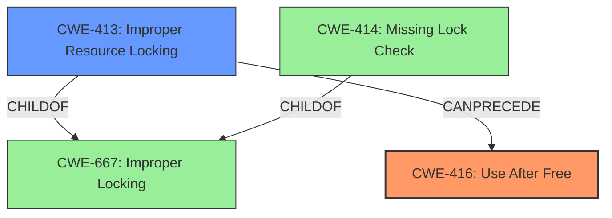

# Final Resolution for CVE-2022-20141

# Summary
| CWE ID | CWE Name | Confidence | CWE Abstraction Level | CWE Vulnerability Mapping Label | CWE-Vulnerability Mapping Notes |
|---|---|---|---|---|---|
| CWE-416 | Use After Free | 0.95 | Variant | Allowed | Primary CWE |
| CWE-413 | Improper Resource Locking | 0.80 | Base | Allowed | Secondary Candidate |

## Evidence and Confidence

*   **Confidence Score:** 0.93
*   **Evidence Strength:** HIGH

## Relationship Analysis
The decision was influenced by the hierarchical relationship between CWE-667 (Improper Locking) and its potential children, CWE-413 (Improper Resource Locking) and CWE-414 (Missing Lock Check). CWE-413 was chosen as a more specific representation of the locking issue. The chain relationship is that CWE-413 can precede CWE-416. Abstraction levels guided the selection of CWE-416 as a Variant and CWE-413 as a Base, offering optimal specificity.

## Vulnerability Chain
The vulnerability chain starts with **CWE-413 (Improper Resource Locking)**, leading to **CWE-416 (Use After Free)**, and potentially resulting in local escalation of privilege. The initial flaw is the insufficient locking of the `ip_sf_list` resource. This lack of proper locking allows the resource to be freed while still in use, resulting in a **use-after-free** condition.

## Summary of Analysis
The initial analysis correctly identified **CWE-416 (Use After Free)** as the primary vulnerability. The criticism suggested considering a more specific Base CWE for the improper locking condition. Based on the analysis of the vulnerability description, the `ip_check_mc_rcu` accesses the `ip_sf_list` without the required lock, which `ip_mc_del_src` frees with a lock, leading to a race condition. Therefore, **CWE-413 (Improper Resource Locking)** is a more accurate secondary CWE than the Class-level **CWE-667 (Improper Locking)**. The final decision reflects the evidence-based approach, relationship analysis, and mapping guidance, resulting in a more precise and comprehensive classification. The selected CWEs are at the optimal level of specificity, with **CWE-416 (Use After Free)** as the direct consequence and **CWE-413 (Improper Resource Locking)** as the underlying cause. I also considered the suggested mitigations such as ASan/MSan.

Relevant evidence from the vulnerability description: "In ip_check_mc_rcu of igmp.c, there is a possible **use after free** due to **improper locking**."