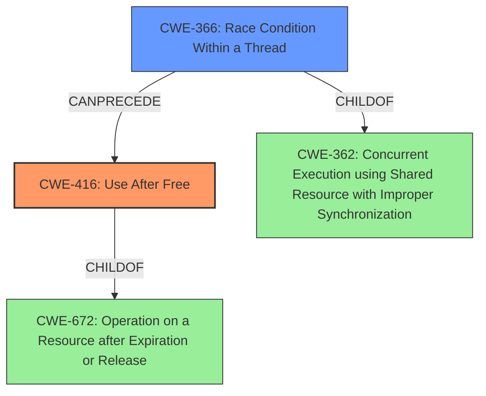

# Final Resolution for CVE-2022-20148

# Summary
| CWE ID | CWE Name | Confidence | CWE Abstraction Level | CWE Vulnerability Mapping Label | CWE-Vulnerability Mapping Notes |
|---|---|---|---|---|---|
| CWE-416 | Use After Free | 0.9 | Variant | Primary | The vulnerability description explicitly mentions a **use-after-free** condition due to a **race condition**. |
| CWE-366 | Race Condition Within a Thread | 0.8 | Base | Secondary | A **race condition** exists between two threads using a shared resource within a thread. The lack of synchronization contributes to the **use-after-free** vulnerability, making it a relevant secondary CWE. |

## Evidence and Confidence

*   **Confidence Score:** 0.85
*   **Evidence Strength:** HIGH

## Relationship Analysis
The primary weakness is CWE-416 (Use After Free), which is a variant of CWE-672 (Operation on a Resource after Expiration or Release). The secondary weakness, CWE-366 (Race Condition Within a Thread), is a base-level CWE and a child of CWE-362 (Concurrent Execution using Shared Resource with Improper Synchronization). The analysis moves from the more general CWE-362 to the more specific CWE-366, as suggested in the criticism. CWE-366 CanPrecede CWE-416, as the race condition can lead to the use-after-free.

## Vulnerability Chain
The vulnerability chain starts with the **race condition** (CWE-366) in the f2fs discard mechanism, where two threads concurrently access a shared resource without proper synchronization. This leads to a scenario where memory is freed by one thread while another thread is still using it, resulting in a **use-after-free** vulnerability (CWE-416). The lack of synchronization is the root cause, and the **use-after-free** is the exploitable condition.

## Summary of Analysis
The initial analysis correctly identified CWE-416 as the primary weakness due to the explicit mention of "use-after-free" in the vulnerability description. The criticism suggested refining the secondary weakness from CWE-362 to a more specific child. After reviewing the children of CWE-362, CWE-366 (Race Condition Within a Thread) was selected as a better fit because it more accurately describes the concurrent access issue within the f2fs discard mechanism. This decision is based on the vulnerability description stating a **race condition** and the understanding that this **race condition** directly leads to the **use-after-free**. The evidence is strong, and the selection of CWE-366 provides a more precise characterization of the **root cause**. The chosen CWEs are at the optimal level of specificity: CWE-416 is a variant, and CWE-366 is a base.