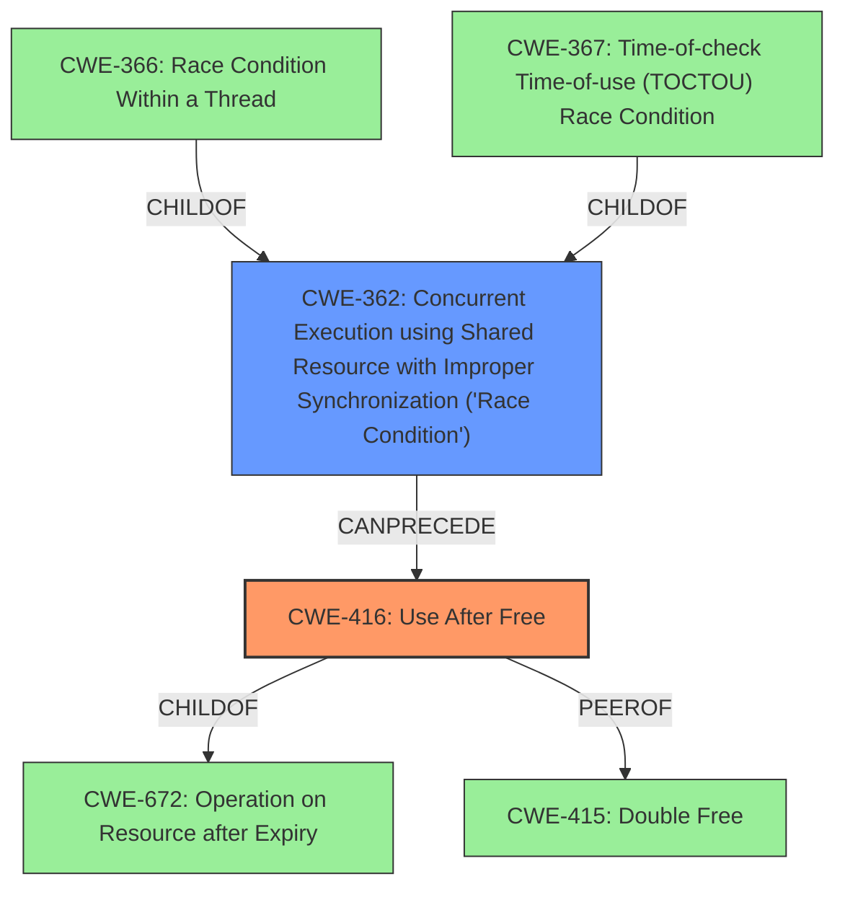

# Final Resolution for CVE-2022-20154

# Summary
| CWE ID | CWE Name | Confidence | CWE Abstraction Level | CWE Vulnerability Mapping Label | CWE-Vulnerability Mapping Notes |
|---|---|---|---|---|---|
| CWE-416 | Use After Free | 0.95 | Variant | Allowed | Primary CWE |
| CWE-362 | Concurrent Execution using Shared Resource with Improper Synchronization ('Race Condition') | 0.85 | Class | Allowed-with-Review | Secondary Candidate |

## Evidence and Confidence

*   **Confidence Score:** 0.95
*   **Evidence Strength:** HIGH

## Relationship Analysis
The primary weakness is **CWE-416 (Use After Free)**, a variant of **CWE-672 (Operation on Resource after Expiry)** and a peer of **CWE-415 (Double Free)**. The secondary weakness is **CWE-362 (Concurrent Execution using Shared Resource with Improper Synchronization ('Race Condition'))**, which is a class-level CWE. **CWE-362** is the parent of **CWE-366 (Race Condition Within a Thread)** and **CWE-367 (Time-of-check Time-of-use (TOCTOU))**. The race condition (**CWE-362**) enables the use-after-free (**CWE-416**).

## Vulnerability Chain
The vulnerability chain begins with a **race condition** (**CWE-362**) where a shared resource is accessed concurrently without proper synchronization. This leads to a scenario where a socket is freed prematurely. Subsequently, a thread attempts to access the freed memory, resulting in a **use-after-free** vulnerability (**CWE-416**). The impact is a potential local escalation of privilege with System execution privileges.

## Summary of Analysis
The initial analysis accurately identified the primary and secondary CWEs. The vulnerability description clearly states the presence of a **use-after-free**, making **CWE-416** the most appropriate primary CWE. The description also mentions a **race condition**, which makes **CWE-362** a fitting secondary CWE.

The retriever results suggested **CWE-413 (Improper Resource Locking)**, **CWE-366 (Race Condition within a Thread)**, **CWE-367 (Time-of-check Time-of-use (TOCTOU) Race Condition)** and **CWE-667 (Improper Locking)**. **CWE-413** was considered, as the lack of proper locking contributes to the race condition. However, it is less directly causative than **CWE-362** as the presence of a race condition is the direct enabler of the use-after-free. **CWE-366** was also suggested but it is a more specific form of race condition which is already covered by the more general **CWE-362**. The content does not contain enough information to differentiate if this was a thread level or process level issue. Similarly, **CWE-367** was not chosen because there is no evidence in the vulnerability summary for the check followed by the use of the state. Finally, **CWE-667** was considered, but **CWE-362** is more directly causative in enabling the **use-after-free**.

The graph relationships highlight the connection between the **race condition** and the **use-after-free**. **CWE-362** enables **CWE-416**. The selected CWEs are at the optimal level of specificity, with **CWE-416** being a Variant and **CWE-362** being a Class, covering the core weaknesses described in the vulnerability. The confidence in this assessment is high due to the clear description of the vulnerability and the supporting evidence.