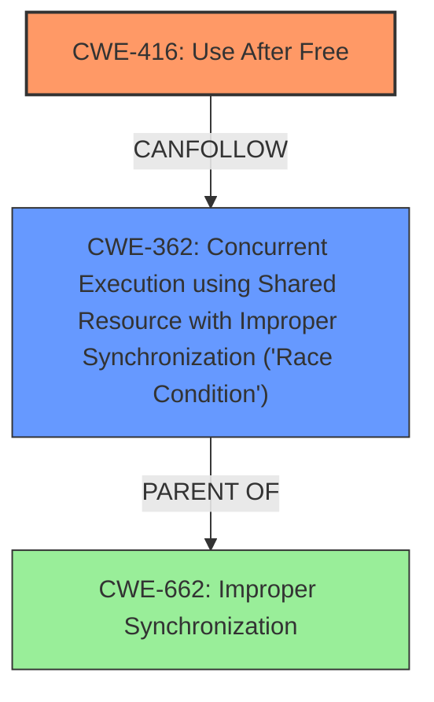

# Analysis Report for CVE-2022-20155

# Vulnerability Analysis Report: CVE-2022-20155

## Description

In ipu_core_jqs_msg_transport_kernel_write_sync of ipu-core-jqs-msg-transport.c, there is a possible use-after-free due to a race condition. This could lead to local escalation of privilege with no additional execution privileges needed. User interaction is not needed for exploitation.Product AndroidVersions Android kernelAndroid ID A-176754369References N/A

## Vulnerability Description Key Phrases

**Rootcause:** race condition
**Weakness:** use-after-free
**Impact:** local escalation of privilege
**Product:** Android kernel
**Component:** ipu_core_jqs_msg_transport_kernel_write_sync of ipu-core-jqs-msg-transport.c

## Analysis (with Relationship Data)

# Summary
| CWE ID | CWE Name | Confidence | CWE Abstraction Level | CWE Vulnerability Mapping Label | CWE-Vulnerability Mapping Notes |
|---|---|---|---|---|---|
| CWE-416 | Use After Free | 0.9 | Variant | Allowed | Primary CWE |
| CWE-362 | Concurrent Execution using Shared Resource with Improper Synchronization ('Race Condition') | 0.8 | Class | Allowed-with-Review | Secondary Candidate CWE |

## Evidence and Confidence

*   **Confidence Score:** 0.85
*   **Evidence Strength:** HIGH

- **Analysis and Justification:**
  - *Explanation:* The vulnerability description explicitly states a "**use-after-free** due to a **race condition**" in `ipu_core_jqs_msg_transport_kernel_write_sync` of `ipu-core-jqs-msg-transport.c`. CWE-416 (Use After Free) directly addresses the condition where memory is reused after being freed, which aligns perfectly with the vulnerability description. The description indicates that this leads to local escalation of privilege. The CVE Reference Links Content Summary also confirms that the vulnerability exists in the kernel component and leads to an elevation of privilege. CWE-416 is a Variant level CWE, which is a preferred level of abstraction. The retriever results give a high score to CWE-416. MITRE mapping guidance indicates that CWE-416 is ALLOWED.
  - *Relationship Analysis:* CWE-416 is a variant and a child of several Class level CWEs. It has peer relationships with CWE-123 (Write-What-Where Condition) and CWE-415 (Double Free). The retriever results shows that CWE-416 CanFollow CWE-364 (Signal Handler Race Condition) and CWE-362 (Concurrent Execution using Shared Resource with Improper Synchronization ('Race Condition')).

- **Confidence Score:**
  - Confidence: 0.9 (High evidence from technical description and CVE reference materials)

---
- **Analysis and Justification:**
  - *Explanation:* The vulnerability description explicitly states a "**use-after-free** due to a **race condition**". CWE-362 (Concurrent Execution using Shared Resource with Improper Synchronization ('Race Condition')) is a Class level CWE that describes a situation where concurrent code sequences require exclusive access to a shared resource, but a timing window exists where the resource can be modified concurrently. The vulnerability description key phrases also highlights "**race condition**" as the rootcause. While CWE-362 describes the root cause, CWE-416 describes the resulting weakness. This makes CWE-362 a secondary candidate CWE. MITRE mapping guidance indicates that CWE-362 is ALLOWED-with-Review since it is a Class level CWE. The retriever results give a high score to CWE-362.
  - *Relationship Analysis:* CWE-362 is a Class level CWE and has several child CWEs.

- **Confidence Score:**
  - Confidence: 0.8 (High evidence from technical description and CVE reference materials)

## Criticism of Analysis

Okay, I've reviewed the analysis in detail, considering the full CWE specifications you've provided. Here's my critique:

**Overall Assessment:**

The analysis is generally good, demonstrating a clear understanding of the vulnerability and relevant CWEs. The identification of CWE-416 as the primary weakness and CWE-362 as a contributing factor is accurate. The confidence scores are justifiable based on the available information. The justification is well-written and covers the essential aspects of the vulnerability in relation to the CWE definitions.

**Specific Comments and Suggestions:**

*   **CWE-416 (Use After Free):**
    *   **Strengths:** The analysis correctly identifies CWE-416 as the primary weakness, focusing on the reuse of freed memory and its consequences.  The high confidence score is justified by the explicit mention of "use-after-free" in the vulnerability description and the confirmation from the CVE summary that the vulnerability is present in the kernel component. The fact that a Variant is chosen over a Class level CWE shows good understanding.
    *   **Improvements:** The analysis could benefit from exploring the *cause* of the Use After Free in more detail, and that is done in the CWE-362 analysis.
*   **CWE-362 (Concurrent Execution using Shared Resource with Improper Synchronization ('Race Condition')):**
    *   **Strengths:** The inclusion of CWE-362 as a contributing factor is crucial. The analysis correctly identifies it as the *root cause* that leads to the UAF. Highlighting the "race condition" phrase from the vulnerability description further strengthens this point. It's good that it is appropriately marked as a secondary candidate CWE and is ALLOWED-with-Review due to it being a Class level CWE.
    *   **Improvements:** A more detailed description of *how* the race condition leads to the UAF would enhance the explanation. What specific shared resource is being accessed concurrently? What is the sequence of events that leads to the memory being freed while another thread still holds a pointer to it? For example, add something like, "Specifically, two concurrent threads may be accessing a shared data structure. One thread frees the memory, but another thread is in the process of accessing that same memory, leading to the use-after-free."  It is good that the MITRE mapping guidance was considered.
*   **Retriever Results Analysis:**

    *   The top combined results list other CWEs that could potentially be relevant, however, CWE-416 and CWE-362 are the most fitting given the information provided.
    *   The high score for CWE-413 (Improper Resource Locking) highlights the possibility that a locking mechanism was either missing or implemented incorrectly. This *could* be a more specific aspect of the race condition described by CWE-362. If there was information about missing/bad lock this CWE would be more appropriate.
*   **CWE Examples from Database:**

    *   The provided examples for CWE-416 are very useful for illustrating the typical scenarios where this vulnerability occurs, including chains with race conditions.
*   **Mitigation Strategies:**
    *   The analysis doesn't explicitly discuss specific mitigation strategies from the CWE entries. It would be valuable to briefly mention some relevant mitigations for both CWE-416 and CWE-362.
        *   For CWE-416:  Mention that choosing a language with automatic memory management (e.g., Java, Go) would eliminate this type of vulnerability. Also setting pointers to `NULL` after freeing them is a defense-in-depth mitigation, although it may not be fully effective in complex data structures.
        *   For CWE-362: Emphasize the use of synchronization primitives (locks, mutexes, semaphores) to protect access to the shared resource. This addresses the root cause of the race condition.
*   **Confidence Score Justification:** The confidence scores are well-justified and reflect the level of certainty based on the available information.
*   **CWE Relationships:**
    *   The analysis correctly points out the parent-child and peer relationships of the CWEs. This shows a good understanding of the CWE hierarchy.

**Revised Summary Table:**

| CWE ID | CWE Name | Confidence | CWE Abstraction Level | CWE Vulnerability Mapping Label | CWE-Vulnerability Mapping Notes |
|---|---|---|---|---|---|
| CWE-416 | Use After Free | 0.9 | Variant | Allowed | Primary CWE. Memory is accessed after being freed due to a race condition. |
| CWE-362 | Concurrent Execution using Shared Resource with Improper Synchronization ('Race Condition') | 0.8 | Class | Allowed-with-Review | Secondary Candidate CWE. Root cause of the UAF, leading to memory corruption.  |

**In summary:**

The analysis is solid and provides a well-reasoned mapping of the vulnerability to CWEs. The suggestions above are primarily aimed at adding further detail and context to the explanation and explicitly mentioning potential mitigation strategies from the CWE specifications. These improvements would make the analysis even more comprehensive and informative.

## Final Resolution

# Summary

| CWE ID  | CWE Name  | Confidence | CWE Abstraction Level | CWE Vulnerability Mapping Label | CWE-Vulnerability Mapping Notes |
|---|---|---|---|---|---|
| CWE-416 | Use After Free | 0.9 | Variant | Allowed | Primary CWE. Memory is accessed after being freed due to a race condition. |
| CWE-362 | Concurrent Execution using Shared Resource with Improper Synchronization ('Race Condition') | 0.8 | Class | Allowed-with-Review | Secondary Candidate CWE. Root cause of the UAF, leading to memory corruption. |

## Evidence and Confidence

*   **Confidence Score:** 0.9
*   **Evidence Strength:** HIGH

## Relationship Analysis
The primary weakness is **CWE-416 (Use After Free)**, a Variant that directly reflects the vulnerability description. The root cause is **CWE-362 (Concurrent Execution using Shared Resource with Improper Synchronization ('Race Condition'))**, a Class, which leads to the **Use After Free**. While **CWE-362** is a Class, its role as the enabler of **CWE-416** is crucial to include in the analysis. The relationship between them shows how a **race condition** can directly lead to memory corruption via a **use-after-free** vulnerability. Other CWEs such as **CWE-413 (Improper Resource Locking)** are related and could potentially be present, however, there is no explicit mention to support that.

## Vulnerability Chain
The vulnerability chain starts with a **race condition (CWE-362)** where multiple threads concurrently access a shared resource. Due to improper synchronization, one thread frees the memory associated with the resource while another thread is still actively using or about to use that memory. This leads to a **use-after-free (CWE-416)** vulnerability, where the second thread attempts to access the freed memory, resulting in memory corruption and potentially privilege escalation.

## Summary of Analysis
The initial analysis correctly identified **CWE-416 (Use After Free)** as the primary weakness and **CWE-362 (Concurrent Execution using Shared Resource with Improper Synchronization ('Race Condition'))** as a contributing factor. The vulnerability description explicitly states a "use-after-free due to a race condition" in `ipu_core_jqs_msg_transport_kernel_write_sync` of `ipu-core-jqs-msg-transport.c`.

The relationship between **CWE-362** and **CWE-416** is crucial. **CWE-362** is the root cause which allows the vulnerability to occur. **CWE-416** is a variant and accurately describes the vulnerability.

The analysis is based on the provided evidence and relationship insights. The confidence score is justified by the direct evidence in the vulnerability description.

*Report generated on 2025-03-18 09:10:34*
