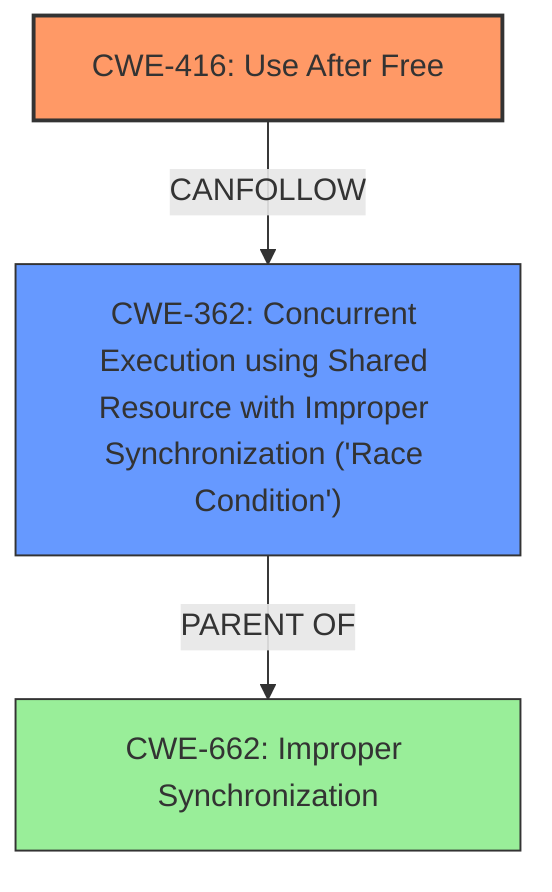

# Final Resolution for CVE-2022-20155

# Summary

| CWE ID  | CWE Name  | Confidence | CWE Abstraction Level | CWE Vulnerability Mapping Label | CWE-Vulnerability Mapping Notes |
|---|---|---|---|---|---|
| CWE-416 | Use After Free | 0.9 | Variant | Allowed | Primary CWE. Memory is accessed after being freed due to a race condition. |
| CWE-362 | Concurrent Execution using Shared Resource with Improper Synchronization ('Race Condition') | 0.8 | Class | Allowed-with-Review | Secondary Candidate CWE. Root cause of the UAF, leading to memory corruption. |

## Evidence and Confidence

*   **Confidence Score:** 0.9
*   **Evidence Strength:** HIGH

## Relationship Analysis
The primary weakness is **CWE-416 (Use After Free)**, a Variant that directly reflects the vulnerability description. The root cause is **CWE-362 (Concurrent Execution using Shared Resource with Improper Synchronization ('Race Condition'))**, a Class, which leads to the **Use After Free**. While **CWE-362** is a Class, its role as the enabler of **CWE-416** is crucial to include in the analysis. The relationship between them shows how a **race condition** can directly lead to memory corruption via a **use-after-free** vulnerability. Other CWEs such as **CWE-413 (Improper Resource Locking)** are related and could potentially be present, however, there is no explicit mention to support that.

## Vulnerability Chain
The vulnerability chain starts with a **race condition (CWE-362)** where multiple threads concurrently access a shared resource. Due to improper synchronization, one thread frees the memory associated with the resource while another thread is still actively using or about to use that memory. This leads to a **use-after-free (CWE-416)** vulnerability, where the second thread attempts to access the freed memory, resulting in memory corruption and potentially privilege escalation.

## Summary of Analysis
The initial analysis correctly identified **CWE-416 (Use After Free)** as the primary weakness and **CWE-362 (Concurrent Execution using Shared Resource with Improper Synchronization ('Race Condition'))** as a contributing factor. The vulnerability description explicitly states a "use-after-free due to a race condition" in `ipu_core_jqs_msg_transport_kernel_write_sync` of `ipu-core-jqs-msg-transport.c`.

The relationship between **CWE-362** and **CWE-416** is crucial. **CWE-362** is the root cause which allows the vulnerability to occur. **CWE-416** is a variant and accurately describes the vulnerability.

The analysis is based on the provided evidence and relationship insights. The confidence score is justified by the direct evidence in the vulnerability description.