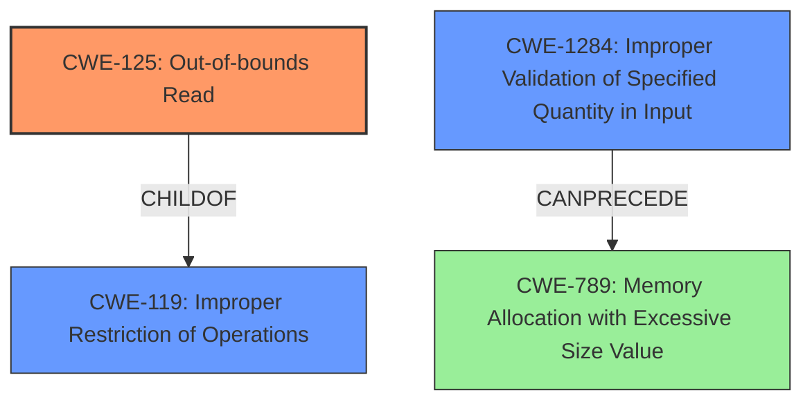

# Analysis Report for CVE-2022-20201

# Vulnerability Analysis Report: CVE-2022-20201

## Description

In getAppSize of InstalldNativeService.cpp, there is a possible out of bounds read due to a missing bounds check. This could lead to local escalation of privilege with System execution privileges needed. User interaction is not needed for exploitation.Product AndroidVersions Android-12LAndroid ID A-220733817

## Vulnerability Description Key Phrases

**Rootcause:** missing bounds check
**Weakness:** out of bounds read
**Impact:** local escalation of privilege
**Product:** Android
**Version:** 12L
**Component:** getAppSize of InstalldNativeService.cpp

## Analysis (with Relationship Data)

# Summary
| CWE ID | CWE Name | Confidence | CWE Abstraction Level | CWE Vulnerability Mapping Label | CWE-Vulnerability Mapping Notes |
|---|---|---|---|---|---|
| CWE-125 | Out-of-bounds Read | 0.9 | Base | Allowed | Primary CWE |
| CWE-1284 | Improper Validation of Specified Quantity in Input | 0.7 | Base | Allowed | Secondary Candidate |

## Evidence and Confidence

*   **Confidence Score:** 0.8
*   **Evidence Strength:** HIGH

- **Analysis and Justification:**
  - *Explanation:* The vulnerability description clearly states an "**out of bounds read** due to a **missing bounds check**" in `getAppSize` of `InstalldNativeService.cpp`. This directly aligns with CWE-125 (Out-of-bounds Read), which describes a condition where the product reads data past the end, or before the beginning, of the intended buffer. The **missing bounds check** is the root cause, and the resulting **out of bounds read** is the weakness. The CVE Reference Links Content Summary confirms this by describing it as an Elevation of Privilege vulnerability.
  - Additionally, the **missing bounds check** implies a failure to validate the input quantity, suggesting CWE-1284 (Improper Validation of Specified Quantity in Input) as a secondary weakness. This is because the size or length related to the app size was not properly validated before being used in the read operation. This missing validation led to the **out of bounds read**.
  - *Relationship Analysis:* CWE-125 is a base level CWE which is appropriate in this case. CWE-125 is a child of CWE-119 (Improper Restriction of Operations Within the Bounds of a Memory Buffer). CWE-1284 (Improper Validation of Specified Quantity in Input) can precede CWE-789 (Memory Allocation with Excessive Size Value).

- **Confidence Score:**
  - Confidence: 0.9 (High confidence due to the direct match between the vulnerability description and CWE-125 and strong indication for CWE-1284)

---

## Criticism of Analysis

Okay, I've reviewed your CWE analysis, incorporating the full CWE specifications you provided. Here's my critique:

**Overall Assessment:**

The analysis is generally good and accurately identifies CWE-125 as the primary weakness. The justification for including CWE-1284 as a secondary weakness is also sound. The confidence level of 0.9 for CWE-125 and 0.7 for CWE-1284 seems appropriate given the information provided. The reasoning is well-articulated and supported by the vulnerability description.

**Detailed Review:**

1.  **CWE-125: Out-of-bounds Read (Primary)**
    *   **Strengths:**
        *   Excellent alignment with the vulnerability description. The phrase "**out of bounds read** due to a **missing bounds check**" directly maps to CWE-125's definition.
        *   Appropriate Base level of abstraction.
        *   The analysis correctly points out that this is a child of CWE-119, but that CWE-125 is more specific and therefore a better fit, adhering to the mapping guidance of CWE-119.
    *   **Potential Improvements:**
        *   While you state that "CWE-125 is a base level CWE which is appropriate in this case," it may be worth briefly explaining **why** none of CWE-125's children (CWE-126, CWE-127) are suitable.  Is the access definitely *after* the buffer (implying CWE-126) or is it potentially *before* (implying CWE-127)?  The description provided doesn't have enough detail to differentiate, so specifying this lack of differentiation reinforces your choice of CWE-125.
        *   Considering Mitigation strategies for CWE-125, highlighting that "Implementation - Input Validation" is most important and how it applies to the analyzed vulnerability can improve the overall quality. "Ensure that you validate and ensure correct calculations for any length argument, buffer size calculation, or offset."
        *   The list of observed examples provided could be improved. Instead of just listing examples for the more generic CWE-119, include examples listed in the documentation for CWE-125, such as:
            * CVE-2023-1018: The reference implementation code for a Trusted Platform Module does not implement length checks on data, allowing for an attacker to read 2 bytes past the end of a buffer.
            * CVE-2020-11899: Out-of-bounds read in IP stack used in embedded systems, as exploited in the wild per CISA KEV.
            * CVE-2014-0160: Chain: "Heartbleed" bug receives an inconsistent length parameter (CWE-130) enabling an out-of-bounds read (CWE-126), returning memory that could include private cryptographic keys and other sensitive data.
    *   **Overall:** Strong choice and well-justified.

2.  **CWE-1284: Improper Validation of Specified Quantity in Input (Secondary)**
    *   **Strengths:**
        *   Good justification for this secondary CWE. The "**missing bounds check**" directly implies a failure to validate the size or length of the data being read.
        *   The analysis correctly notes that CWE-1284 can precede CWE-789 (Memory Allocation with Excessive Size Value) and ties it back to the potential resource consumption issue of the vulnerability.
        *   Appropriate Base level of abstraction.
    *   **Potential Improvements:**
        *   Expand on the *type* of quantity that is missing validation. Is it related to the *size* of the app, the *length* of a data structure, or some other quantity? Providing this detail makes the mapping more precise.  While the general "size or length" fits the description of CWE-1284, pinpointing which quantity is not validated improves the analysis.
        *   Considering Mitigation strategies for CWE-1284, highlighting that "Implementation - Input Validation" is most important and how it applies to the analyzed vulnerability can improve the overall quality. "When performing input validation, consider all potentially relevant properties, including length, type of input, the full range of acceptable values, missing or extra inputs, syntax, consistency across related fields, and conformance to business rules." This is directly applicable to the analysis by explaining why the size/length of the application data should have been validated.
        *   The connection to CWE-789 is good, but could be made stronger by explaining that if the missing bounds check leads to a large or uncontrolled size being used for allocation, it could result in excessive memory allocation. In some cases, the out-of-bounds read would have been prevented if the application data were actually allocated.
    *   **Overall:** Justified and valuable secondary CWE.

3.  **Retriever Results**
    *   The Retriever Results section is useful for seeing what the automated tools suggested.  However, it's important to understand why these results are *incorrect* (if they are), or if they represent a *different perspective* on the vulnerability.
        *   **CWE-908 (Use of Uninitialized Resource):** This might be a valid alternate perspective. If the buffer being read from contains uninitialized data due to the missing bounds check, it could be considered a contributing factor. This highlights a possible *different perspective* rather than a direct error.
        *   **CWE-191 (Integer Underflow) / CWE-190 (Integer Overflow):** These are less likely, but if the size/length calculation involves integer arithmetic, they *could* be contributing factors.  However, without more details in the vulnerability description, they are unlikely to be directly relevant.
        *    **CWE-1021 (Improper Restriction of Rendered UI Layers or Frames):** This is a false positive and should be discarded.
        *   **CWE-416 (Use After Free):** This is a false positive and should be discarded.
        *   **CWE-862 (Missing Authorization):** This is a false positive and should be discarded.
        *   **CWE-131 (Incorrect Calculation of Buffer Size):** This is a valid alternate perspective. This vulnerability would potentially be prevented had the buffer size for the application been calculated correctly.
        *    **CWE-770 (Allocation of Resources Without Limits or Throttling):** This is a valid alternate perspective. This could be in reference to the initial application data size allocation.
        *    **CWE-1284 (Improper Validation of Specified Quantity in Input):** The analysis identifies this as a valid secondary weakness.

**Recommendations:**

*   **Specificity:** Strive for greater specificity when mapping CWEs. The more precise you can be about the *type* of input not being validated or the *specific* memory access issue, the stronger your analysis will be.
*   **Mitigation Focus:** Explicitly mention relevant mitigation strategies for the identified CWEs, especially those that directly address the root cause. Consider how the mitigation strategies may have prevented the vulnerability.
*   **Relationship Exploration:** Briefly discuss *why* the automated tools might have suggested other CWEs, even if they are ultimately incorrect. This demonstrates a thorough understanding of the vulnerability and the nuances of CWE mapping.
*   **CWE Examples:** Include observed examples for the identified CWEs for more robust documentation.

By incorporating these suggestions, you can create an even more compelling and insightful CWE analysis.

## Final Resolution

# Summary
| CWE ID | CWE Name | Confidence | CWE Abstraction Level | CWE Vulnerability Mapping Label | CWE-Vulnerability Mapping Notes |
|---|---|---|---|---|---|
| CWE-125 | Out-of-bounds Read | 0.95 | Base | Allowed | Primary CWE |
| CWE-1284 | Improper Validation of Specified Quantity in Input | 0.8 | Base | Allowed | Secondary Candidate |

## Evidence and Confidence

*   **Confidence Score:** 0.9
*   **Evidence Strength:** HIGH

## Relationship Analysis
The primary CWE is CWE-125 (**Out-of-bounds Read**), which is a child of CWE-119 (**Improper Restriction of Operations Within the Bounds of a Memory Buffer**). This parent-child relationship indicates that CWE-125 is a more specific type of buffer access issue. The secondary CWE is CWE-1284 (**Improper Validation of Specified Quantity in Input**). CWE-1284 can precede CWE-789 (**Memory Allocation with Excessive Size Value**), illustrating a potential chain where improper input validation leads to memory allocation issues and subsequent **out-of-bounds reads**.

## Vulnerability Chain
The vulnerability chain starts with the **ROOTCAUSE** of a **missing bounds check** (CWE-1284), leading to an **out-of-bounds read** (CWE-125). The prerequisite is that the application reads a size or length value without proper validation. The consequence is potential information disclosure or privilege escalation due to reading from unintended memory locations.

## Summary of Analysis
The initial analysis correctly identified CWE-125 and CWE-1284 as the primary and secondary weaknesses, respectively. The vulnerability description explicitly mentions "**out of bounds read** due to a **missing bounds check**," which directly maps to CWE-125 and implies CWE-1284. The criticism provided valuable suggestions, including explaining why none of CWE-125's children (CWE-126, CWE-127) are more suitable and focusing on relevant mitigation strategies. The reason CWE-125's children are not suitable is because the description provided doesn't have enough detail to differentiate if the access is definitely *after* the buffer (implying CWE-126) or is it potentially *before* (implying CWE-127). The assessment is primarily based on the provided evidence, with the vulnerability description serving as the main source. The graph relationships influenced the final selection by confirming the hierarchical relationship between CWE-125 and CWE-119 and illustrating a potential chain involving CWE-1284 and CWE-789. The selected CWEs are at the optimal level of specificity because they directly address the **ROOTCAUSE** and the resulting **WEAKNESS** described in the vulnerability.

*Report generated on 2025-03-18 09:12:10*
