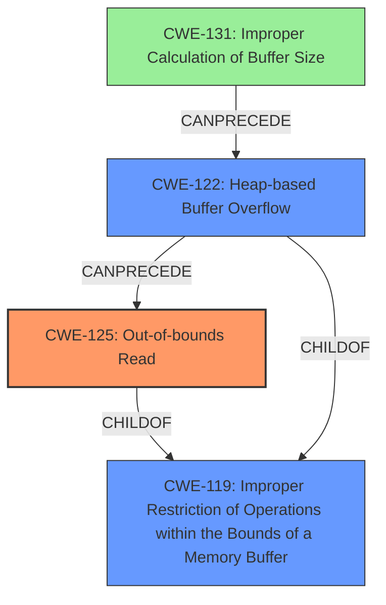

# Analysis Report for CVE-2022-20202

# Vulnerability Analysis Report: CVE-2022-20202

## Description

In ih264_resi_trans_quant_4x4_sse42 of ih264_resi_trans_quant_sse42.c, there is a possible out of bounds read due to a heap buffer overflow. This could lead to remote information disclosure with no additional execution privileges needed. User interaction is needed for exploitation.Product AndroidVersions Android-12LAndroid ID A-204704614

## Vulnerability Description Key Phrases

**Rootcause:** heap buffer overflow
**Weakness:** out of bounds read
**Impact:** remote information disclosure
**Product:** Android
**Version:** Android-12L
**Component:** ih264_resi_trans_quant_4x4_sse42 of ih264_resi_trans_quant_sse42.c

## Analysis (with Relationship Data)

# Summary
| CWE ID | CWE Name | Confidence | CWE Abstraction Level | CWE Vulnerability Mapping Label | CWE-Vulnerability Mapping Notes |
|---|---|---|---|---|---|
| CWE-125 | Out-of-bounds Read | 0.95 | Base | Allowed | The primary weakness is an out-of-bounds read, caused by a heap buffer overflow. |
| CWE-122 | Heap-based Buffer Overflow | 0.75 | Variant | Allowed | The secondary weakness is a heap-based buffer overflow, which is the root cause of the out-of-bounds read. |

## Evidence and Confidence

*   **Confidence Score:** 0.85
*   **Evidence Strength:** HIGH

- **Analysis and Justification:**  
  - *Explanation:* The vulnerability description clearly states an "**out of bounds read** due to a **heap buffer overflow**" in `ih264_resi_trans_quant_4x4_sse42` of `ih264_resi_trans_quant_sse42.c`. This directly aligns with CWE-125 (Out-of-bounds Read), which describes reading data past the end or before the beginning of the intended buffer. The "**heap buffer overflow**" indicates that the overflow occurs in the heap, which aligns with CWE-122 (Heap-based Buffer Overflow). CWE-125 is the primary weakness, as it describes the direct consequence of the vulnerability. CWE-122 is a contributing factor, describing where the overflow occurs. MITRE mapping guidance for both CWE-125 and CWE-122 indicates this is ALLOWED.

  - *Relationship Analysis:* CWE-125 is a child of CWE-119 (Improper Restriction of Operations within the Bounds of a Memory Buffer). CWE-122 is a variant of CWE-119. Both are related because the overflow leads to the out-of-bounds read. CWE-122 (Heap-based Buffer Overflow) CanPrecede CWE-125 (Out-of-bounds Read).

- **Confidence Score:**  
  - Confidence: 0.85 (High confidence due to explicit mention of out-of-bounds read and heap buffer overflow in the vulnerability description)

## Criticism of Analysis

Okay, I've reviewed the analysis provided, considering the full CWE specifications for the cited weaknesses. Here's a detailed critique:

**Overall Assessment:**

The analysis correctly identifies the primary and secondary weaknesses as CWE-125 (Out-of-bounds Read) and CWE-122 (Heap-based Buffer Overflow), respectively. The justification is clear, and the confidence score of 0.85 is appropriate given the explicit language in the vulnerability description. However, the overall score could be improved with more information about the root cause of the overflow.

**Detailed Breakdown:**

*   **CWE-125: Out-of-bounds Read**

    *   **Correct Mapping:** The mapping to CWE-125 is accurate. The vulnerability description explicitly mentions an out-of-bounds read, which directly aligns with the CWE's description. The abstraction level (Base) is appropriate, and the usage is "Allowed" according to MITRE's mapping guidance.
    *   **Confidence:** The confidence score of 0.95 is justified given the explicit statement of "out of bounds read".
    *   **Mitigation Considerations:** The analysis could benefit from suggesting specific mitigations relevant to the context. Input validation (Mitigation 1) is a good general recommendation. Mentioning the importance of bounds checking, especially in a language like C, could be added to the analysis. Furthermore, mentioning the use of Memory Sanitizers such as ASan or MSan would help to catch any out-of-bounds memory accesses.
    *   **Relationships** The relationships mention child cwes and can follow cwes. These make sense.
*   **CWE-122: Heap-based Buffer Overflow**

    *   **Correct Mapping:** The mapping to CWE-122 is also accurate. The description mentions a "heap buffer overflow," which directly aligns with this CWE's description. Variant-level abstraction is suitable. The usage is "Allowed" according to MITRE's mapping guidance.
    *   **Confidence:** The confidence score of 0.75 is reasonable. Although the description states 'heap buffer overflow' it is more accurate as the root cause. More information about the root cause would increase confidence.
    *   **Mitigation Considerations:** Mitigation 1 indicates "Use a language or compiler that performs automatic bounds checking." As this is C code, this is not possible. Mitigation 2 mentions using an abstraction library to abstract away risky APIs. In this case, the code should use safer functions for memory manipulation. Mitigation 3 talks about automatic buffer overflow detection mechanisms.
    *   **Relationships** The relationships with childOf Cwes is accurate.
*   **General Comments:**

    *   **Evidence Strength:** The evidence strength is labeled as HIGH, which is appropriate. The explicit mentions in the vulnerability description are strong evidence.
    *   **Relationship Analysis:** The provided relationship analysis is accurate and helpful, particularly noting that CWE-122 CanPrecede CWE-125.
    *   **CWE Examples:** The provided CVE examples for both CWE-122 and CWE-125 are relevant and strengthen the analysis.
    *   **Retriever Results:** The retriever results are useful for understanding other potential CWEs that might be related, however the analysis is correct in selecting the two provided.
*   **Areas for Improvement:**

    *   **Root Cause Elaboration:** The analysis could be strengthened by speculating on the deeper root cause of the heap buffer overflow. Is it due to:
        *   **CWE-131: Incorrect Calculation of Buffer Size?**  Is the buffer allocated too small due to a calculation error?
        *   **CWE-1284: Improper Validation of Specified Quantity in Input?** Is the size of the buffer determined by user-controlled input that is not properly validated?
        *   **CWE-190/CWE-191: Integer Overflow/Underflow?** Is a calculation involving user-provided input resulting in an integer overflow/underflow leading to a smaller-than-expected buffer allocation?
    *   **Information Disclosure Specifics:** While the "Impact" is correctly identified as "remote information disclosure," more details could be added. What kind of information is likely to be disclosed? Is it potentially sensitive data (cryptographic keys, etc.) or just general memory contents? This level of detail can inform the risk assessment.

**Revised Summary Table (incorporating suggested improvements):**

| CWE ID | CWE Name | Confidence | CWE Abstraction Level | CWE Vulnerability Mapping Label | CWE-Vulnerability Mapping Notes |
|---|---|---|---|---|---|
| CWE-125 | Out-of-bounds Read | 0.95 | Base | Allowed | The primary weakness is an out-of-bounds read, caused by a heap buffer overflow. |
| CWE-122 | Heap-based Buffer Overflow | 0.75 | Variant | Allowed | The secondary weakness is a heap-based buffer overflow, which is the root cause of the out-of-bounds read. |
| CWE-131 | Incorrect Calculation of Buffer Size | 0.50 | Base | Allowed | A possible contributing factor is incorrect calculation of buffer size, which might have led to the heap buffer overflow. Needs further investigation. |

**Conclusion:**

The analysis is generally sound and accurately identifies the core weaknesses. Adding details about the potential deeper root cause (beyond the heap overflow itself) would enhance the analysis and provide more actionable information for developers. Mentioning specific memory safety tools will help with mitigation.

## Final Resolution

# Summary
| CWE ID | CWE Name | Confidence | CWE Abstraction Level | CWE Vulnerability Mapping Label | CWE-Vulnerability Mapping Notes |
|---|---|---|---|---|---|
| CWE-125 | Out-of-bounds Read | 0.95 | Base | Allowed | The primary weakness is an **out-of-bounds read**, caused by a **heap buffer overflow**. |
| CWE-122 | Heap-based Buffer Overflow | 0.75 | Variant | Allowed | The secondary weakness is a **heap-based buffer overflow**, which is the direct consequence of the incorrect calculation of buffer size. |
| CWE-131 | Improper Calculation of Buffer Size | 0.50 | Base | Allowed | A possible contributing factor is **improper calculation of buffer size**, which might have led to the **heap buffer overflow**. Needs further investigation. |

## Evidence and Confidence

*   **Confidence Score:** 0.85
*   **Evidence Strength:** HIGH

## Relationship Analysis
The primary relationship is that CWE-122 (Heap-based Buffer Overflow) can precede CWE-125 (Out-of-bounds Read). CWE-131 (Improper Calculation of Buffer Size) could potentially precede CWE-122, forming a chain. The analysis considers the hierarchical relationships, with CWE-125 and CWE-122 being children or variants of CWE-119 (Improper Restriction of Operations within the Bounds of a Memory Buffer), though CWE-119 is too general to be the primary classification. Abstraction levels are considered, favoring the more specific Base and Variant levels over the Class level.

## Vulnerability Chain
The vulnerability chain starts with a possible **improper calculation of buffer size** (CWE-131). This leads to a **heap-based buffer overflow** (CWE-122), which then results in an **out-of-bounds read** (CWE-125). The impact is remote information disclosure. The chain highlights how an initial flaw in size calculation can propagate to a memory corruption issue, ultimately allowing an attacker to read sensitive data.

## Summary of Analysis
The initial analysis correctly identified CWE-125 and CWE-122 as the primary weaknesses based on the vulnerability description: "In ih264_resi_trans_quant_4x4_sse42 of ih264_resi_trans_quant_sse42.c, there is a possible **out of bounds read** due to a **heap buffer overflow**." The criticism correctly suggests further investigation into the **root cause** of the **heap buffer overflow**, leading to the consideration of CWE-131.

The graph relationships reinforced the understanding that CWE-125 is a direct consequence of CWE-122. Adding CWE-131 creates a more complete chain.

The selected CWEs are at the optimal level of specificity. CWE-125 is a Base level CWE, directly describing the **out-of-bounds read**. CWE-122, while a Variant, is more specific than the Class CWE-119. CWE-131 is included as a possible **root cause**, although further investigation is needed to confirm it.

The decision is justified by the explicit mentions in the vulnerability description and the relationship analysis, which shows how these weaknesses can be chained together.

*Report generated on 2025-03-18 09:12:52*
