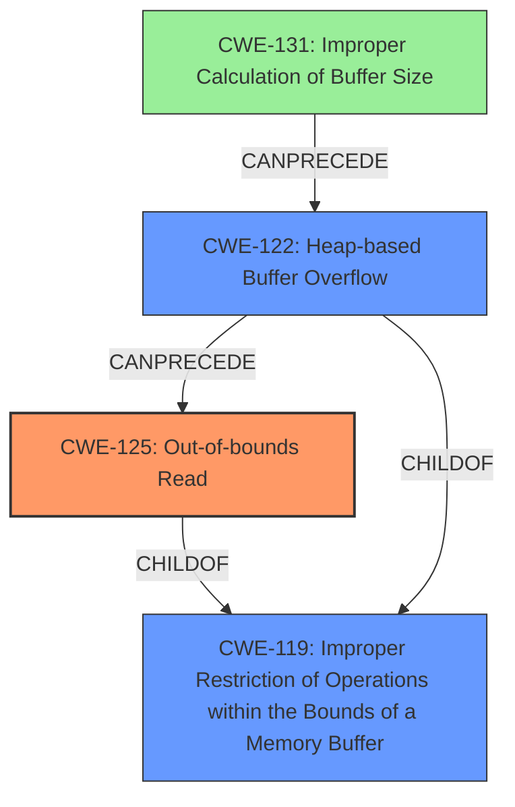

# Final Resolution for CVE-2022-20202

# Summary
| CWE ID | CWE Name | Confidence | CWE Abstraction Level | CWE Vulnerability Mapping Label | CWE-Vulnerability Mapping Notes |
|---|---|---|---|---|---|
| CWE-125 | Out-of-bounds Read | 0.95 | Base | Allowed | The primary weakness is an **out-of-bounds read**, caused by a **heap buffer overflow**. |
| CWE-122 | Heap-based Buffer Overflow | 0.75 | Variant | Allowed | The secondary weakness is a **heap-based buffer overflow**, which is the direct consequence of the incorrect calculation of buffer size. |
| CWE-131 | Improper Calculation of Buffer Size | 0.50 | Base | Allowed | A possible contributing factor is **improper calculation of buffer size**, which might have led to the **heap buffer overflow**. Needs further investigation. |

## Evidence and Confidence

*   **Confidence Score:** 0.85
*   **Evidence Strength:** HIGH

## Relationship Analysis
The primary relationship is that CWE-122 (Heap-based Buffer Overflow) can precede CWE-125 (Out-of-bounds Read). CWE-131 (Improper Calculation of Buffer Size) could potentially precede CWE-122, forming a chain. The analysis considers the hierarchical relationships, with CWE-125 and CWE-122 being children or variants of CWE-119 (Improper Restriction of Operations within the Bounds of a Memory Buffer), though CWE-119 is too general to be the primary classification. Abstraction levels are considered, favoring the more specific Base and Variant levels over the Class level.

## Vulnerability Chain
The vulnerability chain starts with a possible **improper calculation of buffer size** (CWE-131). This leads to a **heap-based buffer overflow** (CWE-122), which then results in an **out-of-bounds read** (CWE-125). The impact is remote information disclosure. The chain highlights how an initial flaw in size calculation can propagate to a memory corruption issue, ultimately allowing an attacker to read sensitive data.

## Summary of Analysis
The initial analysis correctly identified CWE-125 and CWE-122 as the primary weaknesses based on the vulnerability description: "In ih264_resi_trans_quant_4x4_sse42 of ih264_resi_trans_quant_sse42.c, there is a possible **out of bounds read** due to a **heap buffer overflow**." The criticism correctly suggests further investigation into the **root cause** of the **heap buffer overflow**, leading to the consideration of CWE-131.

The graph relationships reinforced the understanding that CWE-125 is a direct consequence of CWE-122. Adding CWE-131 creates a more complete chain.

The selected CWEs are at the optimal level of specificity. CWE-125 is a Base level CWE, directly describing the **out-of-bounds read**. CWE-122, while a Variant, is more specific than the Class CWE-119. CWE-131 is included as a possible **root cause**, although further investigation is needed to confirm it.

The decision is justified by the explicit mentions in the vulnerability description and the relationship analysis, which shows how these weaknesses can be chained together.