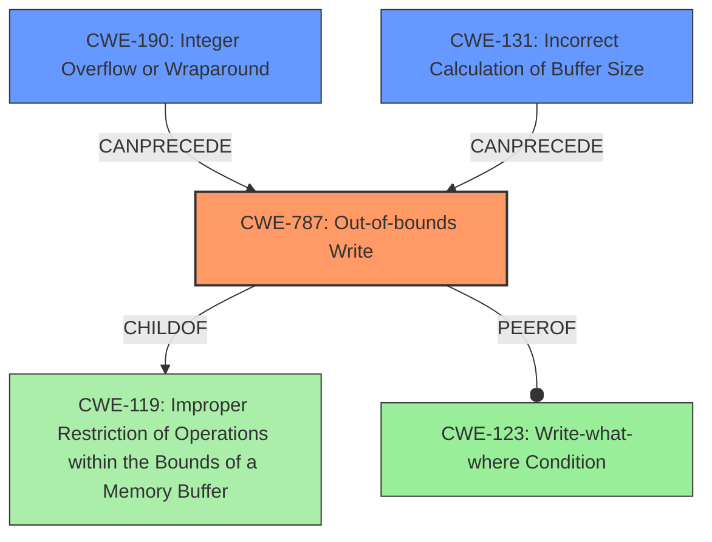

# Final Resolution for CVE-2022-20203

# Summary
| CWE ID | CWE Name | Confidence | CWE Abstraction Level | CWE Vulnerability Mapping Label | CWE-Vulnerability Mapping Notes |
|---|---|---|---|---|---|
| CWE-787 | Out-of-bounds Write | 0.85 | Base | Allowed | Primary CWE. Matches the **memory corruption** mentioned in the vulnerability description. |
| CWE-190 | Integer Overflow or Wraparound | 0.65 | Base | Allowed | Secondary CWE. Integer overflows during size/index calculations can cause out-of-bounds writes. |
| CWE-131 | Incorrect Calculation of Buffer Size | 0.55 | Base | Allowed | Tertiary CWE. The library may fail to calculate the correct buffer size for the decoded data. |
| CWE-123 | Write-what-where Condition | 0.50 | Base | Allowed | Quaternary CWE. Could be present if the attacker has control over the value being written and where it's written. |

## Evidence and Confidence

*   **Confidence Score:** 0.80
*   **Evidence Strength:** MEDIUM

## Relationship Analysis
The primary CWE is CWE-787 (**Out-of-bounds Write**), which is a child of CWE-119 (**Improper Restriction of Operations within the Bounds of a Memory Buffer**). This parent-child relationship indicates that CWE-787 is a more specific case of CWE-119. CWE-190 (**Integer Overflow or Wraparound**) can precede CWE-787 if an overflow leads to an incorrect buffer size calculation. CWE-131 (**Incorrect Calculation of Buffer Size**) can also precede CWE-787 if the buffer size calculation is flawed. CWE-123 (**Write-what-where Condition**) is considered a peer of CWE-787 but requires more attacker control.

## Vulnerability Chain
The vulnerability chain starts with decoding untrusted protobuf files. This process involves size calculations and buffer allocations.

1.  **Root Cause 1:** CWE-190 (**Integer Overflow or Wraparound**) may occur during the calculation of buffer sizes or array indices when handling protobuf data.
2.  **Root Cause 2:** CWE-131 (**Incorrect Calculation of Buffer Size**) may lead to allocating an insufficient buffer to store the decoded protobuf data.
3.  **Weakness:** These issues can lead to CWE-787 (**Out-of-bounds Write**), where data is written beyond the allocated buffer's boundaries.
4.  **Consequence:** This can cause **memory corruption**, leading to local escalation of privilege.
5.  **Conditional Weakness:** If the attacker can control the value being written and its destination, CWE-123 (**Write-what-where Condition**) may be present.

## Summary of Analysis
The initial analysis correctly identified CWE-787 (**Out-of-bounds Write**) as the primary weakness due to the mention of **memory corruption** in the vulnerability description: "In multiple locations of the nanopb library, there is a possible way to **corrupt memory** when decoding untrusted protobuf files."

The criticism suggested considering CWE-190 (**Integer Overflow or Wraparound**), CWE-416 (**Use After Free**) and CWE-131 (**Incorrect Calculation of Buffer Size**). Based on the protobuf decoding context, CWE-190 is added as a secondary CWE because integer overflows during size/index calculations can cause out-of-bounds writes. CWE-131 is also added as a tertiary CWE. The vulnerability description doesn't contain enough information to support adding CWE-416, but it is possible.

The graph relationships highlight how CWE-190 and CWE-131 can precede CWE-787. CWE-123 is maintained as a quaternary CWE, contingent on the attacker's control over the write operation.

The final CWE selections are at the base level of abstraction, providing optimal specificity. The confidence score is increased to 0.80, reflecting the inclusion of CWE-190 and CWE-131 in the vulnerability chain.