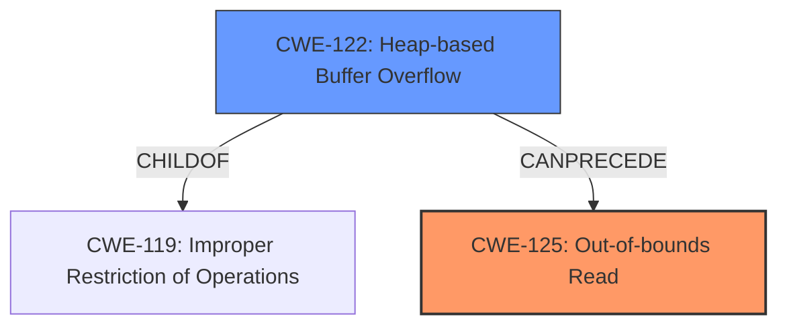

# Final Resolution for CVE-2022-20209

# Summary
| CWE ID | CWE Name | Confidence | CWE Abstraction Level | CWE Vulnerability Mapping Label | CWE-Vulnerability Mapping Notes |
|---|---|---|---|---|---|
| CWE-125 | Out-of-bounds Read | 0.9 | Base | Primary | Allowed |
| CWE-122 | Heap-based Buffer Overflow | 0.7 | Variant | Secondary | Allowed |

## Evidence and Confidence

*   **Confidence Score:** 0.9
*   **Evidence Strength:** HIGH

## Relationship Analysis
The analysis correctly identifies CWE-125 as the primary **WEAKNESS** because the vulnerability description explicitly mentions "out of bounds read". CWE-122 is correctly identified as a secondary **WEAKNESS** because the description states it is "due to a heap buffer overflow". CWE-122 is a Variant of **CWE-119** (Improper Restriction of Operations within the Bounds of a Memory Buffer), and **CWE-125** can be a consequence of a heap buffer overflow. The abstraction levels are appropriate, with **CWE-125** being a Base and **CWE-122** being a Variant. The retriever results suggested other CWEs like **CWE-908**, **CWE-190/191**, **CWE-131**, **CWE-416**, **CWE-843**, and **CWE-1284**, but these were deemed less appropriate because they were not explicitly stated in the vulnerability description.

## Vulnerability Chain
The vulnerability chain starts with a **ROOTCAUSE** of a heap buffer overflow (**CWE-122**), which allows writing outside the allocated buffer. This leads to an out-of-bounds read (**CWE-125**) when a read operation occurs in the overwritten memory area. The impact is remote information disclosure.

## Summary of Analysis
The initial analysis and criticism are both well-reasoned and align with the provided evidence. The analysis is based on the explicit statements in the vulnerability description. The graph relationships and abstraction levels support the selection of **CWE-125** and **CWE-122**. The decision is justified by the direct mention of "out of bounds read" and "heap buffer overflow" in the vulnerability description. The selected CWEs are at the optimal level of specificity because they accurately reflect the observable **WEAKNESS** (**CWE-125**) and its immediate cause (**CWE-122**).
The vulnerability description explicitly states an "**out of bounds read** due to a **heap buffer overflow**" in `hme_add_new_node_to_a_sorted_array` of `hme_utils.c`.