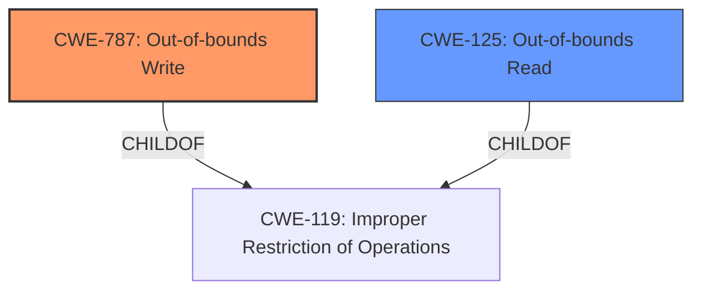

# Final Resolution for CVE-2022-20237

# Summary
| CWE ID | CWE Name | Confidence | CWE Abstraction Level | CWE Vulnerability Mapping Label | CWE-Vulnerability Mapping Notes |
|---|---|---|---|---|---|
| **CWE-787** | **Out-of-bounds Write** | 0.95 | Base | Allowed | The primary weakness is an **out-of-bounds write** due to a **missing bounds check**. |
| CWE-125 | Out-of-bounds Read | 0.60 | Base | Allowed | If the write operation involves reading data before writing (e.g., in a read-modify-write scenario), then it is *possible* that an **out-of-bounds read** could occur if the read is not also bounds-checked. |

## Evidence and Confidence

*   **Confidence Score:** 0.93
*   **Evidence Strength:** HIGH

## Relationship Analysis
The primary relationship that impacted the decision was the parent-child relationship between **CWE-787** (**Out-of-bounds Write**) and **CWE-119** (**Improper Restriction of Operations within the Bounds of a Memory Buffer**). **CWE-787** is a more specific instance of the more general **CWE-119**, and the vulnerability description clearly indicates an out-of-bounds write. **CWE-125** (**Out-of-bounds Read**) was considered as a secondary weakness, as a read operation could potentially occur before the write if it's a read-modify-write operation. The abstraction levels influenced the selection by favoring the more specific Base level CWEs over higher-level Class or Pillar CWEs.

## Vulnerability Chain
The vulnerability chain starts with the **missing bounds check**, which is the root cause. This leads directly to **CWE-787** (**Out-of-bounds Write**), allowing data to be written outside the intended buffer. If the write operation involves reading data before writing, it can also lead to **CWE-125** (**Out-of-bounds Read**). The consequence of the **out-of-bounds write** is remote code execution.

## Summary of Analysis
The initial analysis correctly identified **CWE-787** (**Out-of-bounds Write**) as the primary weakness. The criticism suggested a more specific justification for **CWE-125** (**Out-of-bounds Read**), which has been incorporated into the analysis. The initial inclusion of **CWE-1285** (**Improper Validation of Specified Index, Position, or Offset in Input**) has been removed because the vulnerability is more directly related to the *code* not validating the calculated offset *before* writing, regardless of the initial input's validity.

The vulnerability description states: "In BuildDevIDResponse of miscdatabuilder.cpp, there is a possible **out of bounds write** due to a **missing bounds check**." This evidence strongly supports the classification of **CWE-787**.

The graph relationships influenced the final selection by confirming that **CWE-787** is a specific type of **CWE-119**, making it the more appropriate choice. The selected CWEs are at the optimal level of specificity because they directly reflect the root cause (**missing bounds check** leading to **out-of-bounds write**) and a potential secondary issue (**out-of-bounds read**).