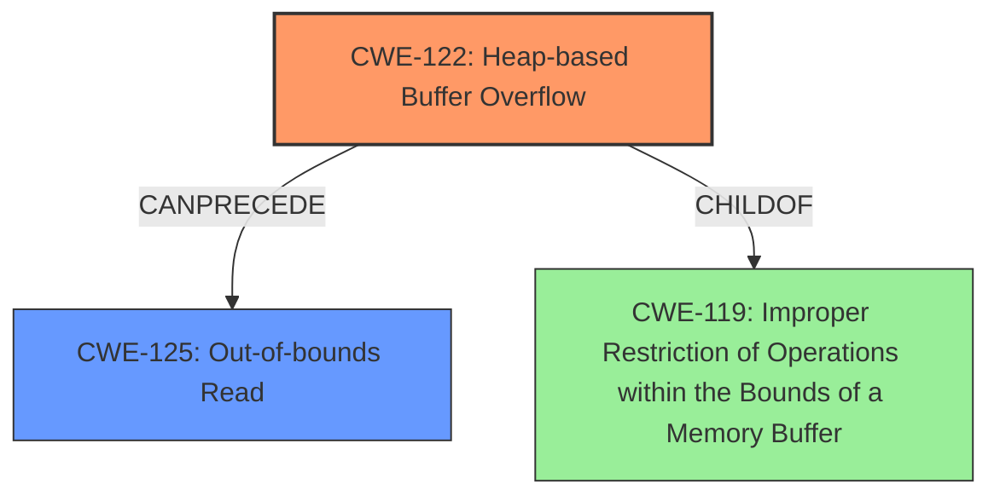

# Final Resolution for CVE-2022-20247

# Summary
| CWE ID | CWE Name | Confidence | CWE Abstraction Level | CWE Vulnerability Mapping Label | CWE-Vulnerability Mapping Notes |
|---|---|---|---|---|---|
| CWE-122 | Heap-based Buffer Overflow | 0.90 | Variant | Allowed | Primary CWE: The vulnerability description explicitly states a heap buffer overflow, which is a specific type of buffer overflow. |
| CWE-125 | Out-of-bounds Read | 0.85 | Base | Allowed | Secondary CWE: The vulnerability description explicitly states an out-of-bounds read. |

## Evidence and Confidence

*   **Confidence Score:** 0.90
*   **Evidence Strength:** HIGH

## Relationship Analysis
The primary **weakness** is a **CWE-122 (Heap-based Buffer Overflow)**, which leads to **CWE-125 (Out-of-bounds Read)**. CWE-122 is a variant of **CWE-119 (Improper Restriction of Operations within the Bounds of a Memory Buffer)**, but is more specific. The heap overflow corrupts memory, allowing subsequent read operations to access memory outside the intended buffer.

## Vulnerability Chain
The vulnerability chain begins with a **CWE-122 (Heap-based Buffer Overflow)**. This allows an attacker to overwrite memory on the heap. This overflow leads directly to **CWE-125 (Out-of-bounds Read)** when the application attempts to read data from the corrupted memory region. The final impact is remote information disclosure.

## Summary of Analysis
The initial analysis correctly identified CWE-125 and CWE-122. The criticism provided useful suggestions for strengthening the justification and considering alternative CWEs. I agree with the assessment that CWE-122 (Heap-based Buffer Overflow) is the root cause, leading to CWE-125 (Out-of-bounds Read).

The vulnerability description states, "In Media, there is a possible **out of bounds read** due to a **heap buffer overflow**." This statement provides direct evidence for both CWE-125 and CWE-122.

The relationship analysis confirms that CWE-122 can precede CWE-125. The heap overflow corrupts memory, leading to the out-of-bounds read.

The selected CWEs are at the optimal level of specificity. CWE-122 is more specific than a general buffer overflow (**CWE-787 (Out-of-bounds Write)**) or **CWE-119 (Improper Restriction of Operations within the Bounds of a Memory Buffer)** because it specifies that the overflow occurs on the heap.

I am increasing the confidence in CWE-122 to 0.90 because it is the root cause. I am maintaining the confidence in CWE-125 at 0.85.