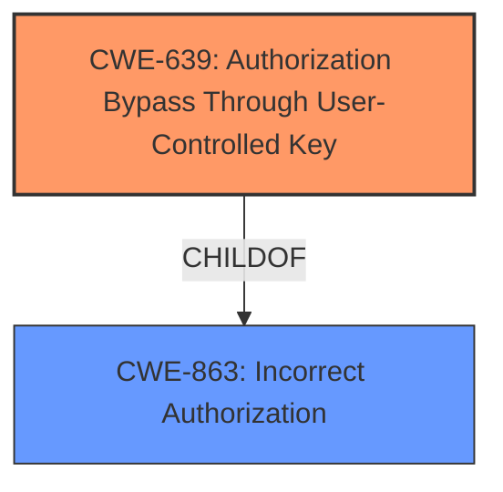

# Final Resolution for CVE-2022-2037

# Summary
| CWE ID  | CWE Name | Confidence | CWE Abstraction Level | CWE Vulnerability Mapping Label | CWE-Vulnerability Mapping Notes |
|-----------------|-------------------------------------------------------------------------------------------|------------|-----------------------|-----------------------------------|-----------------------------------------------------------------------------------------------------------------------------------------------------------------------|
| CWE-639  | Authorization Bypass Through User-Controlled Key| 0.70 | Base  | Primary | Allowed. The vulnerability stems from improper authorization, allowing a user to gain access to another user's data by manipulating the key value identifying the data.
| CWE-863 | Incorrect Authorization | 0.40 | Class | Secondary Candidate | Allowed-with-Review. The root cause is an authorization issue, but this class is too general and a more specific CWE is preferred.

## Evidence and Confidence

*   **Confidence Score:** 0.70
*   **Evidence Strength:** MEDIUM

## Relationship Analysis
The primary decision driver was the specificity of CWE-639. While CWE-863 is a parent, it lacks the focus on user-controlled keys that directly reflects the vulnerability. There are no direct relationships to analyze as the data provided had no relationships other than ParentOf for CWE-863 and children.

## Vulnerability Chain
The chain of events starts with **insecure handling of organization tokens and invitation tokens** (**ROOTCAUSE**). This leads to **CWE-639: Authorization Bypass Through User-Controlled Key** where an attacker can manipulate these tokens to gain unauthorized access. The final impact is unauthorized access to organizations and data exposure.

## Summary of Analysis
Both the initial analysis and the criticism converge on **CWE-639: Authorization Bypass Through User-Controlled Key** as the primary **WEAKNESS**. The vulnerability description highlights the manipulation of tokens, which directly aligns with CWE-639's focus on user-controlled keys used for authorization bypass. The vulnerability description states that there is an "**excessive attack surface** related to user invitations and organization context. The **root cause** is an **insecure handling of organization tokens and invitation tokens**, where the application didn't properly enforce the organization context during password setting. The code changes aim to fix this by explicitly enforcing organization context, suggesting a previous vulnerability where users could potentially gain unauthorized access to organizations."

The criticism rightly points out the importance of linking the vulnerability to the CWE specifications, and I have tried to incorporate that in my summary analysis. The relationship analysis highlighted that while CWE-863 is a parent, it lacks specificity. CWE-639 is the optimal level of specificity as it directly addresses the manipulation of tokens. While there is no direct evidence of exploitation, the code changes and the vulnerability description provide sufficient evidence to support a confidence score of 0.70.