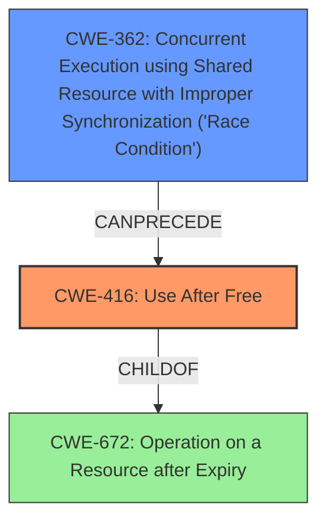

# Final Resolution for CVE-2022-20373

# Summary
| CWE ID | CWE Name | Confidence | CWE Abstraction Level | CWE Vulnerability Mapping Label | CWE-Vulnerability Mapping Notes |
|---|---|---|---|---|---|
| CWE-416 | Use After Free | 0.9 | Variant | Allowed | Primary CWE |
| CWE-362 | Concurrent Execution using Shared Resource with Improper Synchronization ('Race Condition') | 0.7 | Class | Allowed-with-Review | Secondary CWE |

## Evidence and Confidence

*   **Confidence Score:** 0.85
*   **Evidence Strength:** HIGH

## Relationship Analysis
The primary relationship impacting the decision is the CAN_FOLLOW relationship between CWE-362 and CWE-416. The **race condition** (CWE-362) allows code to execute in an order that results in a **use-after-free** (CWE-416). While there are more specific children of CWE-362, the provided information is insufficient to determine which of those children is most appropriate. The variant-level CWE-416 provides a more specific description of the vulnerability than its class-level parent, CWE-672 (Operation on a Resource after Expiry).

## Vulnerability Chain
The vulnerability chain starts with a **race condition** (CWE-362) in the `st21nfc_loc_set_polaritymode` function. This leads to memory being freed while another thread is still using it. Subsequently, the thread attempts to access the freed memory, resulting in a **use-after-free** (CWE-416) vulnerability. This can lead to local escalation of privilege.

## Summary of Analysis
The initial analysis and criticism both correctly identify CWE-416 as the primary weakness and CWE-362 as a contributing factor. The vulnerability description explicitly states a "**use after free**" condition exists due to a "**race condition**" in `st21nfc_loc_set_polaritymode`.

The selection of CWE-416 is based on the direct evidence of a "use-after-free" condition. The decision to include CWE-362 is based on the explicit mention of a "race condition" being the root cause. The CAN_FOLLOW relationship between CWE-362 and CWE-416 supports this classification. The analysis also considered the abstraction levels of the CWEs and selected CWE-416 (Variant) because it provides a more specific description of the vulnerability than its parent class CWE-672 (Operation on a Resource after Expiry). While the criticism suggested exploring child CWEs of CWE-362, the available evidence is not specific enough to confidently select one of those children.