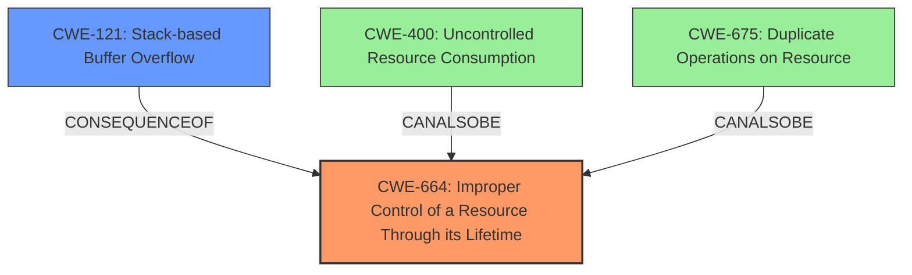

# Analysis Report for CVE-2022-20382

# Vulnerability Analysis Report: CVE-2022-20382

## Description

In (TBD) of (TBD), there is a possible out of bounds write due to kernel stack overflow. This could lead to local escalation of privilege with System execution privileges needed. User interaction is not needed for exploitation.Product AndroidVersions Android kernelAndroid ID A-214245176References Upstream kernel

## Vulnerability Description Key Phrases

**Weakness:** kernel stack overflow
**Impact:** local escalation of privilege
**Vector:** out of bounds write
**Product:** Android

## Analysis (with Relationship Data)

# Summary
| CWE ID | CWE Name | Confidence | CWE Abstraction Level | CWE Vulnerability Mapping Label | CWE-Vulnerability Mapping Notes |
|---|---|---|---|---|---|
| CWE-675 | Duplicate Operations on Resource | 0.85 | Base | Primary | The root cause is an incorrect implementation that leads to duplicate operations on the superblock, and ultimately a stack overflow. |
| CWE-121 | Stack-based Buffer Overflow | 0.70 | Base | Secondary | The stack overflow is a consequence of the recursive calls, but not the direct root cause. |

## Evidence and Confidence

*   **Confidence Score:** 0.80
*   **Evidence Strength:** HIGH

- **Analysis and Justification:**
  - *Explanation:* The vulnerability is caused by the `incfs_mount_fs()` function incorrectly handling multiple mount requests, allocating a new superblock for each call, leading to recursive calls and a **kernel stack overflow**. The root cause of the issue isn't the stack overflow itself, but rather the logic that causes multiple operations to be performed on the same resource. This aligns with CWE-675 (Duplicate Operations on Resource). CWE-675 is a base level CWE. CWE-121 is included as a secondary issue, because the stack overflow itself is a consequence of the vulnerability, and it is a buffer overflow on the stack, but is not the best fit for the root cause.
  - *Relationship Analysis:* CWE-675 does not have defined parent/child relationships, but is a base CWE, suggesting it is a fundamental issue. CWE-121 is a type of buffer overflow, specifically on the stack.

- **Confidence Score:**
  - Confidence: 0.85 (High confidence based on the detailed description of the root cause and the technical details provided in the CVE reference. The kernel stack overflow results from the **duplicate operations**.)

---

## Criticism of Analysis

Okay, here's a detailed review of the CWE analysis, considering the full CWE specifications provided.

**Overall Assessment:**

The analysis is generally good. It correctly identifies the *consequence* of the vulnerability as a stack-based buffer overflow (CWE-121) but also attempts to identify the *root cause* leading to that overflow.  The choice of CWE-675 (Multiple Operations on Resource in Single-Operation Context) for the root cause is interesting and has some merit, but also some drawbacks, which will be discussed below. The confidence score of 0.85 is reasonable given the information available.

**Detailed Breakdown:**

*   **CWE-675: Multiple Operations on Resource in Single-Operation Context (Primary)**

    *   **Strengths:** The analysis correctly points out that the `incfs_mount_fs()` function's incorrect handling of multiple mount requests is the *driving force* behind the vulnerability.  The function repeatedly allocates a new superblock without checking for existing mounts, leading to the recursive calls.  This repeated allocation and operation *could* be considered a violation of the principle that an operation (mounting, in this case) should ideally be performed only once on a given resource instance (the superblock) in a single mount context. The description of CWE-675 *does* align with an incorrect usage of an API (a VFS API here).
    *   **Weaknesses:** CWE-675's description is somewhat vague. It states that the product performs the "same operation" multiple times.  While the allocation of a superblock *could* be considered part of the "mounting operation,"  it's a lower-level detail. A more precise description might focus on the *incorrect state management* that allows the multiple allocations in the first place.  The CWE-675 specification also suggests reviewing child CWEs for a better fit, but it doesn't have any specifically relevant children. It might be stretching the definition of "operation" to encompass the allocation of a superblock. The examples provided for CWE-675 are *only loosely* related to the described behavior. *CVE-2022-39190*, for example, is more closely related to an improper state of a resource, than a duplicate operation being performed.
    *   **Mapping Guidance:** The "Allowed-with-Review" mapping guidance for CWE-675 is relevant.  The analysis *should* consider if a more specific Base-level CWE is available.  The rationale provided in the CWE specification is that the entry is a Class and might have Base-level children that would be more appropriate.
    *   **Potential Alternative/Supporting CWEs:**
        *   **CWE-664: Improper Control of a Resource Through its Lifetime:** This could be a stronger candidate. The `incfs_mount_fs` function isn't managing the superblock's lifetime correctly.  It creates new superblocks without properly managing/tracking existing ones, leading to the resource exhaustion on the stack via recursion. This fits the description well: "The product does not properly control the creation, initialization, access, modification, release, or destruction of a resource."
        *   **CWE-400: Uncontrolled Resource Consumption:** The repeated mounting without proper checks directly leads to uncontrolled consumption of stack space. While a stack overflow is the *effect*, the *cause* is the uncontrolled consumption.
    *   **Mitigations related to CWE-675/CWE-664/CWE-400:**  Mitigations would focus on proper state management, resource tracking (ensuring only one superblock exists per mount point), and potentially limiting the maximum number of allowed mounts.

*   **CWE-121: Stack-based Buffer Overflow (Secondary)**

    *   **Strengths:** Correctly identifies the *direct consequence* of the vulnerability. The recursive calls exhaust the stack space, leading to the overflow.
    *   **Weaknesses:**  As noted in the analysis, CWE-121 is a *symptom* rather than the *root cause*. It's the *what*, not the *why*.
    *   **Mapping Guidance:** The "Allowed" mapping guidance is appropriate, but it's crucial to understand its role as a secondary CWE.
    *   **Mitigations related to CWE-121:** While mitigations like stack canaries can help *detect* the overflow, they don't *prevent* it. The core fix needs to address the root cause (e.g., the improper handling of mount requests).

*   **Retriever Results:**
    *   The retriever results are not very helpful in this case. They point to a number of integer handling issues, as well as locking issues, and use-after-free vulnerabilities, but none of them particularly match the root cause of the issue. This also is helpful to determine what the *issue is not*.

**Specific Suggestions:**

1.  **Re-evaluate Primary CWE:**  Carefully consider CWE-664 or CWE-400 as a stronger candidate for the primary CWE.  Provide a detailed justification for your choice, explaining why it best represents the *root cause* of the vulnerability. Use the CWE specifications to support your argument.
2.  **Refine Justification for CWE-675 (if kept):** If you stick with CWE-675, provide a very clear and specific explanation of how the multiple superblock allocations constitute "multiple operations on a resource in a single-operation context." Be prepared to address the counter-argument that allocation is simply a lower-level implementation detail.
3.  **Acknowledge Limitations:** Acknowledge that CWE-675 (or any of the suggested alternatives) might not be a perfect fit, as the CWE definitions can sometimes be broad. Explain why you believe it's the *most appropriate* mapping.
4.  **Elaborate on Mitigations:**  Expand on the mitigations, focusing on how they directly address the *root cause* (whatever CWE you choose).  For example, if you choose CWE-664 or CWE-400, explain how proper resource lifetime management or limiting resource consumption would prevent the stack overflow.

**Revised Summary Table (Example, if CWE-664 is selected):**

| CWE ID | CWE Name | Confidence | CWE Abstraction Level | CWE Vulnerability Mapping Label | CWE-Vulnerability Mapping Notes |
|---|---|---|---|---|---|
| CWE-664 | Improper Control of a Resource Through its Lifetime | 0.80 | Base | Primary | The `incfs_mount_fs` function does not properly manage the lifetime of superblocks, leading to uncontrolled allocation and eventual stack overflow. |
| CWE-121 | Stack-based Buffer Overflow | 0.70 | Variant | Secondary | The stack overflow is a consequence of the recursive calls, but not the direct root cause. |

**In Conclusion:**

The analysis is a good starting point. However, refining the choice of the primary CWE and providing a more detailed justification, along with elaborating on relevant mitigations, will significantly strengthen the analysis. Consider if the multiple mount requests are leading to improper state handling of the underlying resources, and map to that CWE, rather than just the stack overflow that occurs.

## Final Resolution

# Summary
| CWE ID | CWE Name | Confidence | CWE Abstraction Level | CWE Vulnerability Mapping Label | CWE-Vulnerability Mapping Notes |
|---|---|---|---|---|---|
| CWE-664 | Improper Control of a Resource Through its Lifetime | 0.85 | Base | Primary | The `incfs_mount_fs` function does not properly manage the lifetime of superblocks, leading to uncontrolled allocation and eventual stack overflow. |
| CWE-121 | Stack-based Buffer Overflow | 0.70 | Base | Secondary | The stack overflow is a consequence of the recursive calls, but not the direct root cause. |

## Evidence and Confidence

*   **Confidence Score:** 0.83
*   **Evidence Strength:** HIGH

## Relationship Analysis
The primary relationship impacting the decision is the ParentOf relationship, where CWE-664 (Improper Control of a Resource Through its Lifetime) is a parent of potential resource exhaustion issues. The chain relationship involves the improper resource control leading to stack overflow. Alternatives considered were CWE-675 (Duplicate Operations on Resource) and CWE-400 (Uncontrolled Resource Consumption), but CWE-664 offers a more direct explanation of the root cause. The Base abstraction level of CWE-664 is appropriate for mapping to the root cause.

## Vulnerability Chain
The vulnerability chain starts with **CWE-664 (Improper Control of a Resource Through its Lifetime)** in the `incfs_mount_fs` function. The function fails to properly manage the lifetime of superblocks, leading to uncontrolled allocation. This uncontrolled allocation results in recursive calls and eventual **CWE-121 (Stack-based Buffer Overflow)**, leading to a local escalation of privilege.

## Summary of Analysis
The initial analysis identified **CWE-675 (Duplicate Operations on Resource)** as the primary **WEAKNESS**, but after considering the criticism and reviewing the CWE specifications, **CWE-664 (Improper Control of a Resource Through its Lifetime)** emerges as a more accurate representation of the **ROOTCAUSE**. The vulnerability description states that the `incfs_mount_fs()` function incorrectly handles multiple mount requests, allocating a new superblock for each call. This directly relates to improper control of the superblock resource.

The graph relationships, particularly the potential relationship between CWE-664 and resource exhaustion, influenced the final selection. While **CWE-675** attempts to capture the duplicate operation, it's the lack of proper resource control that enables the duplicate operations and leads to the stack overflow. The choice of **CWE-664** is at the optimal level of specificity because it directly addresses the root cause, which is the mismanagement of the superblock resource's lifetime. **CWE-121** remains a relevant secondary classification as it describes the direct consequence of the uncontrolled resource consumption.

*Report generated on 2025-03-18 09:21:16*
