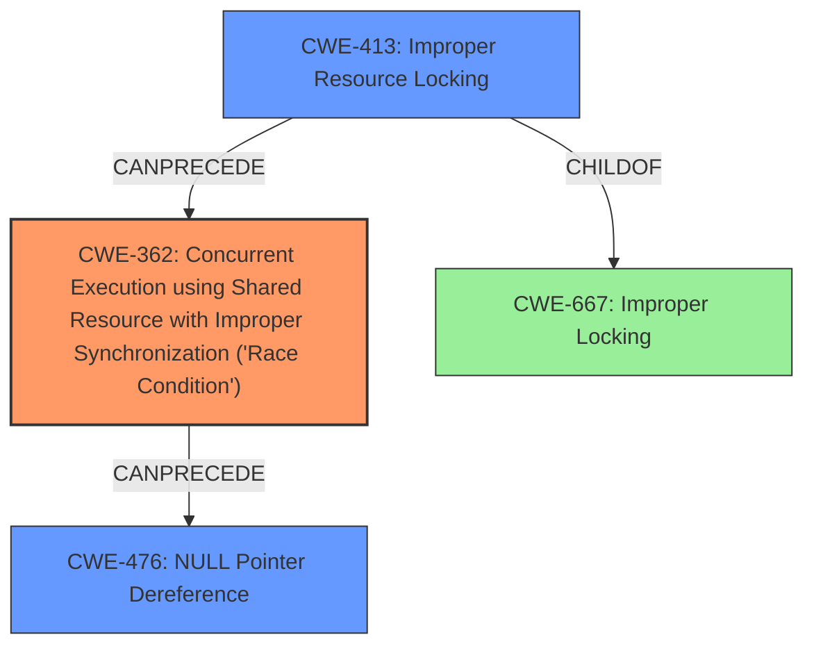

# Final Resolution for CVE-2022-20422

# Summary
| CWE ID | CWE Name | Confidence | CWE Abstraction Level | CWE Vulnerability Mapping Label | CWE-Vulnerability Mapping Notes |
|---|---|---|---|---|---|
| CWE-362 | Concurrent Execution using Shared Resource with Improper Synchronization ('**Race Condition**') | 0.9 | Class | Allowed-with-Review | Primary CWE: The core issue is a **race condition** due to improper synchronization.  While this is a Class CWE, more information is needed to determine if CWE-366 is more applicable. |
| CWE-413 | Improper Resource Locking | 0.7 | Base | Allowed | Secondary CWE: Indicates that the **race condition** is a result of the lack of correct usage of locks to ensure that resources are properly synchronized. |
| CWE-476 | NULL Pointer Dereference | 0.6 | Base | Allowed | Secondary CWE: Resulting impact due to the **race condition**. |

## Evidence and Confidence

*   **Confidence Score:** 0.85
*   **Evidence Strength:** HIGH

## Relationship Analysis
The primary **weakness** is identified as CWE-362 (**Race Condition**), a Class-level CWE. While a more specific Base CWE would be ideal, the available information doesn't definitively confirm whether the **race condition** occurs within a single thread (CWE-366). The criticism correctly pointed out that the original analysis's secondary CWE-412 was a weaker fit. By changing the secondary **weakness** to CWE-413, we now have a more solid grasp on how the **race condition** occurred. The fix adding a mutex confirms that the code was not correctly locking the resource, leading to the **race condition**. CWE-476 is retained as the impact, indicating the consequence of the **race condition**.

## Vulnerability Chain
The vulnerability chain starts with CWE-413 (**Improper Resource Locking**), which allows CWE-362 (**Race Condition**) to occur. The **race condition** then leads to CWE-476 (**NULL Pointer Dereference**).

## Summary of Analysis
The initial analysis identified CWE-362 as the primary issue, which is accurate based on the vulnerability description stating a **race condition**. The criticism improved the analysis by suggesting a more fitting secondary CWE. Replacing CWE-412 with CWE-413 strengthens the analysis as it directly relates to the fix implemented (adding a mutex), suggesting that the resource was not correctly locked, leading to the **race condition**.

The decision is based on the vulnerability description "In emulation_proc_handler of armv8_deprecated.c, there is a possible way to corrupt memory due to a **race condition**" and the fact that the fix involved adding a mutex. The high retriever scores for CWE-362 also support this decision. The relationships between the CWEs are also considered. CWE-413 enables CWE-362, which in turn leads to CWE-476. The abstraction levels are appropriate. CWE-362 is a Class because the available information does not allow us to select a more specific Base CWE. CWE-413 and CWE-476 are Base CWEs, which are preferred for mapping to the root causes and impacts of vulnerabilities.