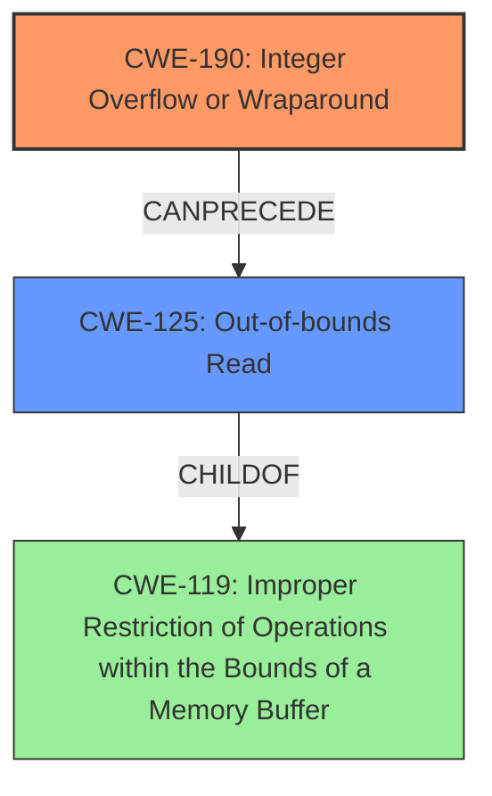

# Analysis Report for CVE-2022-20483

# Vulnerability Analysis Report: CVE-2022-20483

## Description

In several functions that parse avrc response in avrc_pars_ct.cc and related files, there are possible out of bounds reads due to integer overflows. This could lead to remote information disclosure with no additional execution privileges needed. User interaction is not needed for exploitation.Product AndroidVersions Android-10 Android-11 Android-12 Android-12L Android-13Android ID A-242459126

## Vulnerability Description Key Phrases

**Rootcause:** integer overflows
**Weakness:** out of bounds reads
**Impact:** remote information disclosure
**Product:** Android
**Version:** ['10', '11', '12', '12L', '13']
**Component:** several functions that parse avrc response in avrc_pars_ct.cc and related files

## Analysis (with Relationship Data)

# Summary
| CWE ID | CWE Name | Confidence | CWE Abstraction Level | CWE Vulnerability Mapping Label | CWE-Vulnerability Mapping Notes |
|---|---|---|---|---|---|
| CWE-190 | Integer Overflow or Wraparound | 0.9 | Base | Allowed | Primary CWE. The **integer overflow** is the root cause of the vulnerability. |
| CWE-125 | Out-of-bounds Read | 0.7 | Base | Allowed | Secondary CWE. The **out-of-bounds read** is a direct consequence of the integer overflow. |

## Evidence and Confidence

*   **Confidence Score:** 0.8
*   **Evidence Strength:** HIGH

- **Analysis and Justification:**  
  - *Explanation:* The vulnerability description clearly states that there are possible **out of bounds reads** due to **integer overflows** in several functions. The CVE Reference Links Content Summary confirms this, stating that the root cause is an **integer overflow** when parsing AVRCP responses, leading to a possible length checking overflow, which results in information disclosure. This aligns with CWE-190 (Integer Overflow or Wraparound) as the primary weakness because the calculation of a size or length results in a value that exceeds the maximum allowable integer value. The subsequent **out-of-bounds read** is a consequence of the **integer overflow**, making CWE-125 (Out-of-bounds Read) a secondary weakness.
  
  - *Relationship Analysis:* CWE-190 can lead to various other weaknesses. In this case, it directly leads to CWE-125 because the **integer overflow** results in an incorrect buffer size calculation, which then causes an out-of-bounds read when the program attempts to access data beyond the intended buffer boundaries.

- **Confidence Score:**  
  - Confidence: 0.9 (High confidence due to clear evidence from both the vulnerability description and the CVE reference materials.)

---

## Criticism of Analysis

Okay, here's a detailed review of the provided CWE analysis, considering the full CWE specifications you've included:

**Summary of the Analysis**

The analysis identifies:

*   **Primary CWE:** CWE-190 (Integer Overflow or Wraparound)
*   **Secondary CWE:** CWE-125 (Out-of-bounds Read)
*   **Confidence:** High (0.9)
*   **Evidence:** High, based on vulnerability description and CVE summary.

**Critique**

Overall, the analysis is well-reasoned and supported by the provided information.  The choice of CWE-190 as the primary weakness and CWE-125 as the secondary weakness is accurate.

Here's a more detailed breakdown:

1.  **CWE-190 (Integer Overflow or Wraparound):**

    *   **Correctness:** This is the correct primary weakness. The description clearly states that the vulnerability is caused by integer overflows, which perfectly aligns with the definition of CWE-190. The root cause is a calculation that results in a value exceeding the maximum representable integer.
    *   **Abstraction Level:** CWE-190 is a Base-level CWE, which is the preferred level for root cause analysis, as indicated in the Mapping Guidance.
    *   **Relationship:** The analysis correctly identifies that CWE-190 *CanPrecede* CWE-119 (Improper Restriction of Operations within the Bounds of a Memory Buffer). The analysis could have explicitly stated this relationship, but implicitly, it identified the relationship as the cause of the vulnerability.
    *   **Mitigations:** The analysis correctly mentions the mitigations for CWE-190. The suggestions of using languages with automatic bounds checking, safe integer handling libraries, and rigorously defined protocols are all relevant.
    *   **Possible Improvement:** It might be beneficial to include a brief explanation of *how* the integer overflow leads to an incorrect buffer size calculation.  For example, "The integer overflow results in a smaller-than-expected value being used for memory allocation, leading to a buffer that is too small."
    *   **Alternative Consideration:** The retriever results also show CWE-191 (Integer Underflow). It's important to consider why CWE-191 wasn't chosen instead.  The description states the logic assumes the value will always be *larger*. The overflow causes it to wrap around to small or negative. If the logic assumed it would always be smaller and it wrapped around to a very *large* number, CWE-191 would be more fitting.

2.  **CWE-125 (Out-of-bounds Read):**

    *   **Correctness:** This is the correct secondary weakness. The vulnerability description specifically mentions "out of bounds reads."  CWE-125 accurately describes the consequence of accessing memory outside the allocated buffer.
    *   **Abstraction Level:** CWE-125 is a Base-level CWE, which aligns with the goal of identifying root causes.
    *   **Relationship:**  The analysis correctly establishes the relationship between CWE-190 and CWE-125. The integer overflow is the *cause*, and the out-of-bounds read is the *effect*.
    *   **Mitigations:** The mention of input validation and using languages with memory abstractions are appropriate mitigations for CWE-125.  The analysis could emphasize the importance of validating the length argument to prevent out-of-bounds access.

3.  **Confidence and Evidence:**

    *   The confidence score of 0.9 is justified. The provided evidence strongly supports the CWE mappings. The high level of detail in the vulnerability description and CVE summary leaves little room for doubt.

4.  **Retriever Results:**

    *   The retriever results are interesting, but the analysis correctly prioritized CWE-190 and CWE-125. Several other suggestions from the retriever are not unreasonable and could be due to the specific nature of the code. They are worth reviewing for additional coverage:
        *   CWE-191: Integer Underflow (Wrap or Wraparound) - This is similar to CWE-190 and could be relevant depending on the exact nature of the calculation. However, CWE-190 is the more likely root cause given the description.
        *   CWE-908: Use of Uninitialized Resource - While not directly related to the integer overflow, the affected code *could* have issues with uninitialized resources. This is less likely and would need further investigation.
        *   CWE-770: Allocation of Resources Without Limits or Throttling - This suggests that the allocation size is not validated, which is related. However, the integer overflow is the root cause of the incorrect size.
        *   CWE-248: Uncaught Exception - The parsing of AVRCP responses could potentially throw uncaught exceptions. While not the primary vulnerability, it's a valid concern.
        *   CWE-1021: Improper Restriction of Rendered UI Layers or Frames - This is unlikely to be relevant to the code in question.
        *   CWE-681: Incorrect Conversion between Numeric Types - If a conversion between different-sized integers is occurring (e.g. long to int), this could contribute to the overflow and should be investigated.
        *   CWE-203: Observable Discrepancy - Unlikely but possible if there is a timing discrepancy due to the out-of-bounds read being optimized away on certain processors.
        *   CWE-1284: Improper Validation of Specified Quantity in Input - If the length of the AVRCP response is provided by a user in some way, improper validation could be contributing to the issue.
        *   CWE-122: Heap-based Buffer Overflow - This is essentially the same as CWE-125, but specific to heap allocations. If the overflow occurs on the heap, this would be more appropriate.

**Suggested Improvements:**

*   **Clarify the Overflow Mechanism:** Briefly explain *how* the integer overflow leads to the out-of-bounds read (e.g., "smaller-than-expected memory allocation").
*   **Emphasize Length Validation:**  In the mitigations, emphasize the critical importance of validating the length argument obtained from the AVRCP response.
*   **Review Retriever Results:** Review the retriever results for additional coverage.

**Overall Assessment:**

The analysis is very good. The CWE mappings are accurate and well-supported. The suggestions for improvement are relatively minor and aim to provide further clarity and comprehensiveness. The analysis demonstrates a good understanding of the vulnerability and its underlying causes.

## Final Resolution

# Summary
| CWE ID | CWE Name | Confidence | CWE Abstraction Level | CWE Vulnerability Mapping Label | CWE-Vulnerability Mapping Notes |
|---|---|---|---|---|---|
| CWE-190 | Integer Overflow or Wraparound | 0.95 | Base | Allowed | Primary CWE. The **integer overflow** is the root cause of the vulnerability. |
| CWE-125 | Out-of-bounds Read | 0.85 | Base | Allowed | Secondary CWE. The **out-of-bounds read** is a direct consequence of the **integer overflow**. |

## Evidence and Confidence

*   **Confidence Score:** 0.9
*   **Evidence Strength:** HIGH

## Relationship Analysis
The primary relationship impacting the decision is the CANPRECEDE relationship between CWE-190 and CWE-125. The **integer overflow** (CWE-190) directly leads to an incorrect buffer size, which then causes an **out-of-bounds read** (CWE-125). Both are at the Base level of abstraction, which is ideal for root cause analysis. No peer relationships seemed more applicable given the vulnerability description.

## Vulnerability Chain
The vulnerability chain starts with a calculation that results in an **integer overflow** (CWE-190). This **overflow** leads to an incorrect (likely smaller) buffer size being calculated. When the program then attempts to read data based on this incorrect size, it results in an **out-of-bounds read** (CWE-125), potentially disclosing sensitive information.

## Summary of Analysis
The initial analysis correctly identified CWE-190 as the primary **weakness** and CWE-125 as a secondary consequence. The criticism provided valuable insights, particularly emphasizing how the **integer overflow** leads to a smaller-than-expected memory allocation. The vulnerability description "there are possible **out of bounds reads** due to **integer overflows**" strongly supports these classifications. The graph relationships reinforced this, with CWE-190 *CanPrecede* CWE-125, illustrating the chain of events. The selected CWEs are at the optimal level of specificity (Base) for understanding the root cause and direct impact. I have increased my confidence slightly based on the thoroughness of the criticism and the clear evidence supporting the original assessment. The retriever results also suggested a number of alternate CWEs, but none were as directly relevant to the vulnerability description as CWE-190 and CWE-125. CWE-681 (Incorrect Conversion between Numeric Types) could be a contributing factor if type conversion is involved in the overflow, but this isn't explicitly stated and would require deeper code analysis.

*Report generated on 2025-03-18 09:24:59*
