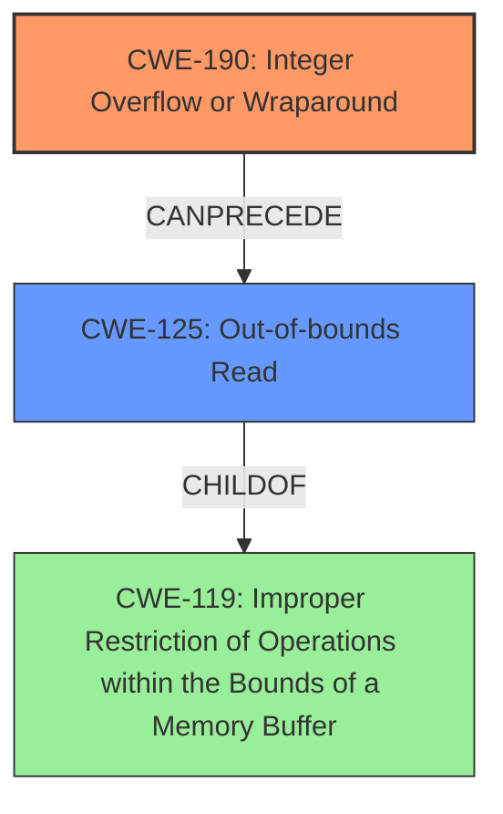

# Final Resolution for CVE-2022-20483

# Summary
| CWE ID | CWE Name | Confidence | CWE Abstraction Level | CWE Vulnerability Mapping Label | CWE-Vulnerability Mapping Notes |
|---|---|---|---|---|---|
| CWE-190 | Integer Overflow or Wraparound | 0.95 | Base | Allowed | Primary CWE. The **integer overflow** is the root cause of the vulnerability. |
| CWE-125 | Out-of-bounds Read | 0.85 | Base | Allowed | Secondary CWE. The **out-of-bounds read** is a direct consequence of the **integer overflow**. |

## Evidence and Confidence

*   **Confidence Score:** 0.9
*   **Evidence Strength:** HIGH

## Relationship Analysis
The primary relationship impacting the decision is the CANPRECEDE relationship between CWE-190 and CWE-125. The **integer overflow** (CWE-190) directly leads to an incorrect buffer size, which then causes an **out-of-bounds read** (CWE-125). Both are at the Base level of abstraction, which is ideal for root cause analysis. No peer relationships seemed more applicable given the vulnerability description.

## Vulnerability Chain
The vulnerability chain starts with a calculation that results in an **integer overflow** (CWE-190). This **overflow** leads to an incorrect (likely smaller) buffer size being calculated. When the program then attempts to read data based on this incorrect size, it results in an **out-of-bounds read** (CWE-125), potentially disclosing sensitive information.

## Summary of Analysis
The initial analysis correctly identified CWE-190 as the primary **weakness** and CWE-125 as a secondary consequence. The criticism provided valuable insights, particularly emphasizing how the **integer overflow** leads to a smaller-than-expected memory allocation. The vulnerability description "there are possible **out of bounds reads** due to **integer overflows**" strongly supports these classifications. The graph relationships reinforced this, with CWE-190 *CanPrecede* CWE-125, illustrating the chain of events. The selected CWEs are at the optimal level of specificity (Base) for understanding the root cause and direct impact. I have increased my confidence slightly based on the thoroughness of the criticism and the clear evidence supporting the original assessment. The retriever results also suggested a number of alternate CWEs, but none were as directly relevant to the vulnerability description as CWE-190 and CWE-125. CWE-681 (Incorrect Conversion between Numeric Types) could be a contributing factor if type conversion is involved in the overflow, but this isn't explicitly stated and would require deeper code analysis.