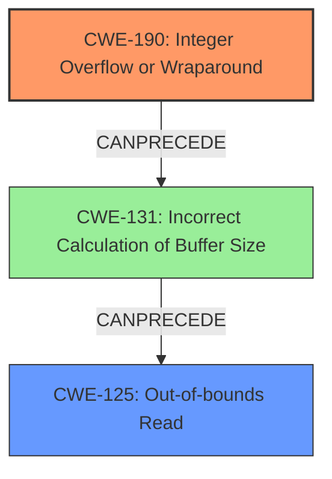

# Final Resolution for CVE-2022-20516

# Summary
| CWE ID | CWE Name | Confidence | CWE Abstraction Level | CWE Vulnerability Mapping Label | CWE-Vulnerability Mapping Notes |
|---|---|---|---|---|---|
| CWE-190 | Integer Overflow or Wraparound | 0.95 | Base | Allowed | Primary CWE |
| CWE-125 | Out-of-bounds Read | 0.85 | Base | Allowed | Secondary Candidate |

## Evidence and Confidence

*   **Confidence Score:** 0.90
*   **Evidence Strength:** HIGH

## Relationship Analysis
The primary relationship impacting the decision is the chain relationship where **CWE-190** (Integer Overflow or Wraparound) can precede **CWE-125** (Out-of-bounds Read). The analysis considered that the integer overflow directly leads to reading memory outside the allocated buffer. Although not explicitly stated, it is possible that the overflow leads to an incorrect calculation of buffer size (**CWE-131**), further contributing to the out-of-bounds read. The abstraction levels influenced the selection by favoring base-level CWEs, which are preferred for mapping to root causes and consequences.

## Vulnerability Chain
The chain of events starts with an **integer overflow** (**CWE-190**) in the `rw_t3t_act_handle_check_ndef_rsp` function. This could lead to an incorrect calculation of the buffer size (**CWE-131**), ultimately resulting in an out-of-bounds read (**CWE-125**). The consequence is remote information disclosure. The vulnerability description clearly specifies the **integer overflow** and the resulting out-of-bounds read, solidifying the chain. A missing link, not stated, is **CWE-131**, as the integer overflow may lead to an incorrect calculation of buffer size.

## Summary of Analysis
The initial analysis and criticism were both accurate in identifying **CWE-190** as the primary **root cause**, based on the explicit mention of "integer overflow" in the vulnerability description and CVE details: "Integer overflow in `rw_t3t_act_handle_check_ndef_rsp()` function in `rw_t3t.cc`". The graph relationships reinforce this by illustrating how **CWE-190** can precede **CWE-125**.

The decision to include **CWE-125** as a secondary candidate is justified because the vulnerability description explicitly states that the **integer overflow** leads to an "out of bounds read".

The selected CWEs are at the optimal level of specificity because they are both Base-level CWEs, which are preferred for mapping to root causes and consequences. **CWE-190** accurately reflects the **root cause** of the vulnerability, and **CWE-125** correctly identifies the immediate impact.