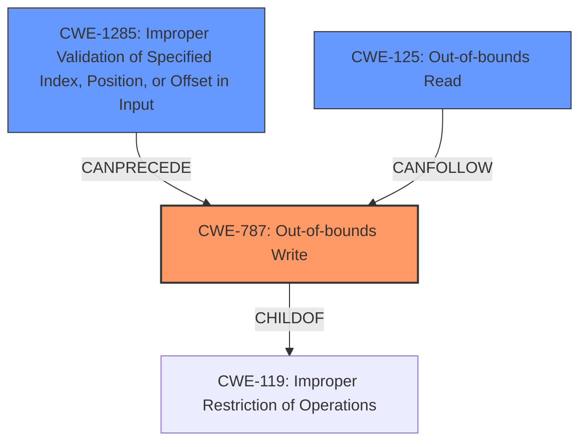

# Analysis Report for CVE-2022-20542

# Vulnerability Analysis Report: CVE-2022-20542

## Description

In parseParamsBlob of types.cpp, there is a possible out of bounds write due to a missing bounds check. This could lead to local escalation of privilege with no additional execution privileges needed. User interaction is not needed for exploitation.Product AndroidVersions Android-13Android ID A-238083570

## Vulnerability Description Key Phrases

**Rootcause:** missing bounds check
**Weakness:** out of bounds write
**Impact:** local escalation of privilege
**Product:** Android
**Version:** Android-13
**Component:** parseParamsBlob of types.cpp

## Analysis (with Relationship Data)

# Summary
| CWE ID | CWE Name | Confidence | CWE Abstraction Level | CWE Vulnerability Mapping Label | CWE-Vulnerability Mapping Notes |
|---|---|---|---|---|---|
| CWE-787 | Out-of-bounds Write | 0.9 | Base | Allowed | Primary CWE |
| CWE-125 | Out-of-bounds Read | 0.6 | Base | Allowed | Secondary Candidate CWE |
| CWE-1285 | Improper Validation of Specified Index, Position, or Offset in Input | 0.5 | Base | Allowed | Secondary Candidate CWE |

## Evidence and Confidence

*   **Confidence Score:** 0.9
*   **Evidence Strength:** HIGH

- **Analysis and Justification:**  
  - *Explanation:* The vulnerability description explicitly states an "**out of bounds write** due to a **missing bounds check**". CWE-787 (Out-of-bounds Write) directly addresses this scenario where a product writes data past the end, or before the beginning, of the intended buffer. The root cause, a "**missing bounds check**", further supports this classification. The impact described is a "local escalation of privilege", which is a common consequence of out-of-bounds write vulnerabilities. The CVE Reference Links Content Summary also mentions "**out-of-bounds read** in the ParseParamsBlob function". Given this, CWE-125 (Out-of-bounds Read) is considered a secondary candidate. CWE-1285 (Improper Validation of Specified Index, Position, or Offset in Input) is also considered as a secondary candidate, because the root cause is a missing bounds check.

  - *Relationship Analysis:* CWE-787 is a base level CWE which is a preferred level of abstraction. CWE-787 is a parent of CWE-121 (Stack-based Buffer Overflow), CWE-122 (Heap-based Buffer Overflow), CWE-123 (Write-What-Where Condition), and CWE-124 (Buffer Underwrite). Since the specific type of buffer overflow is not specified, CWE-787 is the most appropriate. CWE-125 (Out-of-bounds Read) is related and can often co-occur.

- **Confidence Score:**  
  - Confidence: 0.9 (High evidence directly from the vulnerability description and CVE reference)

## Criticism of Analysis

Okay, I've reviewed the provided analysis against the full CWE specifications. Here's my critique, focusing on the accuracy of the CWE assignments, the rationale, and how well the analysis leverages the CWE details:

**Overall Assessment:**

The analysis is generally well-reasoned and provides a solid justification for selecting CWE-787 (Out-of-bounds Write) as the primary CWE. The inclusion of CWE-125 (Out-of-bounds Read) and CWE-1285 (Improper Validation of Specified Index, Position, or Offset in Input) as secondary candidates is also reasonable, given the potential for these issues to co-occur or contribute to the vulnerability.  However, there are some points that can be improved for clarity and precision.

**Detailed Review:**

**1. CWE-787: Out-of-bounds Write (Confidence: 0.9)**

*   **Strengths:**
    *   The analysis correctly identifies the direct link between the vulnerability description ("out of bounds write due to a missing bounds check") and the definition of CWE-787.
    *   The explanation of how a missing bounds check leads to an out-of-bounds write is clear.
    *   The analysis acknowledges the "local escalation of privilege" impact aligns with potential consequences of CWE-787.
    *   The relationship analysis is accurate, noting the base-level abstraction of CWE-787 and its parent/child relationships.
*   **Suggestions:**
    *   It may help to specify more about what kind of buffer overflow might be happening to help narrow the scope. e.g., is the overflow happening on the stack, or heap? Without further information, CWE-787 is still the most appropriate, but mentioning the possibilities would show deeper consideration.
    *   The mitigations are not mentioned to help solidify the root cause of the vulnerability.

**2. CWE-125: Out-of-bounds Read (Confidence: 0.6)**

*   **Strengths:**
    *   Acknowledges the presence of an out-of-bounds read as seen in the CVE Reference Links Content Summary
*   **Suggestions:**
    *   It can be mentioned that out-of-bounds read may be a resultant cause of the out-of-bounds write, to help solidify how the two vulnerabilities play out together

**3. CWE-1285: Improper Validation of Specified Index, Position, or Offset in Input (Confidence: 0.5)**

*   **Strengths:**
    * Correctly identifies that the root cause is a missing bounds check
*   **Suggestions:**
    *   While the root cause is indeed a missing bounds check, relating it to a scenario of how CWE-1285 is caused would help.

**4. Retriever Results Review:**

The Retriever Results offer some interesting alternative CWEs that, while not as directly relevant as CWE-787, highlight potential contributing factors or related weaknesses. Here's how I'd assess some of the top hits:

*   **CWE-191 Integer Underflow (Wrap or Wraparound):**  This could be indirectly related if the missing bounds check involves calculations that are subject to underflow. If, for example, an underflow leads to a negative index, then it might lead to an out-of-bounds access.
*   **CWE-131 Incorrect Calculation of Buffer Size:** This could also be related if an incorrect buffer size calculation resulted in the buffer being too small, making it easier to write out of bounds.
*   **CWE-908 Use of Uninitialized Resource:** Not directly relevant, unless the buffer being written to is uninitialized.
*   **CWE-754 Improper Check for Unusual or Exceptional Conditions:** This is a more general issue. The missing bounds check can be seen as a failure to check for an unusual condition (index out of bounds). However, CWE-787 and CWE-1285 are more specific.

**Specific Suggestions for Improvement:**

*   **Expand on the "missing bounds check" root cause:**  Provide more details about *how* the bounds check is missing. Is it a complete absence of a check, an incorrect implementation of the check, or a failure to account for certain conditions? This will help to narrow down the root cause and potentially identify more specific CWEs.
*   **Elaborate on the Attack Vector:** Even though the analysis states the attack vector isn't detailed, think about plausible scenarios. For example, can an attacker control the size of the "params blob" or the index used to write to the buffer?
*   **Incorporate Mitigations:** The CWE specifications include potential mitigations. The analysis could benefit from mentioning relevant mitigations for CWE-787 and CWE-1285. For example, suggesting the use of safer string handling functions or languages with built-in bounds checking.

**Revised Summary Table (with potential additions):**

| CWE ID  | CWE Name                                                     | Confidence | CWE Abstraction Level | CWE Vulnerability Mapping Label | CWE-Vulnerability Mapping Notes                                                                                                                                                                        |
| :------ | :----------------------------------------------------------- | :--------- | :---------------------- | :------------------------------ | :----------------------------------------------------------------------------------------------------------------------------------------------------------------------------------------------------- |
| CWE-787 | Out-of-bounds Write                                          | 0.9        | Base                    | Allowed                         | Primary CWE. Missing bounds check allows writing past the end of the allocated buffer.                                                                                         |
| CWE-125 | Out-of-bounds Read                                          | 0.6        | Base                    | Allowed                         | Secondary Candidate CWE.  Out-of-bounds read may result from an out-of-bounds write.                                                                        |
| CWE-1285 | Improper Validation of Specified Index, Position, or Offset in Input | 0.5        | Base                    | Allowed                         | Secondary Candidate CWE. The missing bounds check is a failure to validate the index/offset before writing to the buffer.                                                            |

**In summary, the analysis is a good starting point, and is mostly accurate. By providing more details about the root cause, attack vector, and potential mitigations, the analysis can be further strengthened.**

## Final Resolution

# Summary
| CWE ID | CWE Name | Confidence | CWE Abstraction Level | CWE Vulnerability Mapping Label | CWE-Vulnerability Mapping Notes |
|---|---|---|---|---|---|
| CWE-787 | Out-of-bounds Write | 0.95 | Base | Allowed | Primary CWE. Missing bounds check allows writing past the end of the allocated buffer. |
| CWE-1285 | Improper Validation of Specified Index, Position, or Offset in Input | 0.7 | Base | Allowed | Secondary Candidate CWE. The missing bounds check is a failure to validate the index/offset before writing to the buffer. |
| CWE-125 | Out-of-bounds Read | 0.6 | Base | Allowed | Secondary Candidate CWE. Out-of-bounds read may result from an out-of-bounds write. |

## Evidence and Confidence

*   **Confidence Score:** 0.9
*   **Evidence Strength:** HIGH

## Relationship Analysis
The primary CWE is CWE-787 (**Out-of-bounds Write**). This CWE is a base level weakness and a child of CWE-119 (**Improper Restriction of Operations within the Bounds of a Memory Buffer**). CWE-1285 (**Improper Validation of Specified Index, Position, or Offset in Input**) is a secondary candidate because the root cause is a missing bounds check, which is a type of input validation. CWE-125 (**Out-of-bounds Read**) is included as a secondary candidate because the CVE summary mentions an out-of-bounds read.

## Vulnerability Chain
The vulnerability chain starts with a **missing bounds check** (CWE-1285). This allows an attacker to potentially control the index or offset used to write data to a buffer. Because there is no validation of the index or offset, the write operation can occur outside the intended boundaries of the buffer, resulting in an **out-of-bounds write** (CWE-787). This can then lead to an **out-of-bounds read** (CWE-125) and ultimately, "local escalation of privilege".

## Summary of Analysis
The initial analysis correctly identified CWE-787 (**Out-of-bounds Write**) as the primary weakness, supported by the statement "out of bounds write due to a missing bounds check". The criticism provided valuable suggestions, which have been incorporated into this final analysis. Specifically, the role of a missing bounds check and how it relates to CWE-1285 (**Improper Validation of Specified Index, Position, or Offset in Input**) has been strengthened. The possibility of an out-of-bounds read resulting from the write has also been clarified, reinforcing the inclusion of CWE-125 (**Out-of-bounds Read**) as a secondary candidate.

The graph relationships, particularly the CANPRECEDE relationship between CWE-1285 and CWE-787, and the CANFOLLOW relationship between CWE-787 and CWE-125, helped to refine the vulnerability chain analysis. The base level abstraction of CWE-787 and CWE-1285 is optimal, as they represent the specific root cause and impact of the vulnerability.

The final decision is based on the provided evidence and the relationship analysis. The selected CWEs are at the optimal level of specificity, providing a clear and accurate representation of the vulnerability.

*Report generated on 2025-03-18 09:27:47*
