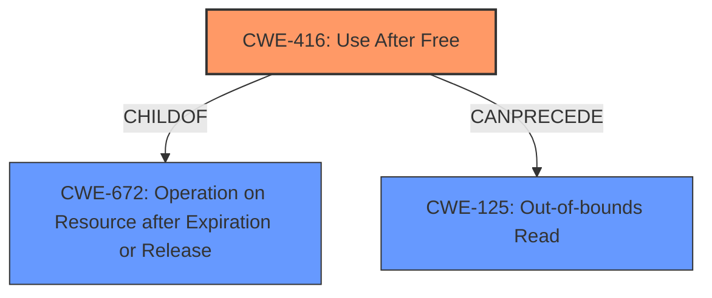

# Analysis Report for CVE-2022-20552

# Vulnerability Analysis Report: CVE-2022-20552

## Description

In btif_a2dp_sink_command_ready of btif_a2dp_sink.cc, there is a possible out of bounds read due to a use after free. This could lead to local information disclosure with no additional execution privileges needed. User interaction is not needed for exploitation.Product AndroidVersions Android-13Android ID A-243922806

## Vulnerability Description Key Phrases

**Rootcause:** use after free
**Weakness:** out of bounds read
**Impact:** local information disclosure
**Product:** Android
**Version:** Android-13
**Component:** btif_a2dp_sink_command_ready of btif_a2dp_sink.cc

## Analysis (with Relationship Data)

# Summary
| CWE ID | CWE Name | Confidence | CWE Abstraction Level | CWE Vulnerability Mapping Label | CWE-Vulnerability Mapping Notes |
|---|---|---|---|---|---|
| CWE-416 | Use After Free | 0.95 | Variant | Primary | Allowed |
| CWE-125 | Out-of-bounds Read | 0.60 | Base | Secondary | Allowed |

## Evidence and Confidence

*   **Confidence Score:** 0.9
*   **Evidence Strength:** HIGH

- **Analysis and Justification:**  
  - *Explanation:* The vulnerability description clearly states a "**use after free**" condition, leading to a potential "**out of bounds read**". The CVE Reference Links Content Summary confirms the "**Root cause of vulnerability**" as "Heap use-after-free". This strongly aligns with CWE-416 (Use After Free), which occurs when memory is accessed after it has been freed. The "**weakness**" is described as an "**out of bounds read**" which matches CWE-125. However, since the root cause is Use-After-Free, CWE-416 is chosen as the primary, and CWE-125 as a secondary. The impact of the vulnerability, as described in the vulnerability description, is "local information disclosure".
  
  - *Relationship Analysis:* CWE-416 is a variant of CWE-672 (Operation on Resource after Expiration or Release). CWE-125 (Out-of-bounds Read) can often result from a Use-After-Free condition, as the freed memory might be reallocated and accessed incorrectly.

- **Confidence Score:**  
  - Confidence: 0.95 (High confidence due to clear description and confirmation from CVE reference).

---

## Criticism of Analysis

Okay, here's a breakdown of the provided analysis and a critique based on the full CWE specifications.

**Overall Assessment:**

The analysis is generally well-reasoned and the CWE assignments are accurate, particularly the primary assignment of CWE-416 (Use After Free). The inclusion of CWE-125 (Out-of-bounds Read) as a secondary weakness is also appropriate, given that an out-of-bounds read is a likely consequence of using freed memory. The confidence level of 0.95 is justified by the clear vulnerability description and the supporting CVE summary.

**Detailed Review:**

1.  **CWE-416: Use After Free (Primary)**

    *   **Correctness:**  The assignment is correct. The core issue, as stated in the vulnerability description and CVE summary, is the use of memory after it has been freed. This aligns perfectly with CWE-416's definition.
    *   **Abstraction Level:** Variant level is appropriate, as it is a specific type of resource mismanagement.
    *   **Mapping Guidance:** The analysis correctly notes that the Variant level is preferred, and this is an appropriate fit for the root cause.
    *   **Mitigations:** The analysis could be enhanced by mentioning potential mitigations for CWE-416:
        *   **Language Selection:** Suggesting languages with automatic memory management (e.g., Java, Go, Python) would be a useful addition.
        *   **Defensive Programming:**  Explicitly mention setting pointers to `NULL` after freeing the associated memory.  While the analysis does mention this, reiterating it in context of the primary CWE is beneficial.
        *   **Smart Pointers:** Consider languages that support smart pointers which handle lifetimes automatically.

2.  **CWE-125: Out-of-bounds Read (Secondary)**

    *   **Correctness:**  The assignment is reasonable. While the root cause is the UAF, the *immediate* manifestation of the vulnerability at the point of exploitation is likely to be reading memory outside the expected boundaries. The analysis correctly identifies that this often results from the UAF.
    *   **Abstraction Level:**  Base level is appropriate as it is the specific mechanism of failure in this case.
    *   **Mapping Guidance:** The analysis correctly followed the mapping guidance.
    *   **Mitigations:** The analysis could be enhanced by mentioning potential mitigations for CWE-125:
        *   **Input Validation:** Stringent validation of buffer sizes and offsets to prevent reads beyond buffer boundaries.
        *   **Safe APIs:**  Using safe string handling functions (e.g., `strncpy` instead of `strcpy`) to avoid accidental overreads.
        *   **Bounds Checking:** Compiler or runtime bounds checking to detect and prevent out-of-bounds accesses.
        *   **Fuzzing:** Fuzzing could be used to identify instances of this error.

3.  **Other CWEs Considered (Based on Retriever Results):**

    *   **CWE-908: Use of Uninitialized Resource:**  While tempting to consider, this is unlikely to be the case here.  The resource *was* initialized at some point; the problem is that it was *freed* and then *used* again.  Therefore, CWE-908 is not appropriate.
    *   **CWE-191: Integer Underflow:** This is less relevant, unless an integer underflow was the means by which the UAF was caused. Without more information, this is too speculative.
    *   **CWE-131: Incorrect Calculation of Buffer Size:**  This is not directly relevant. The problem isn't the buffer size calculation, but rather the use of a buffer that is no longer valid.
    *   **CWE-248: Uncaught Exception:** Unlikely to be the primary cause of a UAF.
    *   **CWE-190: Integer Overflow:** Similar to CWE-191, it might be a contributing factor if an overflow caused the incorrect freeing of memory, but without more info, this is speculative.
    *   **CWE-413: Improper Resource Locking & CWE-362: Race Condition:** If the vulnerability stems from concurrent access leading to UAF, then these CWEs might be applicable *in addition* to CWE-416, but they would be considered *cause* rather than *effect* of UAF. More information would be needed to determine if a race condition is involved in the freeing of the resource.
    *   **CWE-415: Double Free:** While double free can also result in information disclosure, it is not part of the original vulnerability description.

4.  **CWE-672: Operation on a Resource after Expiration or Release:**

    *   **Correctness:** CWE-672 is a class-level weakness and includes CWE-416. Therefore, mapping to the variant CWE-416 would be more appropriate.

**Recommendations for Improvement:**

*   **Expand on Mitigations:**  For both CWE-416 and CWE-125, provide a more comprehensive list of relevant mitigations, drawing from the CWE specifications.  This increases the practical value of the analysis.
*   **Chain Analysis (If Applicable):** Explicitly address the potential for a race condition (CWE-362) or improper locking (CWE-413) *leading to* the UAF. If concurrency is suspected, add this as a possible causal factor that requires further investigation.  This would shift the analysis from just identifying the weakness to considering its origins.
*   **Code Example (If Available):** If a code snippet demonstrating the vulnerability exists (even a simplified one), including it would significantly improve the analysis and make the CWE assignments more concrete.

By incorporating these suggestions, the analysis can be made more robust and practically useful for developers and security analysts.

## Final Resolution

# Summary
| CWE ID | CWE Name | Confidence | CWE Abstraction Level | CWE Vulnerability Mapping Label | CWE-Vulnerability Mapping Notes |
|---|---|---|---|---|---|
| CWE-416 | Use After Free | 0.95 | Variant | Primary | Allowed |
| CWE-125 | Out-of-bounds Read | 0.60 | Base | Secondary | Allowed |

## Evidence and Confidence

*   **Confidence Score:** 0.95
*   **Evidence Strength:** HIGH

## Relationship Analysis
The primary weakness is **CWE-416 (Use After Free)**, which is a variant of **CWE-672 (Operation on Resource after Expiration or Release)**. **CWE-125 (Out-of-bounds Read)** is a consequence of the **Use-After-Free**, where the freed memory is accessed, potentially leading to reading data outside the intended buffer. The abstraction levels are appropriate, with **CWE-416** at the Variant level providing specificity and **CWE-125** at the Base level describing the specific mechanism of failure.

## Vulnerability Chain
The vulnerability chain starts with a **Use-After-Free** condition (**CWE-416**). This allows an attacker to potentially read data outside the intended buffer (**CWE-125**), leading to local information disclosure. The root cause is the improper management of memory, and the impact is information leakage.

## Summary of Analysis
The initial analysis is accurate, identifying **CWE-416 (Use After Free)** as the primary **weakness** and **CWE-125 (Out-of-bounds Read)** as a secondary consequence. The vulnerability description clearly states "In btif_a2dp_sink_command_ready of btif_a2dp_sink.cc, there is a possible **out of bounds read due to a use after free**." The CVE Reference Links Content Summary confirms the "**Root cause of vulnerability**" as "Heap **use-after-free**". The relationship analysis supports this classification, as **CWE-125** often results from a **CWE-416** condition. The selected CWEs are at the optimal level of specificity, with **CWE-416** being a Variant and **CWE-125** being a Base. The confidence is high due to the clear description and confirmation from CVE reference.

*Report generated on 2025-03-18 09:28:39*
