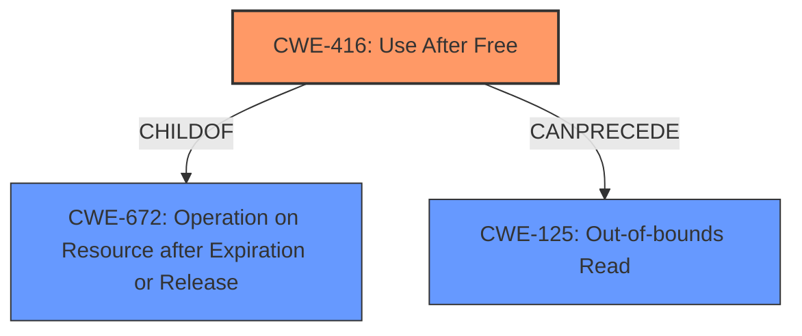

# Final Resolution for CVE-2022-20552

# Summary
| CWE ID | CWE Name | Confidence | CWE Abstraction Level | CWE Vulnerability Mapping Label | CWE-Vulnerability Mapping Notes |
|---|---|---|---|---|---|
| CWE-416 | Use After Free | 0.95 | Variant | Primary | Allowed |
| CWE-125 | Out-of-bounds Read | 0.60 | Base | Secondary | Allowed |

## Evidence and Confidence

*   **Confidence Score:** 0.95
*   **Evidence Strength:** HIGH

## Relationship Analysis
The primary weakness is **CWE-416 (Use After Free)**, which is a variant of **CWE-672 (Operation on Resource after Expiration or Release)**. **CWE-125 (Out-of-bounds Read)** is a consequence of the **Use-After-Free**, where the freed memory is accessed, potentially leading to reading data outside the intended buffer. The abstraction levels are appropriate, with **CWE-416** at the Variant level providing specificity and **CWE-125** at the Base level describing the specific mechanism of failure.

## Vulnerability Chain
The vulnerability chain starts with a **Use-After-Free** condition (**CWE-416**). This allows an attacker to potentially read data outside the intended buffer (**CWE-125**), leading to local information disclosure. The root cause is the improper management of memory, and the impact is information leakage.

## Summary of Analysis
The initial analysis is accurate, identifying **CWE-416 (Use After Free)** as the primary **weakness** and **CWE-125 (Out-of-bounds Read)** as a secondary consequence. The vulnerability description clearly states "In btif_a2dp_sink_command_ready of btif_a2dp_sink.cc, there is a possible **out of bounds read due to a use after free**." The CVE Reference Links Content Summary confirms the "**Root cause of vulnerability**" as "Heap **use-after-free**". The relationship analysis supports this classification, as **CWE-125** often results from a **CWE-416** condition. The selected CWEs are at the optimal level of specificity, with **CWE-416** being a Variant and **CWE-125** being a Base. The confidence is high due to the clear description and confirmation from CVE reference.