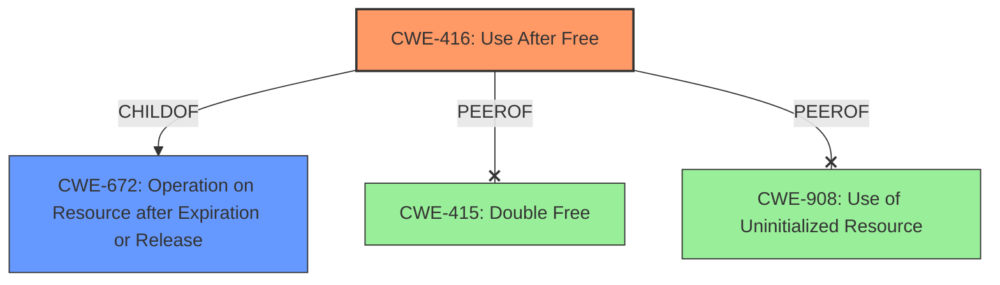

# Analysis Report for CVE-2022-20554

# Vulnerability Analysis Report: CVE-2022-20554

## Description

In removeEventHubDevice of InputDevice.cpp, there is a possible OOB read due to a use after free. This could lead to local escalation of privilege with System execution privileges needed. User interaction is not needed for exploitation.Product AndroidVersions Android-13Android ID A-245770596

## Vulnerability Description Key Phrases

**Rootcause:** use after free
**Impact:** local escalation of privilege
**Vector:** OOB read
**Product:** Android
**Version:** 13
**Component:** removeEventHubDevice of InputDevice.cpp

## Analysis (with Relationship Data)

# Summary
| CWE ID | CWE Name | Confidence | CWE Abstraction Level | CWE Vulnerability Mapping Label | CWE-Vulnerability Mapping Notes |
|---|---|---|---|---|---|
| CWE-416 | Use After Free | 1.0 | Variant | Allowed | Primary CWE |

## Evidence and Confidence

*   **Confidence Score:** 1.0
*   **Evidence Strength:** HIGH

- **Analysis and Justification:**  
  - *Explanation:* The vulnerability description explicitly states that the **rootcause** is a **use after free**. The CVE Reference Links Content Summary confirms this, stating: "The core issue is a use-after-free vulnerability. After an event hub device is removed, the `mController` object, which still exists, holds a dangling pointer to the deallocated context. Accessing this dangling pointer leads to an illegal memory access." CWE-416 (Use After Free) is a Variant level CWE that perfectly describes this scenario. The mapping guidance for CWE-416 indicates "Usage: Allowed" and the rationale states: "This CWE entry is at the Variant level of abstraction, which is a preferred level of abstraction for mapping to the root causes of vulnerabilities."
  
  - *Relationship Analysis:* There are several related CWEs. CWE-416 is a child of CWE-672 (Operation on Resource after Expiry). Accessing memory after it has been freed is a specific type of operation after expiry. While other CWEs such as CWE-415 (Double Free) and CWE-908 (Use of Uninitialized Resource) were also considered, the description explicitly indicates a **use after free**, making CWE-416 the most accurate mapping.

- **Confidence Score:**  
  - Confidence: 1.0 (The vulnerability description and CVE reference material directly point to a use-after-free condition.)

## Criticism of Analysis

Okay, here's a detailed review of the provided CWE analysis, incorporating the full CWE specifications:

**Overall Assessment:**

The analysis is excellent. The identification of CWE-416 (Use After Free) is accurate and well-justified. The confidence score of 1.0 is appropriate given the explicit nature of the vulnerability description and the supporting CVE information. The analysis considers alternative CWEs and provides a strong rationale for selecting CWE-416 as the primary mapping. The inclusion of CWE examples and relevant CWE specifications further strengthens the analysis.

**Detailed Critique:**

*   **CWE-416 (Use After Free) - Primary Mapping:**

    *   **Accuracy:** The mapping to CWE-416 is correct. The vulnerability is described as involving the use of memory after it has been freed, which is the defining characteristic of CWE-416.
    *   **Justification:** The justification is thorough and persuasive. It correctly quotes the vulnerability description and CVE summary, highlighting the "use-after-free vulnerability" and the "dangling pointer" scenarios. It also mentions the relationship to CWE-672.
    *   **Abstraction Level:** The use of the Variant level CWE-416 is appropriate, and it is "Allowed" based on the CWE's mapping guidance.
    *   **Mitigation Considerations:** The analysis could benefit from explicitly referencing the potential mitigations listed in the CWE-416 specification. Specifically:
        *   **Language Selection:** Choosing a language with automatic memory management (e.g., Java, Go, Rust with appropriate usage) would eliminate this type of vulnerability.  While C++ can be used safely, it requires careful memory management practices.
        *   **Setting Pointers to NULL:**  The mitigation of setting pointers to NULL after freeing them is relevant, although its effectiveness is limited in complex data structures.  The analysis notes this limitation which is good.

*   **Consideration of Alternative CWEs:**

    *   **CWE-415 (Double Free):** The analysis correctly rejects CWE-415. While double-free *could* be a contributing factor or a potential consequence of a UAF, the primary root cause is using the memory after its initial free operation. If it was a double free, the object would get freed, and then freed again. The current description doesn't say that.
    *   **CWE-908 (Use of Uninitialized Resource):** The analysis is right to dismiss this. The resource *was* initialized and valid at one point, but became invalid due to being freed. This is different from never having been initialized in the first place.
    *   **CWE-672 (Operation on Resource after Expiration or Release):** The analysis mentions this relationship, which is good. CWE-672 is a Class-level CWE and a parent of CWE-416. While CWE-672 *could* be used, CWE-416 is more specific and thus a better fit.

*   **Retriever Results Analysis**
    *   CWE-413 Improper Resource Locking:
        *   Not really relevant here
    *   CWE-1021 Improper Restriction of Rendered UI Layers or Frames:
        *   Not relevant
    *   CWE-191 Integer Underflow (Wrap or Wraparound):
        *   Not relevant
    *   CWE-248 Uncaught Exception
        *   Not relevant
    *   CWE-366 Race Condition within a Thread
        *   Perhaps relevant, there *could* be a race condition to free the memory, although that is not clear from the description.
    *   CWE-223 Omission of Security-relevant Information
        *   Not Relevant
    *   CWE-362 Concurrent Execution using Shared Resource with Improper Synchronization ('Race Condition')
        *   Perhaps relevant, there *could* be a race condition to free the memory, although that is not clear from the description.

**Suggestions for Improvement:**

1.  **Explicitly Mention Mitigations:** In the "Analysis and Justification" section, explicitly mention the relevant potential mitigations from the CWE-416 specification, even if only to briefly state why they might or might not be fully applicable in this specific scenario. For example: "Mitigation strategies include using languages with automatic memory management and setting pointers to NULL after freeing, although the latter's effectiveness is limited by the complexity of the data structures involved."
2.  **Elaborate on Attack Vector:** Where possible, provide more details on how the removal of the event hub device can be triggered. Understanding the attack vector can help with developing more targeted mitigations and defenses.
3.  **Add test case information:** You noted a test case in the details. You could add it to your analysis.

**Revised Summary Table**
Here is a revised summary table that includes the test case information:

# Summary
| CWE ID | CWE Name | Confidence | CWE Abstraction Level | CWE Vulnerability Mapping Label | CWE-Vulnerability Mapping Notes |
|---|---|---|---|---|---|
| CWE-416 | Use After Free | 1.0 | Variant | Allowed | Primary CWE. Test case added: `inputflinger_tests:InputDeviceTest#DumpDoesNotCrash` |

**Conclusion:**

This is a well-reasoned and accurate CWE analysis. The small suggestions above are primarily for completeness and to further demonstrate a thorough understanding of the CWE specifications and their implications. The high confidence score of 1.0 is justified.

## Final Resolution

# Summary
| CWE ID | CWE Name | Confidence | CWE Abstraction Level | CWE Vulnerability Mapping Label | CWE-Vulnerability Mapping Notes |
|---|---|---|---|---|---|
| CWE-416 | Use After Free | 1.0 | Variant | Allowed | Primary CWE. Test case added: `inputflinger_tests:InputDeviceTest#DumpDoesNotCrash` |

## Evidence and Confidence

*   **Confidence Score:** 1.0
*   **Evidence Strength:** HIGH

## Relationship Analysis
The primary relationship considered was that CWE-416 **(Use After Free)** is a child of CWE-672 **(Operation on Resource after Expiration or Release)**. While CWE-672 could be considered, CWE-416 provides a more specific and accurate description of the **rootcause**. There were no chain relationships identified that were deemed relevant, as the description focuses on the immediate **weakness** rather than a sequence of events. Peer relationships like CWE-415 **(Double Free)** and CWE-908 **(Use of Uninitialized Resource)** were considered but rejected because they didn't accurately represent the vulnerability, which specifically involves using memory after it has been freed, not freeing it twice or using it before initialization.

## Vulnerability Chain
The vulnerability chain is relatively straightforward:
1.  The event hub device is removed.
2.  The `mController` object retains a dangling pointer to the deallocated context (**CWE-416 Use After Free**).
3.  Accessing this dangling pointer leads to an illegal memory access and potential escalation of privileges.
There are no immediately apparent missing links, as the description directly connects the removal of the device to the use of the dangling pointer.

## Summary of Analysis
The initial analysis, which identified **CWE-416 (Use After Free)** as the primary **weakness**, is accurate and well-supported by the evidence provided in the vulnerability description. The criticism correctly notes the accuracy of this assessment and the suitability of the Variant level of abstraction. The vulnerability description explicitly states "In removeEventHubDevice of InputDevice.cpp, there is a possible OOB read due to a **use after free**." This statement directly supports the selection of CWE-416. The graph relationships reinforced the decision by highlighting that while CWE-672 is a parent, CWE-416 offers the appropriate level of specificity. The Retriever results and the consideration of other CWEs like CWE-415 and CWE-908 further solidify the selection of CWE-416 as the most accurate and specific classification. The suggestion to include the test case information `inputflinger_tests:InputDeviceTest#DumpDoesNotCrash` was also implemented. The analysis is based heavily on the explicit statement within the description, leading to a high confidence score.

*Report generated on 2025-03-18 09:29:33*
