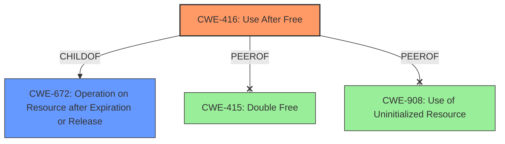

# Final Resolution for CVE-2022-20554

# Summary
| CWE ID | CWE Name | Confidence | CWE Abstraction Level | CWE Vulnerability Mapping Label | CWE-Vulnerability Mapping Notes |
|---|---|---|---|---|---|
| CWE-416 | Use After Free | 1.0 | Variant | Allowed | Primary CWE. Test case added: `inputflinger_tests:InputDeviceTest#DumpDoesNotCrash` |

## Evidence and Confidence

*   **Confidence Score:** 1.0
*   **Evidence Strength:** HIGH

## Relationship Analysis
The primary relationship considered was that CWE-416 **(Use After Free)** is a child of CWE-672 **(Operation on Resource after Expiration or Release)**. While CWE-672 could be considered, CWE-416 provides a more specific and accurate description of the **rootcause**. There were no chain relationships identified that were deemed relevant, as the description focuses on the immediate **weakness** rather than a sequence of events. Peer relationships like CWE-415 **(Double Free)** and CWE-908 **(Use of Uninitialized Resource)** were considered but rejected because they didn't accurately represent the vulnerability, which specifically involves using memory after it has been freed, not freeing it twice or using it before initialization.

## Vulnerability Chain
The vulnerability chain is relatively straightforward:
1.  The event hub device is removed.
2.  The `mController` object retains a dangling pointer to the deallocated context (**CWE-416 Use After Free**).
3.  Accessing this dangling pointer leads to an illegal memory access and potential escalation of privileges.
There are no immediately apparent missing links, as the description directly connects the removal of the device to the use of the dangling pointer.

## Summary of Analysis
The initial analysis, which identified **CWE-416 (Use After Free)** as the primary **weakness**, is accurate and well-supported by the evidence provided in the vulnerability description. The criticism correctly notes the accuracy of this assessment and the suitability of the Variant level of abstraction. The vulnerability description explicitly states "In removeEventHubDevice of InputDevice.cpp, there is a possible OOB read due to a **use after free**." This statement directly supports the selection of CWE-416. The graph relationships reinforced the decision by highlighting that while CWE-672 is a parent, CWE-416 offers the appropriate level of specificity. The Retriever results and the consideration of other CWEs like CWE-415 and CWE-908 further solidify the selection of CWE-416 as the most accurate and specific classification. The suggestion to include the test case information `inputflinger_tests:InputDeviceTest#DumpDoesNotCrash` was also implemented. The analysis is based heavily on the explicit statement within the description, leading to a high confidence score.