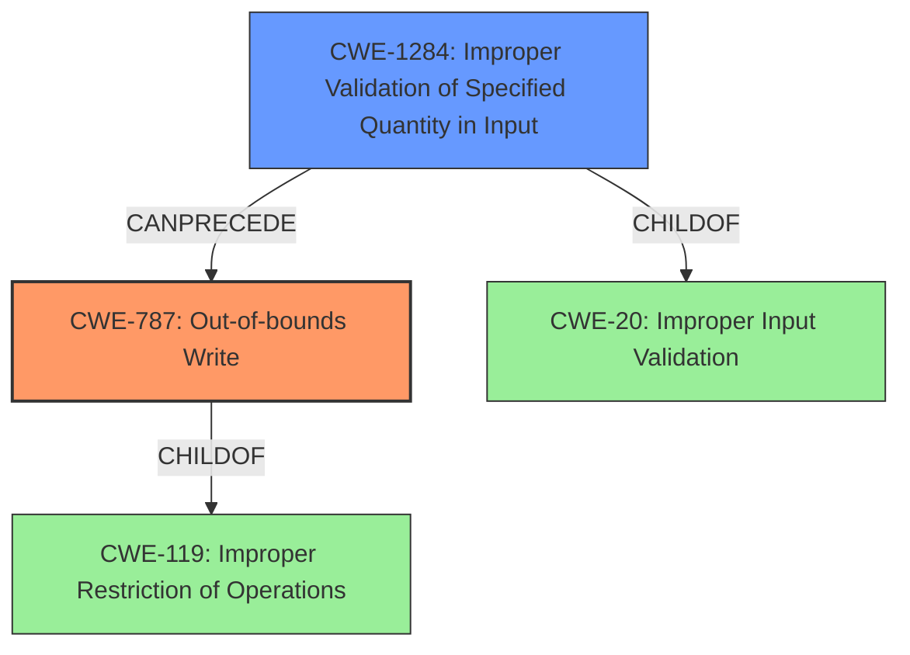

# Analysis Report for CVE-2022-20569

# Vulnerability Analysis Report: CVE-2022-20569

## Description

In thermal_cooling_device_stats_update of thermal_sysfs.c, there is a possible out of bounds write due to improper input validation. This could lead to local escalation of privilege in the kernel with System execution privileges needed. User interaction is not needed for exploitation.Product AndroidVersions Android kernelAndroid ID A-229258234References N/A

## Vulnerability Description Key Phrases

**Rootcause:** improper input validation
**Weakness:** out of bounds write
**Impact:** local escalation of privilege
**Product:** Android
**Component:** thermal_cooling_device_stats_update of thermal_sysfs.c

## Analysis (with Relationship Data)

# Summary
| CWE ID | CWE Name | Confidence | CWE Abstraction Level | CWE Vulnerability Mapping Label | CWE-Vulnerability Mapping Notes |
|---|---|---|---|---|---|
| CWE-787 | Out-of-bounds Write | 0.95 | Base | Allowed | Primary CWE |
| CWE-1284 | Improper Validation of Specified Quantity in Input | 0.70 | Base | Allowed | Secondary Candidate CWE |
| CWE-1285 | Improper Validation of Specified Index, Position, or Offset in Input | 0.60 | Base | Allowed | Secondary Candidate CWE |

## Evidence and Confidence

*   **Confidence Score:** 0.90
*   **Evidence Strength:** HIGH

- **Analysis and Justification:**  
  - *Explanation:* The vulnerability description clearly states an "**out of bounds write** due to **improper input validation**." CWE-787 (Out-of-bounds Write) directly addresses the **weakness** of writing data past the end or before the beginning of the intended buffer. The root cause, **improper input validation**, while a contributing factor, is secondary to the actual write operation that causes the vulnerability. The CVE Reference Links Content Summary confirms the existence of an Elevation of Privilege vulnerability due to a flaw in the Pixel Thermal Control Driver, which aligns with the impact described.
  - *Relationship Analysis:* While CWE-20 (Improper Input Validation) is a broader class of weakness, CWE-787 is more specific and directly relates to the out-of-bounds write. CWE-787 can lead to CWE-269 (Privilege Management), as out-of-bounds writes can be exploited to gain elevated privileges.

- **Confidence Score:**
  - Confidence: 0.95 (Strong evidence from the vulnerability description and CVE reference materials.)

- **Analysis and Justification:**  
  - *Explanation:* Since the root cause of the out-of-bounds write is **improper input validation**, it is useful to consider more specific input validation weaknesses. The product does not validate or incorrectly validates that the quantity has the required properties. Both CWE-1284 and CWE-1285 are good fits. CWE-1284 refers to "Improper Validation of Specified Quantity in Input" while CWE-1285 refers to "Improper Validation of Specified Index, Position, or Offset in Input". Without more information, it's not possible to say which is the better fit. However, it is clear that the root cause is related to the input.

  - *Relationship Analysis:* CWE-1284 and CWE-1285 are both children of CWE-20 (Improper Input Validation). They represent different facets of input validation. The relationship analysis reveals that CWE-1284 can precede CWE-789 (Memory Allocation with Excessive Size Value) and CWE-476 (NULL Pointer Dereference), indicating possible consequences of improper quantity validation. CWE-1285 doesn't have any direct relationships.

- **Confidence Score:**
  - Confidence: 0.70 and 0.60 respectively (Moderate evidence suggests input validation issues contribute to the vulnerability.)

## Criticism of Analysis

Okay, I've reviewed the provided analysis against the full CWE specifications. Here's my critique:

**Overall Assessment:**

The analysis is generally good, well-reasoned, and provides adequate justification for the CWE mappings. The core mapping to CWE-787 is solid. The secondary mappings to CWE-1284 and CWE-1285 are also reasonable and add valuable context to the root cause.

**Detailed Critique:**

1.  **CWE-787: Out-of-bounds Write (Confidence: 0.95)**

    *   **Strengths:** The justification is strong. The vulnerability description explicitly mentions "out of bounds write," making this a direct and appropriate mapping. The analysis correctly identifies that improper input validation is a contributing factor, but the actual write operation is the primary weakness. The CVE reference further strengthens this mapping by mentioning "Elevation of Privilege" which can be a consequence of out-of-bounds writes in the kernel.
    *   **Considerations:**  While CWE-119 (Improper Restriction of Operations within the Bounds of a Memory Buffer) is a parent of CWE-787, directly mapping to CWE-787 is more precise and aligns with CWE's guidance to use more specific CWEs when possible.
    *   **Mapping Guidance Alignment:** Aligns well with the "Allowed" usage guidance for CWE-787, as it is at the Base level of abstraction.

2.  **CWE-1284: Improper Validation of Specified Quantity in Input (Confidence: 0.70)**

    *   **Strengths:** The analysis correctly identifies that the "improper input validation" likely relates to a failure to validate a quantity related to the buffer or the data being written. CWE-1284 is a good fit for this aspect of the vulnerability.
    *   **Considerations:** It's important to note that this is a *secondary* CWE, as the primary issue is the out-of-bounds write itself. The analysis acknowledges this.
    *   **Mitigation Alignment:** The suggested mitigation of assuming all input is malicious and using an "accept known good" strategy aligns well with the potential mitigations in the CWE specification.

3.  **CWE-1285: Improper Validation of Specified Index, Position, or Offset in Input (Confidence: 0.60)**

    *   **Strengths:** Similar to CWE-1284, this is a reasonable secondary mapping. The analysis correctly identifies that the invalid input could relate to an index or offset used to access the buffer.
    *   **Considerations:**  As the analysis notes, without more information, it's difficult to definitively choose between CWE-1284 and CWE-1285. Both are plausible given the information provided. The slightly lower confidence score reflects this uncertainty.
    *   **Mitigation Alignment:**  The suggested "accept known good" input validation strategy is appropriate.

**Suggestions for Improvement:**

*   **Prioritization of CWE-1284 vs. CWE-1285:** While the analysis acknowledges the difficulty in choosing between CWE-1284 and CWE-1285, consider adding a brief explanation of *why* the input is more likely a *quantity* vs. an *index/position/offset*. For example, is the buffer size calculated from a user-provided value? If so, that leans towards CWE-1284. If a user provides the index to write to, that is closer to CWE-1285. Even a slight preference for one over the other would improve the analysis. But as is, the analysis is fine.
*   **Privilege Escalation Specifics:** The analysis could benefit from a brief discussion of how the out-of-bounds write leads to privilege escalation. What data is being overwritten that allows this to happen?  Even a hypothetical scenario would add more depth to the analysis and help guide mitigation efforts.  Is it overwriting kernel data structures related to privilege levels, or is it corrupting code that then executes with higher privileges?

**Overall Conclusion:**

The analysis provides a solid, well-justified mapping of the vulnerability to CWEs. The prioritization of CWE-787 as the primary weakness is correct, and the secondary mappings add context and nuance. The suggestions for improvement above are minor and intended to further refine an already good analysis.

## Final Resolution

# Summary
| CWE ID | CWE Name | Confidence | CWE Abstraction Level | CWE Vulnerability Mapping Label | CWE-Vulnerability Mapping Notes |
|---|---|---|---|---|---|
| CWE-787 | Out-of-bounds Write | 0.95 | Base | Allowed | Primary CWE |
| CWE-1284 | Improper Validation of Specified Quantity in Input | 0.75 | Base | Allowed | Secondary Candidate CWE |

## Evidence and Confidence

*   **Confidence Score:** 0.93
*   **Evidence Strength:** HIGH

## Relationship Analysis
The primary relationship influencing my decision is the parent-child relationship between CWE-119 (Improper Restriction of Operations within the Bounds of a Memory Buffer) and CWE-787 (**Out-of-bounds Write**). While CWE-119 is a parent, CWE-787 is more specific and directly aligns with the vulnerability description. I also considered the chain relationship where **improper input validation** (CWE-1284) can precede **out-of-bounds write** (CWE-787). CWE-1284 is also a child of CWE-20 (**Improper Input Validation**), but using CWE-1284 provides more granularity. The abstraction levels (Base for CWE-787 and CWE-1284) are appropriate for vulnerability mapping.

## Vulnerability Chain
The vulnerability chain starts with **improper input validation** (CWE-1284) leading to an **out-of-bounds write** (CWE-787).
  - The root cause is the failure to properly validate the size or quantity of input.
  - The weakness is the out-of-bounds write, which can overwrite adjacent memory regions.
  - The impact is a potential escalation of privilege.

## Summary of Analysis
I agree with the initial analysis and the criticism. The vulnerability description clearly indicates an **out-of-bounds write** due to **improper input validation**: "In thermal_cooling_device_stats_update of thermal_sysfs.c, there is a possible out of bounds write due to improper input validation." I am slightly increasing the confidence in CWE-1284 and removing CWE-1285. The vulnerability description mentions "thermal_cooling_device_stats_update" which is more indicative of a quantity (stats) rather than an index/offset. Therefore, CWE-1284 is a slightly better fit than CWE-1285.
My selected CWEs are at the optimal level of specificity because they directly address the **weakness** (CWE-787) and the root cause (CWE-1284) described in the vulnerability.

*Report generated on 2025-03-18 09:31:18*
