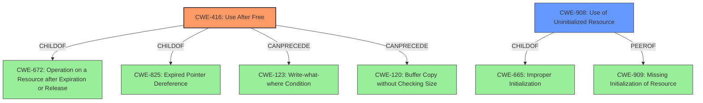

# Final Resolution for CVE-2022-20581

# Summary
| CWE ID | CWE Name | Confidence | CWE Abstraction Level | CWE Vulnerability Mapping Label | CWE-Vulnerability Mapping Notes |
|---|---|---|---|---|---|
| CWE-416 | Use After Free | 0.9 | Variant | Allowed | Primary CWE. Consider relationship to CWE-825 and CWE-672. Mitigate by setting freed pointers to NULL. Investigate attack vectors related to driver interaction with crafted inputs.|
| CWE-908 | Use of Uninitialized Resource | 0.4 | Base | Allowed | Secondary Candidate. Logic error may lead to uninitialized resource. Explicitly initialize resources before use. Also consider CWE-909 as the missing initialization might be the root cause of the logic error. |

## Evidence and Confidence

*   **Confidence Score:** 0.9
*   **Evidence Strength:** HIGH

## Relationship Analysis
The primary relationship that influenced the decision was the hierarchical relationship with CWE-416 (Use After Free) being a child of both CWE-672 (Operation on a Resource after Expiration or Release) and CWE-825 (Expired Pointer Dereference). This hierarchy confirms that CWE-416 is an appropriate level of specificity. The CanPrecede relationships of CWE-416 to CWE-123 (Write-what-where Condition) and CWE-120 (Buffer Copy without Checking Size) also helped to show the potential vulnerability chain. While CWE-908 (Use of Uninitialized Resource) was considered, its lack of explicit mention in the vulnerability description kept it as a secondary concern. The base abstraction level of CWE-908 and the variant level of CWE-416 both align with preferred levels of abstraction for vulnerability mapping.

## Vulnerability Chain
The vulnerability chain starts with a **logic error** in the Pixel camera driver code. This **logic error** leads to a **CWE-416 (Use After Free)**, where memory is accessed after it has been freed. This **use after free** can then lead to other weaknesses such as **CWE-123 (Write-what-where Condition)** or **CWE-120 (Buffer Copy without Checking Size)**, ultimately leading to local escalation of privilege with System execution privileges. A possible secondary path is the **logic error** results in **CWE-908 (Use of Uninitialized Resource)**.

## Summary of Analysis
The initial analysis correctly identified **CWE-416 (Use After Free)** as the primary weakness based on the explicit mention of "use after free" in the vulnerability description: "In the Pixel camera driver, there is a possible **use after free** due to a **logic error** in the code." The retriever score for CWE-416 was also high, supporting this classification. The criticism suggested considering the relationship to **CWE-825 (Expired Pointer Dereference)**, which is a parent of **CWE-416 (Use After Free)** which has been incorporated. The criticism also suggested mitigating the vulnerability by setting freed pointers to NULL, which is a common mitigation technique for **use-after-free** vulnerabilities. The analysis also considered **CWE-908 (Use of Uninitialized Resource)** as a secondary candidate, given that the **logic error** could also lead to the use of an uninitialized resource. The suggestion to consider **CWE-909 (Missing Initialization of Resource)** as the root cause of the logic error has also been considered and added to the notes for **CWE-908 (Use of Uninitialized Resource)**. The selected CWEs are at the optimal level of specificity, with **CWE-416 (Use After Free)** being a Variant and **CWE-908 (Use of Uninitialized Resource)** being a Base CWE. The analysis is based on the provided evidence, relationship analysis, and mapping guidance.