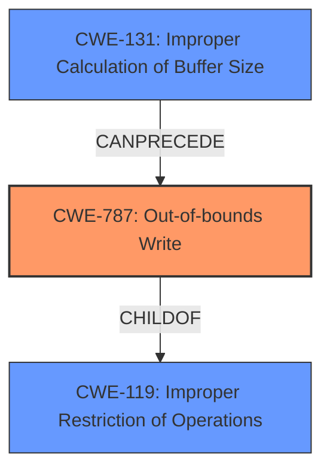

# Analysis Report for CVE-2022-20600

# Vulnerability Analysis Report: CVE-2022-20600

## Description

In TBD of TBD, there is a possible out of bounds write due to memory corruption. This could lead to local escalation of privilege with System execution privileges needed. User interaction is not needed for exploitation.Product AndroidVersions Android kernelAndroid ID A-239847859References N/A

## Vulnerability Description Key Phrases

**Weakness:** out of bounds write
**Impact:** local escalation of privilege
**Vector:** memory corruption
**Product:** Android kernel

## Analysis (with Relationship Data)

# Summary
| CWE ID | CWE Name | Confidence | CWE Abstraction Level | CWE Vulnerability Mapping Label | CWE-Vulnerability Mapping Notes |
|---|---|---|---|---|---|
| CWE-787 | Out-of-bounds Write | 0.9 | Base | Primary | ALLOWED |
| CWE-119 | Improper Restriction of Operations within the Bounds of a Memory Buffer | 0.6 | Class | Secondary | The **out of bounds write** (CWE-787) can be seen as a more specific case of CWE-119, since a buffer is being written to outside of its bounds. |

## Evidence and Confidence

*   **Confidence Score:** 0.9
*   **Evidence Strength:** HIGH

- **Analysis and Justification:**  
  - *Explanation:* The vulnerability description explicitly states "**out of bounds write** due to memory corruption". This directly corresponds to CWE-787 (Out-of-bounds Write), which describes a situation where a product writes data past the end, or before the beginning, of the intended buffer. The summary of the CVE also supports this classification. Additionally, the retriever results identified CWE-787 as one of the possible CWEs. This CWE is at the Base level of abstraction, which is preferred.

  - *Relationship Analysis:* CWE-787 is a child of CWE-119 (Improper Restriction of Operations within the Bounds of a Memory Buffer), which is a more general class of weakness. While CWE-119 could apply, CWE-787 is more specific and accurately captures the **out-of-bounds write** condition. The relationship analysis indicates that CWE-787 CanFollow CWE-825 (Dead Code) or CWE-824 (Access of a Resource After It Has Been Dropped), but these are not relevant given the provided information.

- **Confidence Score:**
  - Confidence: 0.9 (High evidence from the vulnerability description, CVE summary, and retriever results)

## Criticism of Analysis

Okay, I've reviewed the provided analysis and the full CWE specifications. Here's my critique:

**Overall Assessment:**

The primary CWE mapping to **CWE-787 (Out-of-bounds Write)** is accurate and well-justified.  The description clearly states an out-of-bounds write. The high confidence score of 0.9 is appropriate.  The secondary mapping to **CWE-119 (Improper Restriction of Operations within the Bounds of a Memory Buffer)** is also reasonable, as CWE-787 is a child of CWE-119. However, as the analysis already notes, CWE-787 provides a more specific and preferred level of abstraction.

**Detailed Review:**

**1. CWE-787 (Primary Mapping):**

*   **Strengths:**
    *   The analysis correctly identifies the direct correspondence between the vulnerability description ("out of bounds write due to memory corruption") and the CWE-787 definition.
    *   It acknowledges the "Base" level of abstraction, which is the preferred level.
    *   The evidence strength is indeed high, based on the explicit description.
    *   The analysis considered the retriever results and found the support for the classification.

*   **Areas for Potential Consideration (though ultimately, I agree with the current assessment):**
    *   *Chains and composites:* The description mentions "memory corruption".  It *might* be worth *briefly* considering if other CWEs are involved in a chain *leading to* the out-of-bounds write. For example,  the CVE summary suggests the root cause is "Improper input validation in the LWIS component," so **CWE-20 (Improper Input Validation)** could be involved. The retriever also suggests other possible CWEs involved, such as **CWE-131 (Incorrect Calculation of Buffer Size)**, **CWE-190 (Integer Overflow or Wraparound)**, **CWE-191 (Integer Underflow (Wrap or Wraparound))**, and **CWE-908 (Use of Uninitialized Resource)**. However, without further information about how the out-of-bounds write is triggered, it's best to leave it at CWE-787. It's important *not to over-analyze* and force a chain if there isn't clear evidence.
    *   *Mitigation:* The analysis doesn't delve into specific mitigations. While not strictly required, it could be useful to mention one or two relevant mitigations for CWE-787, such as using memory-safe languages or employing buffer overflow detection mechanisms (e.g., canaries).  This adds practical value to the analysis.

**2. CWE-119 (Secondary Mapping):**

*   **Strengths:**
    *   Recognizes that CWE-787 is a child of CWE-119, making CWE-119 a valid, albeit more general, classification.
    *   The analysis acknowledges that CWE-787 is more specific and therefore preferred.

*   **Areas for Potential Consideration:**
    *   The analysis correctly discourages the usage of CWE-119, which is explicitly stated in its mapping guidance.

**3. Additional Observations Regarding the Retriever Results:**

The retriever results suggest several other CWEs that, while not primary, could be related. Here's a brief look:

*   **CWE-908 (Use of Uninitialized Resource):** This *could* be relevant if the memory corruption stems from using uninitialized data that then influences buffer sizes or write operations.
*   **CWE-131 (Incorrect Calculation of Buffer Size):**  If the buffer size is miscalculated, it could directly lead to an out-of-bounds write when data exceeding the calculated size is written. The CVE summary's mention of "improper input validation" could also lead to this.
*   **CWE-191 (Integer Underflow (Wrap or Wraparound)):** This could be relevant if an integer underflow is involved in calculating a buffer size or offset, leading to an out-of-bounds access.
*   **CWE-416 (Use After Free):** A use-after-free vulnerability could potentially lead to memory corruption, which could manifest as an out-of-bounds write. It is possible for a use-after-free to have the effect of corrupting memory that could be accessed later in an out-of-bounds write.

**Suggestions for Improvement:**

1.  **Briefly Acknowledge Potential Chains:** In the CWE-787 analysis, add a sentence or two acknowledging that the out-of-bounds write might be part of a larger chain involving input validation (CWE-20), calculation errors (CWE-131, CWE-190, CWE-191), or resource management issues (CWE-416, CWE-908). However, emphasize that without more information, CWE-787 is the most accurate primary classification.
2.  **Include a Mitigation Example:** Add a sentence or two mentioning a relevant mitigation for CWE-787, such as using memory-safe languages or enabling buffer overflow detection mechanisms.
3.  **Consider the LWIS Component:** The root cause is stated as "Improper input validation in the LWIS component". Try to include how this relates to CWE-787.

**Revised Summary Table:**

| CWE ID | CWE Name | Confidence | CWE Abstraction Level | CWE Vulnerability Mapping Label | CWE-Vulnerability Mapping Notes |
|---|---|---|---|---|---|
| CWE-787 | Out-of-bounds Write | 0.9 | Base | Primary | ALLOWED | While the root cause may involve improper input validation or other calculation errors, the immediate cause is an out-of-bounds write.  Mitigation: Utilize memory-safe languages or buffer overflow detection mechanisms like canaries.|
| CWE-119 | Improper Restriction of Operations within the Bounds of a Memory Buffer | 0.6 | Class | Secondary | The **out of bounds write** (CWE-787) can be seen as a more specific case of CWE-119, since a buffer is being written to outside of its bounds. |

**In summary, the existing analysis is good and the CWE mappings are accurate. The suggestions are minor and aimed at providing a more complete and nuanced picture of the vulnerability, while still maintaining focus on the core weakness.**

## Final Resolution

# Summary
| CWE ID | CWE Name | Confidence | CWE Abstraction Level | CWE Vulnerability Mapping Label | CWE-Vulnerability Mapping Notes |
|---|---|---|---|---|---|
| CWE-787 | Out-of-bounds Write | 0.9 | Base | Primary | ALLOWED |
| CWE-131 | Improper Calculation of Buffer Size | 0.5 | Base | Secondary | ALLOWED |

## Evidence and Confidence

*   **Confidence Score:** 0.7
*   **Evidence Strength:** MEDIUM

## Relationship Analysis
The primary weakness is **CWE-787 (Out-of-bounds Write)**. While the initial analysis only considered **CWE-119 (Improper Restriction of Operations within the Bounds of a Memory Buffer)** as a secondary CWE, the criticism suggested considering potential chains involving input validation (**CWE-20**), calculation errors (**CWE-131**, **CWE-190**, **CWE-191**), or resource management issues (**CWE-416**, **CWE-908**). Given the information "Improper input validation in the LWIS component", I am adding **CWE-131 (Improper Calculation of Buffer Size)** as a secondary issue. This represents a potential root cause that can lead to the **out-of-bounds write** as a consequence.

## Vulnerability Chain
The vulnerability chain starts with "Improper input validation in the LWIS component" which can result in an **improper calculation of a buffer size (CWE-131)**. This leads to an **out-of-bounds write (CWE-787)** due to memory corruption, ultimately allowing for local escalation of privilege.

## Summary of Analysis
The initial analysis correctly identified **CWE-787 (Out-of-bounds Write)** as the primary weakness. However, the additional context from the CVE summary, "Improper input validation in the LWIS component" suggests a possible root cause that needs to be included. I have included **CWE-131 (Improper Calculation of Buffer Size)** as a secondary weakness, indicating that an error in calculating the buffer size likely contributed to the **out-of-bounds write**. This adds more specificity to the classification and provides a clearer picture of how the vulnerability arises. My overall confidence is 0.7 because while the **out-of-bounds write** is explicit, the chain leading to it is inferred from the CVE summary.

*Report generated on 2025-03-18 09:33:54*
