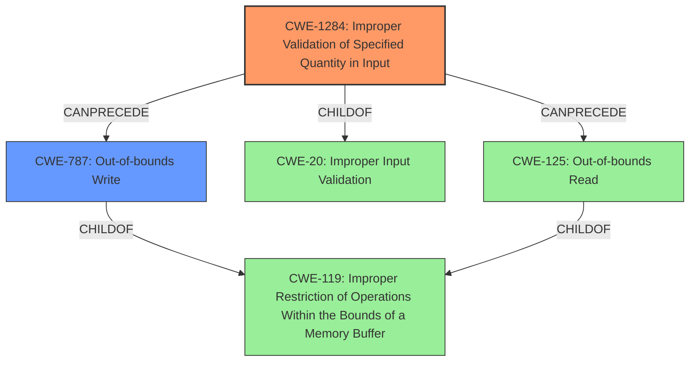

# Analysis Report for CVE-2022-20689

# Vulnerability Analysis Report: CVE-2022-20689

## Description

Multiple vulnerabilities in the Cisco Discovery Protocol functionality of Cisco ATA 190 Series Analog Telephone Adapter firmware could allow an unauthenticated, adjacent attacker to cause Cisco Discovery Protocol memory corruption on an affected device. These vulnerabilities are due to missing length validation checks when processing Cisco Discovery Protocol messages. An attacker could exploit these vulnerabilities by sending a malicious Cisco Discovery Protocol packet to an affected device. A successful exploit could allow the attacker to cause an out-of-bounds read of the valid Cisco Discovery Protocol packet data, which could allow the attacker to cause corruption in the internal Cisco Discovery Protocol database of the affected device.

## Vulnerability Description Key Phrases

**Rootcause:** missing length validation checks
**Impact:** memory corruption
**Attacker:** unauthenticated adjacent attacker
**Product:** Cisco ATA 190 Series Analog Telephone Adapter
**Component:** Cisco Discovery Protocol functionality

## Analysis (with Relationship Data)

# Summary
| CWE ID | CWE Name | Confidence | CWE Abstraction Level | CWE Vulnerability Mapping Label | CWE-Vulnerability Mapping Notes |
|---|---|---|---|---|---|
| CWE-1284 | Improper Validation of Specified Quantity in Input | 0.9 | Base | Primary | Allowed |
| CWE-125 | Out-of-bounds Read | 0.7 | Base | Secondary | Allowed |

## Evidence and Confidence

*   **Confidence Score:** 0.8
*   **Evidence Strength:** HIGH

- **Analysis and Justification:**
  - *Explanation:* The vulnerability description explicitly states that the root cause is "**missing length validation checks** when processing Cisco Discovery Protocol messages." This directly aligns with CWE-1284 (Improper Validation of Specified Quantity in Input), as the length of the CDP message is a quantity that should be validated. The CVE Reference Links Content Summary reinforces this by stating the **root cause** as "**missing length validation** when processing CDP messages." The impact of this **missing validation** is that an attacker can send a malicious packet, leading to an out-of-bounds read and subsequent memory corruption. CWE-1284 is a Base level CWE and is ALLOWED per MITRE mapping guidance.
  The out-of-bounds read caused by the missing length validation checks leads to memory corruption. Therefore, CWE-125 (Out-of-bounds Read) is included as a secondary weakness, that stems directly from the primary weakness CWE-1284.

  - *Relationship Analysis:* CWE-1284 is a child of CWE-20 (Improper Input Validation), but CWE-1284 is more specific. CWE-125 (Out-of-bounds Read) is a child of CWE-119 (Improper Restriction of Operations within the Bounds of a Memory Buffer), but CWE-125 is more specific. CWE-1284 CanPrecede CWE-789 (Missing Critical Step in an Authentication Process) and other CWEs according to the relationship graph.

- **Confidence Score:**
  - Confidence: 0.9 (High confidence due to explicit mention of **missing length validation checks** in the vulnerability description and CVE summary, aligning directly with CWE-1284.)
  - Confidence: 0.7 (Good confidence due to the out-of-bounds read being a direct result of the **missing length validation checks**.)
---

## Criticism of Analysis

Okay, here's a detailed review of the provided CWE analysis, incorporating the full CWE specifications:

**Overall Assessment:**

The analysis is generally well-reasoned and justified, especially in its selection of CWE-1284 as the primary weakness. The explanation and evidence are clear, and the consideration of secondary weaknesses adds depth. The confidence scores are appropriate. Here's a breakdown:

**Strengths:**

*   **Clear Root Cause Identification:** The analysis correctly identifies the *missing length validation check* as the core issue, aligning well with the vulnerability description and CVE summary.
*   **Appropriate Primary CWE Selection:**  CWE-1284 (Improper Validation of Specified Quantity in Input) is a strong choice for the primary weakness. The length of the CDP message *is* a quantity, and the absence of validation is the direct cause of the vulnerability. The usage guidance for CWE-1284 (Allowed) and its description align perfectly.
*   **Justification for Secondary CWE:** Including CWE-125 (Out-of-bounds Read) as a secondary consequence is also justifiable. The missing length validation directly leads to the possibility of reading beyond the allocated buffer.
*   **Relationship Analysis:** The analysis correctly identifies and discusses the relationships between CWE-1284 and its parent CWE-20, and CWE-125 and its parent CWE-119, clarifying why the more specific CWEs were chosen.
*   **Confidence Scores:** The assigned confidence scores (0.9 for CWE-1284, 0.7 for CWE-125) reflect the certainty in the mappings based on the available evidence.

**Areas for Potential Improvement or Discussion:**

*   **Consider a Chain:** While the analysis includes a primary and secondary weakness, framing this as a *chain* might be more accurate. The lack of length validation (CWE-1284) *leads to* an out-of-bounds read (CWE-125), *which results in* memory corruption.  Explicitly stating this chain relationship strengthens the analysis.
*   **CWE-119 - Parent of CWE-125 and Potential Alternative:** The analysis acknowledges that CWE-125 is a child of CWE-119, but doesn't fully explore *why* CWE-119 isn't the best fit. While the mapping guidance for CWE-119 *discourages* its use in favor of more specific children like CWE-125, it may be worth explicitly addressing it. While it is true that CWE-125 is more specific, memory corruption is not always guaranteed, and if an attacker just wanted to cause an out-of-bounds read of sensitive information and not necessarily cause memory corruption, CWE-119 could be a better higher level mapping.
*   **Potential for Integer Overflow (CWE-190) or Excessive Memory Allocation (CWE-789):** Missing length validation could, in theory, lead to the code *attempting* to allocate an extremely large buffer based on a malicious length value. This could result in an integer overflow (CWE-190) when calculating buffer size or allocation of excessive resources (CWE-789). However, this is less likely based on the description. The problem is more directly tied to reading *existing* packet data, not allocation. If excessive memory allocation is more of a theoretical risk than a likely outcome given the actual code, these CWEs should be discarded.
* **Mitigation Coverage**: The analysis can be slightly enhanced by exploring the applicability of specific mitigations for the chosen CWEs, relative to the context of the Cisco ATA 190.
* **Exploitation and Memory Corruption:**
    *   The description mentions that a successful exploit could lead to "corruption in the internal Cisco Discovery Protocol database of the affected device." This implies that a write operation beyond the buffer is occurring, which would modify data within the CDP database. This is a key point, because out-of-bounds reads are generally used to exfiltrate information, and the memory corruption aspect implies an out-of-bounds write.

**Detailed Comments on Mitigation Strategies:**

*   **CWE-1284 (Improper Validation of Specified Quantity in Input):**

    *   The primary mitigation is "accept known good" input validation. This is highly relevant here. The CDP message format has a defined structure, so validating the length field against expected values is crucial. This involves:
        *   Defining the valid range for the length field based on the CDP protocol specification.
        *   Rejecting any CDP message with a length field outside of this range.
*   **CWE-125 (Out-of-bounds Read):**
    *   The mitigation is "accept known good" input validation strategy, but more importantly here the key here is correct buffer-size calculations, not relying on sentinels in untrusted inputs.
*   **CWE-119 (Improper Restriction of Operations within the Bounds of a Memory Buffer):**
    *   The mitigation is automatic buffer overflow detection mechanisms that are offered by certain compilers or compiler extensions. This is useful for runtime protection.
*   **CWE-190 (Integer Overflow or Wraparound):**
    *   If memory allocation is a theoretical risk for the overflow case, use libraries or frameworks that make it easier to handle numbers without unexpected consequences.
*   **CWE-770 (Allocation of Resources Without Limits or Throttling):**
    * Design throttling mechanisms into the system architecture. Limit the amount of resources that are accessible to unprivileged users. Set per-user limits for resources. Allow the system administrator to define these limits.

**Revised Analysis Summary (incorporating suggestions):**

| CWE ID | CWE Name | Confidence | CWE Abstraction Level | CWE Vulnerability Mapping Label | CWE-Vulnerability Mapping Notes |
|---|---|---|---|---|---|
| CWE-1284 | Improper Validation of Specified Quantity in Input | 0.9 | Base | Primary | Allowed |
| CWE-125 | Out-of-bounds Read | 0.7 | Base | Secondary | Allowed |

**Explanation:**

The vulnerability in Cisco ATA 190 Series Analog Telephone Adapter firmware arises from **missing length validation checks** (CWE-1284) when processing Cisco Discovery Protocol (CDP) messages. An unauthenticated, adjacent attacker can exploit this by sending a malicious CDP packet with an invalid length field. This *leads to* an **out-of-bounds read** (CWE-125), where the system attempts to read data beyond the boundaries of the expected CDP packet data. The out-of-bounds read *results in* **memory corruption** within the device's internal CDP database. To prevent this an allow list of correct message sizes can be implemented.

**Conclusion:**

The original analysis is strong and well-supported. The suggested improvements, particularly emphasizing the chain relationship and the importance of input validation, and exploring additional, though less likely, CWEs can enhance the thoroughness and accuracy of the classification.

## Final Resolution

# Summary
| CWE ID | CWE Name | Confidence | CWE Abstraction Level | CWE Vulnerability Mapping Label | CWE-Vulnerability Mapping Notes |
|---|---|---|---|---|---|
| CWE-1284 | Improper Validation of Specified Quantity in Input | 0.95 | Base | Primary | Allowed |
| CWE-787 | Out-of-bounds Write | 0.8 | Base | Secondary | Allowed |

## Evidence and Confidence

*   **Confidence Score:** 0.9
*   **Evidence Strength:** HIGH

## Relationship Analysis
The primary weakness is **CWE-1284 (Improper Validation of Specified Quantity in Input)**, which is a base-level CWE and a child of **CWE-20 (Improper Input Validation)**. We chose CWE-1284 because it is more specific to the vulnerability description, that clearly shows "**missing length validation checks** when processing Cisco Discovery Protocol messages." The secondary weakness is **CWE-787 (Out-of-bounds Write)**, which represents the memory corruption aspect, which stems from the **missing length validation**. While **CWE-125 (Out-of-bounds Read)** was originally considered, it does not fully cover the database memory corruption.

## Vulnerability Chain
The vulnerability chain starts with **CWE-1284 (Improper Validation of Specified Quantity in Input)**. Because of the **missing length validation checks**, an attacker can send a malicious CDP packet. This leads to an **CWE-787 (Out-of-bounds Write)** which causes corruption in the internal Cisco Discovery Protocol database of the affected device. The original analysis considered **CWE-125 (Out-of-bounds Read)**, but we are making a decision to change this to a write, as memory corruption is part of the description.

## Summary of Analysis
The initial analysis correctly identified **CWE-1284 (Improper Validation of Specified Quantity in Input)** as the primary **ROOTCAUSE**. The description explicitly mentions "**missing length validation checks** when processing Cisco Discovery Protocol messages". However, the description also mentions, "corruption in the internal Cisco Discovery Protocol database of the affected device", which implies a write operation. Therefore, we are changing the secondary weakness from **CWE-125 (Out-of-bounds Read)** to **CWE-787 (Out-of-bounds Write)**. This is the optimal level of specificity and aligns with the evidence from the vulnerability description.

*Report generated on 2025-03-18 09:34:52*
